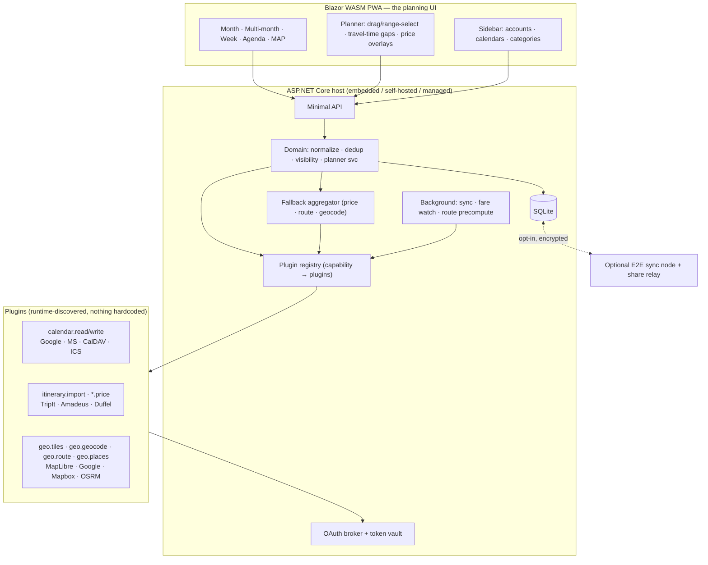
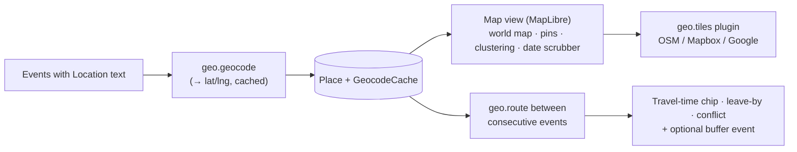
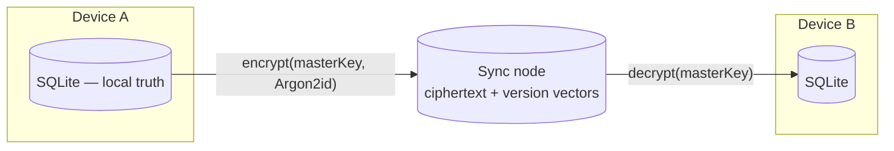
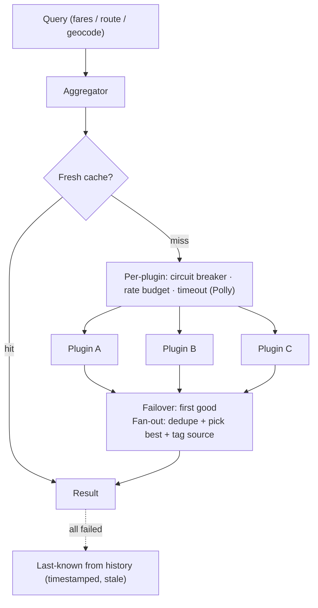

# Architecture

**Unified Calendar** is a responsive web app (.NET 9 / C#) that aggregates events from any number of
sources into one **UI built for seeing and planning**, with a **world-map view** and **travel-time
aware** scheduling. Its defining trait: **nothing is hardcoded** — every integration (calendars,
travel, fares, maps, geocoding, routing) is a **plugin** discovered at runtime through a
**capability** registry.

- [1. Design principles](#1-design-principles)
- [2. Technology stack](#2-technology-stack)
- [3. System overview](#3-system-overview)
- [4. Plugin & capability system](#4-plugin--capability-system)  ·  deep dive: [PLUGINS.md](PLUGINS.md)
- [5. Capability catalog](#5-capability-catalog)
- [6. UI & planning](#6-ui--planning)  ·  deep dive: [UI.md](UI.md)
- [7. Map, geocoding & routing](#7-map-geocoding--routing)
- [8. Storage & hybrid local-first](#8-storage--hybrid-local-first)
- [9. Domain model](#9-domain-model)
- [10. Sync engine](#10-sync-engine)
- [11. Calendar capabilities & iOS/iCloud](#11-calendar-capabilities--iosicloud)
- [12. Duplicate detection & grouping](#12-duplicate-detection--grouping)
- [13. Categories & visibility](#13-categories--visibility)
- [14. Travel: itineraries, stays & fares](#14-travel-itineraries-stays--fares)
- [15. Multi-provider fallback aggregator](#15-multi-provider-fallback-aggregator)
- [16. Sharing](#16-sharing)
- [17. Security & privacy](#17-security--privacy)
- [18. Solution layout](#18-solution-layout)

---

## 1. Design principles

1. **UI-first.** The product *is* the planning surface. Everything else (sync, plugins, geo) exists to
   feed a fast, fluid calendar you can see and plan over. See [UI.md](UI.md).
2. **Nothing hardcoded.** No provider is baked into the core. Integrations are **plugins** that declare
   **capabilities**; the core only ever asks the registry for "everything that does X."
3. **Local-first, opt-in encrypted sync.** Data lives in on-device SQLite; cloud sync is zero-knowledge.
4. **Least privilege.** Read-only scopes first; the host owns all secrets — plugins never see tokens.
5. **Deterministic, reversible dedup.** Grouping is explainable and always undoable.
6. **Offline-capable.** Blazor WASM + PWA: the calendar and map open instantly and work offline.

## 2. Technology stack

| Concern | Choice | Notes |
| --- | --- | --- |
| Language / runtime | **C# / .NET 9** | One language across host, plugins, UI. |
| Web API | **ASP.NET Core Minimal APIs** | Thin HTTP layer over domain services. |
| Front end | **Blazor WebAssembly** (PWA) | The planning UI; installable + offline. |
| Map rendering | **MapLibre GL JS** via JS interop | Open, vector tiles, self-hostable; Google/Mapbox tiles are *plugins*. |
| ORM / local DB | **EF Core + SQLite** (SQLCipher-capable) | On-device source of truth. |
| Cloud sync node (optional) | **ASP.NET Core + PostgreSQL** | Stores only E2E-encrypted blobs + share metadata. |
| Background work | **Quartz.NET** | Sync, fare watches, route precompute. |
| Plugin loading | **`AssemblyLoadContext`** (collectible) + connector engine | Hot load/unload; declarative connectors need no code. |
| ICS / recurrence | **Ical.Net** | RFC 5545 parsing + RRULE expansion. |
| OpenAPI (declarative plugins) | **Microsoft.OpenApi** | Read API specs at load time. |
| Mapping (declarative plugins) | JSONata / JMESPath evaluator | Map API JSON → domain model, no code. |
| Resilience | **Polly** | Retry · circuit breaker · timeout · fallback per plugin. |

## 3. System overview



## 4. Plugin & capability system

The architectural backbone. The core knows **capabilities**, not providers. A plugin is either a
**declarative connector** (a manifest + OpenAPI spec + field mapping — *no code*, the "read APIs and
load them" path) or an **assembly plugin** (compiled C# against a stable SDK contract). Built-in
providers ship as first-party plugins — they are not special.

- **Discovery → validate (SDK version, signature, permissions) → load (ALC or connector engine) →
  register capabilities → schema-driven configure → run (sandboxed, budgeted).**
- **The host owns secrets**: plugins declare auth needs; the OAuth broker runs the dance and injects
  scoped, short-lived handles. Plugins never see client secrets or tokens.
- **Permission-scoped**: network egress allowlist, declared capabilities, resource budgets enforced by
  the host. Untrusted code can run **out-of-process** behind gRPC.

Full SDK contract, manifest spec, connector format, and security model: **[PLUGINS.md](PLUGINS.md)**.

## 5. Capability catalog

The core defines these capability contracts; any plugin may implement one or more. New capability =
new interface in the SDK; existing plugins keep working.

| Capability | Purpose | Example plugins |
| --- | --- | --- |
| `calendar.read` / `calendar.write` | Read/normalize (and later write) events | Google, Microsoft Graph, CalDAV, ICS |
| `itinerary.import` | Import booked trips → events | TripIt, forwarded `.ics` |
| `flight.price` / `stay.price` | Search/track fares & hotel rates | Amadeus, Duffel, Kiwi, Hotelbeds |
| `geo.tiles` | Map tiles/style for the map view | MapLibre/OSM, Mapbox, Google |
| `geo.geocode` | Location string ⇄ lat/lng | Nominatim/OSM, Google, Mapbox |
| `geo.route` | Directions + duration (drive/transit/walk/bike) | Google Directions, OSRM, Valhalla, ORS |
| `geo.places` | Place search / autocomplete | Google Places, Mapbox, Foursquare |
| `notify` | Reminders / alerts | Email, push, webhook |

Capabilities that return **interchangeable results for the same query** (`*.price`, `geo.route`,
`geo.geocode`) automatically run through the [fallback aggregator](#15-multi-provider-fallback-aggregator).

## 6. UI & planning

The most important part of the product. The UI is a fast, offline-capable planning canvas with
multiple views over **one** filtered/deduped event stream — switching views never re-queries providers.

- **Views:** Month · **Multi-month** (vacation planning) · Week · Day · Agenda · **Map**.
- **Planning interactions:** drag-create / drag-move, **range-select across month boundaries**, a
  **scenario/draft layer** for tentative trip plans, combined **free/busy overlay**, **travel-time
  gaps** between events, and **price overlays** (fares/stays) painted onto candidate dates.
- **Travel-time awareness:** consecutive events at different places show a computed commute chip,
  **"leave by" alerts**, and conflict detection when the gap is too small (see §7).

Full layout, view specs, interaction model, performance, and accessibility: **[UI.md](UI.md)**.

## 7. Map, geocoding & routing

Maps are not a special subsystem — they are three capabilities, each pluggable.



- **Map view (world map).** Renders every event/trip location as a pin on a world map (MapLibre GL),
  with **clustering**, a **date-range scrubber** to see *where you are over time*, **trip routes drawn**
  between legs, and geographic filtering ("show only events in this region"). Tiles come from a
  `geo.tiles` plugin — **MapLibre/OSM by default, Google Maps or Mapbox as plugins**.
- **Geocoding (`geo.geocode`).** Event `Location` strings resolve to coordinates, **cached** so the
  same address is never looked up twice. Pluggable: **self-hosted Nominatim/OSM** → Google/Mapbox.
  ⚠️ The **public** Nominatim endpoint must not be used in a shipped app (1 req/s, caching mandatory, and
  its policy forbids no-code/LLM-generated generic geocoding — <https://operations.osmfoundation.org/policies/nominatim/>);
  self-host or use a commercial geocoder. See [PLUGIN-RESEARCH.md](PLUGIN-RESEARCH.md).
- **Directions & timing (`geo.route`).** The headline planning feature: between two consecutive events
  the planner computes **travel duration by mode** (drive/transit/walk/bike), respecting the event time
  (transit schedules use the arrival time). It surfaces:
  - a **commute chip** in the gap ("32 min drive"),
  - a **"leave by HH:MM"** hint,
  - a **conflict warning** when the gap is smaller than the commute ("you can't make it"),
  - an optional **auto-inserted travel buffer** event.
  Providers (**Google Directions, Mapbox, OpenRouteService, OSRM/Valhalla self-host**) sit behind the
  [fallback aggregator](#15-multi-provider-fallback-aggregator), so routing degrades gracefully and
  respects per-provider quotas.
- **Privacy.** Geocoding/routing send location text to an external service *only* for the chosen
  provider; self-hostable Nominatim/OSRM/Valhalla plugins keep everything local. Results are cached to
  minimize outbound calls.

## 8. Storage & hybrid local-first



- **Source of truth is local.** Providers are fetched/cached into device SQLite; the app works fully
  offline.
- **Cloud sync is opt-in and zero-knowledge.** Change sets are encrypted on-device before upload; the
  relay stores only ciphertext + version vectors (Lamport clocks). It never reads events.
- **Conflict resolution.** Last-writer-wins per user-metadata field (colors, visibility, dedup
  overrides, scenario plans). Provider-owned fields refresh from the provider on next sync.
- **Tokens stay on the authorizing device.** Synced data is limited to preferences and (optionally) the
  event cache for instant multi-device view.

## 9. Domain model

```mermaid
erDiagram
    ACCOUNT ||--o{ CALENDAR : has
    CALENDAR ||--o{ EVENT : contains
    EVENT }o--o{ CATEGORY : tagged
    EVENT }o--|| DUPLICATE_GROUP : "member of"
    EVENT }o--|| PLACE : "located at"
    PLACE ||--o{ GEOCODE_CACHE : resolved
    EVENT ||--o{ ROUTE_LEG : "commute to next"
    TRIP ||--o{ TRIP_ITEM : groups
    TRIP_ITEM }o--|| PLACE : at
    CALENDAR ||--o{ SHARE : "published as"
    PLUGIN ||--o{ ACCOUNT : "backs"
    FARE_WATCH }o--|| PLACE : route

    PLUGIN { string Id; string[] Capabilities; string Kind "declarative|assembly"; string SdkVersion; string Status }
    ACCOUNT { guid Id; string PluginId; string DisplayName; string AuthRef "vault handle"; datetime LastSyncAt; string SyncToken }
    CALENDAR { guid Id; guid AccountId; string RemoteId; string Name; string Color; bool IsVisible; bool IsReadOnly }
    EVENT { guid Id; guid CalendarId; string Uid; string Title; datetime StartUtc; datetime EndUtc; bool AllDay; string Rrule; guid PlaceId; string DedupSignature; guid DuplicateGroupId }
    CATEGORY { guid Id; string Name; bool IsVisible; string MatchRules }
    DUPLICATE_GROUP { guid Id; guid CanonicalEventId; string Signature }
    PLACE { guid Id; string Label; double Lat; double Lng; string Address }
    GEOCODE_CACHE { string Query; double Lat; double Lng; datetime ResolvedAt; string Source }
    ROUTE_LEG { guid Id; guid FromEventId; guid ToEventId; string Mode; int DurationSec; datetime LeaveByUtc; string Source }
    TRIP { guid Id; string Name; datetime StartUtc; datetime EndUtc }
    TRIP_ITEM { guid Id; guid TripId; string Kind "Flight|Stay|Car|Rail|Activity"; string Status "Booked|Candidate"; guid PlaceId; string Confirmation }
    FARE_WATCH { guid Id; string Kind "Flight|Stay"; guid OriginPlaceId; guid DestPlaceId; date RangeStart; date RangeEnd; int Pax }
    SHARE { guid Id; guid CalendarId; string Token; string Scope "FullDetails|FreeBusy"; datetime ExpiresAt }
```

Every plugin maps its native payload onto `Event`/`Calendar`/`TripItem` + `Place`. Recurrence stores
the master `Rrule`; occurrences expand on demand for the visible range. `Place`, `GeocodeCache`, and
`ROUTE_LEG` make the map and travel-time features first-class.

## 10. Sync engine

```mermaid
sequenceDiagram
    participant S as Scheduler (Quartz)
    participant R as Registry
    participant P as Plugin (capability)
    participant N as Normalizer
    participant D as Dedup + geocode
    participant DB as SQLite
    S->>R: due jobs (sync / fare watch / route precompute)
    R->>P: invoke (delta token)
    P-->>N: native payload + new token
    N->>DB: upsert (Uid / RemoteId keyed)
    N->>D: re-evaluate dedup; geocode new Places; recompute affected ROUTE_LEGs
    D->>DB: persist signatures, places, route legs
```

- **Delta-first** (Google sync tokens, Graph delta, CalDAV `sync-collection`); ICS diffed by `Uid` +
  `LAST-MODIFIED`. Per-plugin backoff on 429/5xx; idempotent upserts.

## 11. Calendar capabilities & iOS/iCloud

Calendar providers are plugins implementing `calendar.read` (later `calendar.write`):

| Plugin | Auth (via host broker) | Notes |
| --- | --- | --- |
| **Google** | OAuth2 `calendar.readonly` first | Sync tokens; Holidays/Birthdays calendars feed dedup. |
| **Microsoft / Outlook (work)** | OAuth2 via MSAL | Graph delta; work/school tenants. |
| **iCloud / Fastmail / Nextcloud** | App-specific password / Basic over TLS | CalDAV (`PROPFIND` + `calendar-query` `REPORT` + `sync-collection`). |
| **ICS feeds** | none | Public holidays, birthdays. **Easiest first plugin — no OAuth.** |
| **Proton** | — | ⚠️ No public CalDAV/API today (Bridge is mail-only). Use Proton's read-only **"share via link" ICS URL** via the ICS plugin until an official API exists. |

**iOS / Apple Calendar.** The iOS Calendar app is itself an aggregator — what matters is the accounts
behind it:
- **iCloud calendars → CalDAV** (`caldav.icloud.com`, Apple ID + **app-specific password**). Handled by
  the CalDAV plugin; no device needed.
- **Google/Outlook/subscribed calendars shown on the iPhone** → connect them directly via their own
  plugins. We never route through iOS.
- **"On My iPhone" device-local calendars** have no server and can't be read over a network. The only
  path is **EventKit** via a small **native iOS companion** (a future `calendar.read` plugin that pushes
  EventKit events to the host) — or move those calendars into iCloud.

## 12. Duplicate detection & grouping

Holidays/birthdays appearing in multiple accounts collapse into one visible entry, reversibly.

1. **Signature** = `hash(normalizedTitle | startDate | allDay | endDate?)` (lower-cased, emoji/
   punctuation stripped, whitespace collapsed; birthdays also key on recurring `Uid`/contact, holidays
   on date + fuzzy title).
2. **Group** events sharing a signature **across different calendars**.
3. **Canonical** chosen by user-orderable account priority; others suppressed but reachable as
   "+N duplicates".
4. **Explainable & reversible** — UI shows why, with merge / split / never-merge overrides (synced).

## 13. Categories & visibility

Events resolve to categories via source-derived rules (Google Birthdays/Holidays calendars, CalDAV
`CATEGORIES`, Graph categories) or user rules (keywords, calendar-of-origin). Final visibility is a
pure pipeline:

```
visible = calendar.IsVisible
          AND category.All(c => c.IsVisible)
          AND NOT (inDuplicateGroup AND not canonical)
          AND withinSelectedRange
```

So "hide all Birthdays" is one toggle on the `Birthday` category, regardless of source.

## 14. Travel: itineraries, stays & fares

Two jobs, both via the plugin/capability system, unified by the **Trip → TripItem** model.

- **Itinerary import (`itinerary.import`).** **TripIt** is the best aggregator (forward a confirmation →
  flights/hotels/cars/rail/dining). ⚠️ Its **public API is closed to new integrations** (June 2026), so
  ship TripIt via its **read-only `.ics` calendar feed** through the ICS plugin — no API access needed.
  A true API plugin only if partner access is obtained. Booked items **project into `Event`s** (Travel
  category) and ride dedup/visibility/multi-month/map automatically.
- **Offer pricing (`flight.price` / `stay.price`).** Flights *and* hotels share the **same aggregator**.
  ⚠️ **Amadeus Self-Service is being decommissioned 2026-07-17** — do not build on it. Lead with
  **Duffel** (Flights + Stays, search **and book**, official C# SDK); **Kiwi (Tequila)** as a second
  source; Hotelbeds/Expedia/Booking and Travelpayouts as partner/affiliate alternatives. The
  **multi-month planner** paints **cheapest-date overlays** for flights and **nightly-rate overlays** for
  hotels so you plan dates and lodging on one surface.
- **Fare watches.** `FareWatch` (route/stay + date range + pax) is polled by the scheduler, storing
  **price history** and firing `notify` on drops/thresholds.
- **Caveats.** Hotel/fare APIs are partner-gated and ToS-restrict caching — handled by per-plugin budgets
  and graceful degradation. See **[PLUGIN-RESEARCH.md](PLUGIN-RESEARCH.md)** for the full provider survey.
- **Booking** stays external (deep-link/affiliate) unless you adopt Duffel/Amadeus ticketing — being an
  OTA is regulated.

## 15. Multi-provider fallback aggregator

Any capability with **interchangeable** results (`*.price`, `geo.route`, `geo.geocode`) is fronted by a
generic aggregator so one dead/slow/rate-limited provider never breaks a query.



- **Failover** (cheap, default) vs **fan-out + merge** (best coverage: normalize, dedupe identical
  results, pick best, tag the winning source for deep-link/attribution).
- **Routing policy** chooses primary by coverage/health/cost/remaining quota — not a fixed order.
- **Graceful degradation** to last-known stored result, flagged `stale`.
- **Observability**: per-query which plugins were tried, hit/miss, latency, winning source.

## 16. Sharing

- **Read-only link**: publish a calendar (or filtered union) as a tokenized URL serving a live **ICS
  feed** + web view; scope `FullDetails` or `FreeBusy`.
- **Expiry & revocation** per `Share` token.
- **Hybrid constraint**: sharing with others needs a reachable endpoint — expose the self-hosted host
  or use the optional cloud relay (share feeds separately keyed). Pure-local mode limits sharing to your
  own devices/LAN.

## 17. Security & privacy

- **Host owns all secrets**; plugins get scoped, short-lived auth handles via the OAuth broker — never
  client secrets or tokens.
- **Plugin sandboxing**: declared permission manifest (egress allowlist, capabilities, config), SDK
  version + signature verification, per-plugin resource budgets/circuit breakers, optional
  out-of-process execution for untrusted code. Declarative connectors are the safe default.
- **Least privilege**: read-only scopes first.
- **Zero-knowledge sync**: relay sees only ciphertext + version vectors.
- **No email scraping**: calendar/travel/geo protocols only.
- **Geo privacy**: self-hostable tiles/geocoding/routing plugins keep location data local; results cached
  to minimize outbound calls.
- **Auditable dedup/hide**: nothing is deleted — suppression is a reversible view-layer decision.

## 18. Solution layout

```
Calendar.sln
├─ src/
│  ├─ Calendar.Plugin.Abstractions/  # STABLE SDK contract: IPlugin, capability interfaces, manifest
│  ├─ Calendar.Domain/               # entities, dedup/category/visibility/planner engines (no I/O)
│  ├─ Calendar.Application/          # use cases, sync orchestration, aggregator, registry interfaces
│  ├─ Calendar.Infrastructure/       # EF Core, plugin host (ALC), connector engine, OAuth broker, crypto
│  ├─ Calendar.Api/                  # ASP.NET Core minimal API + background jobs (Quartz)
│  └─ Calendar.Web/                  # Blazor WASM PWA — views, planner, MAP (MapLibre interop)
├─ plugins/                          # first-party plugins (each isolated)
│  ├─ Calendar.Plugin.Google/        Calendar.Plugin.Microsoft/  Calendar.Plugin.CalDav/
│  ├─ Calendar.Plugin.Ics/           Calendar.Plugin.TripIt/     Calendar.Plugin.Amadeus/
│  └─ geo/  Calendar.Plugin.MapLibre/  Calendar.Plugin.Nominatim/  Calendar.Plugin.Osrm/
├─ tests/
│  ├─ Calendar.Domain.Tests/         # dedup, recurrence, visibility, route-gap logic
│  └─ Calendar.Integration.Tests/    # plugin host, connector engine, aggregator
└─ docs/                             # this file + PLUGINS.md + UI.md + ROADMAP.md
```

Clean layering: `Plugin.Abstractions` and `Domain` have no dependencies; `Application` depends on
`Domain`; `Infrastructure` implements `Application` interfaces and hosts plugins; `Api`/`Web` are entry
points. Every provider is isolated behind the SDK so a broken or new integration never touches the core.
