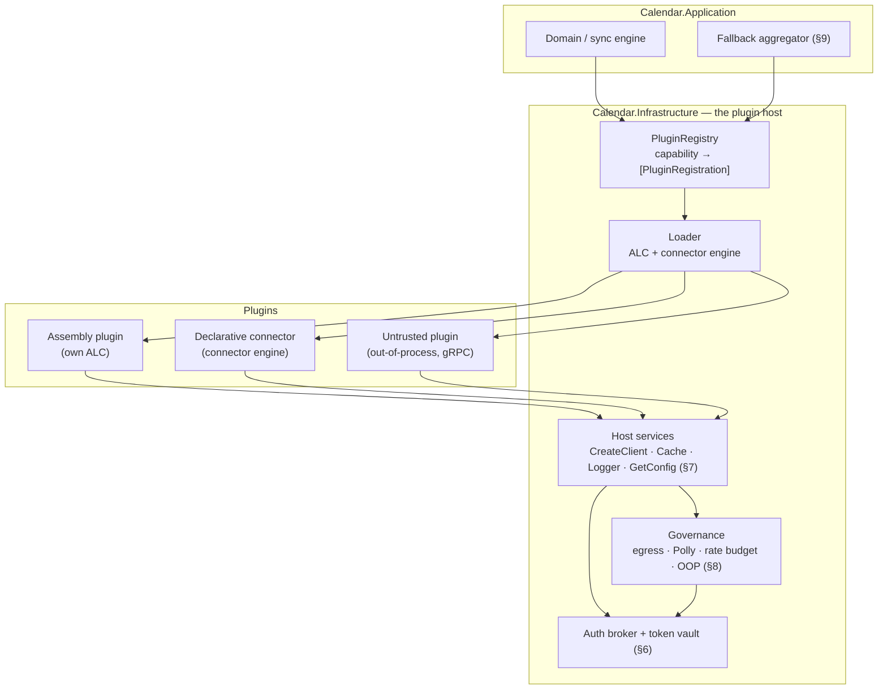
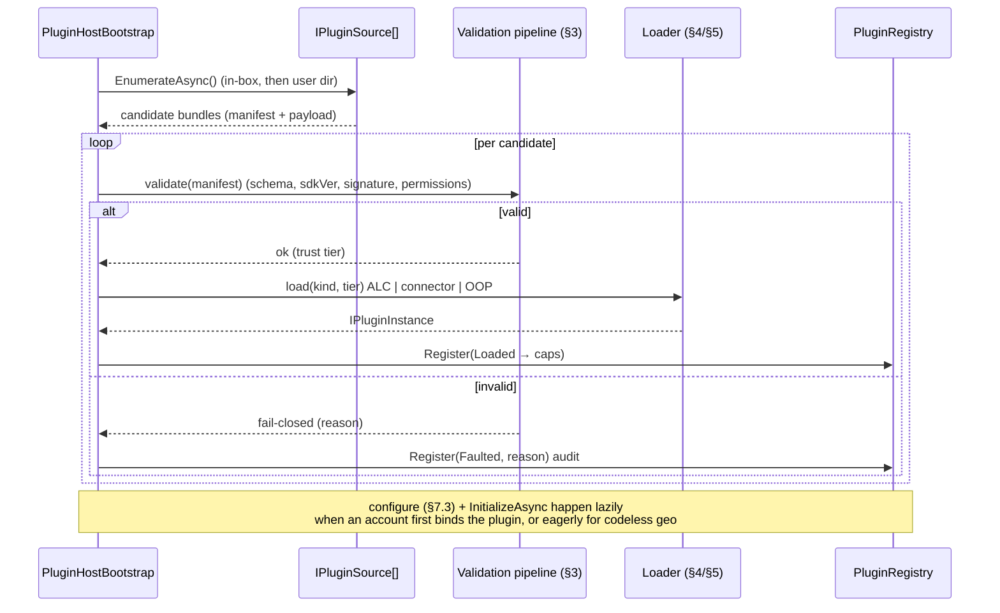
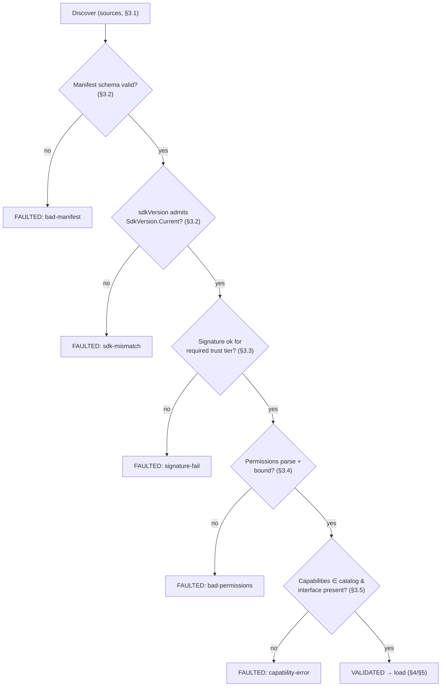
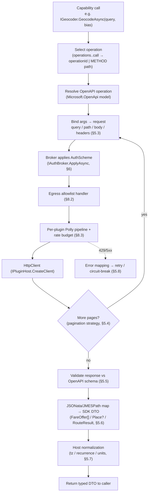
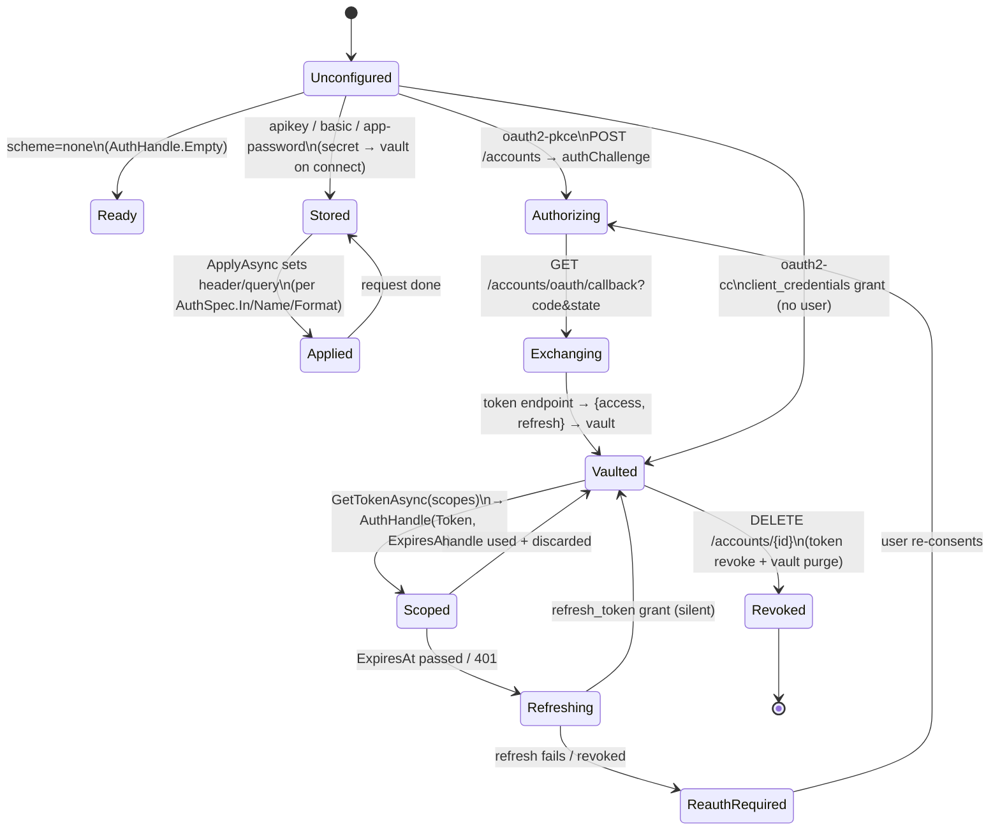
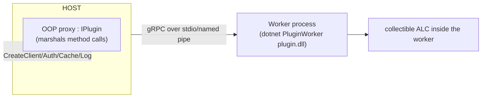
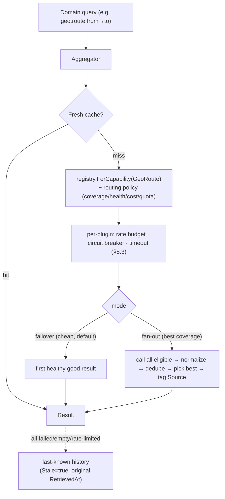
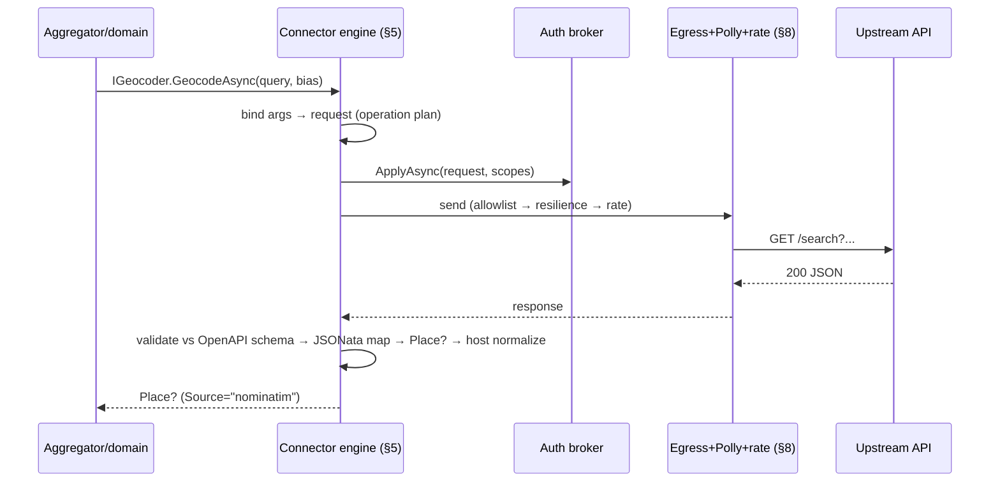

# Deep dive: the plugin host

The plugin host is the **backbone subsystem** that turns the "nothing hardcoded" principle
([ARCHITECTURE.md §1](ARCHITECTURE.md#1-design-principles)) into running code. It builds the
capability **registry**, discovers and validates plugins, loads them (collectible
`AssemblyLoadContext` for assembly plugins, the shared **connector engine** for declarative ones),
owns every secret through the **auth broker**, hands each plugin a tightly-scoped `IPluginHost`, and
sandboxes execution with an egress allowlist, per-plugin Polly resilience, a shared rate budget, and
optional out-of-process isolation.

This document is the implementation-depth expansion of
[PLUGINS.md §6 (auth broker)](PLUGINS.md#6-authentication-broker),
[§7 (loading, isolation & lifecycle)](PLUGINS.md#7-loading-isolation--lifecycle), and
[§8 (security & sandboxing)](PLUGINS.md#8-security--sandboxing). Every interface, DTO, and enum name
used here is pinned by [SDK-CONTRACT.md](SDK-CONTRACT.md) — where a name appears (`IPluginHost`,
`IAuthBroker`, `AuthHandle`, `PluginManifest`, `AuthScheme`, `CapabilityIds`, …) it is **exactly** that
type. The host lives in `Calendar.Infrastructure`
([ARCHITECTURE.md §18](ARCHITECTURE.md#18-solution-layout)) and is consumed by `Calendar.Application`
(registry/aggregator interfaces) and `Calendar.Api` (the ASP.NET Core entry point).

- [1. Where the host sits](#1-where-the-host-sits)
- [2. Host composition & startup](#2-host-composition--startup)
- [3. Discovery & validation pipeline](#3-discovery--validation-pipeline)
- [4. Assembly-plugin loading (collectible ALC)](#4-assembly-plugin-loading-collectible-alc)
- [5. Declarative connector engine](#5-declarative-connector-engine)
- [6. Auth broker (state machine)](#6-auth-broker-state-machine)
- [7. Host services implementation](#7-host-services-implementation)
- [8. Sandboxing & resource governance](#8-sandboxing--resource-governance)
- [9. Invocation & the aggregator](#9-invocation--the-aggregator)
- [10. Lifecycle sequence diagrams](#10-lifecycle-sequence-diagrams)
- [11. Failure modes & tests](#11-failure-modes--tests)
- [12. Sources](#12-sources)

---

## 1. Where the host sits

The host is the only thing that sits between the **domain/aggregator** (which speaks *capabilities*)
and the **plugins** (which speak *providers*). The core never names a provider; it asks the registry
"who does `geo.route`?" and gets back a list of `IPlugin` handles it can invoke through the SDK.



The registry is the single query surface; `GET /capabilities` and `GET /plugins`
([API.md](API.md#plugins--capabilities)) are thin projections of it.

---

## 2. Host composition & startup

### 2.1 DI wiring

The host is composed once at ASP.NET Core startup via a single extension method, then driven by a
hosted service that runs the lifecycle. Everything is singleton-scoped except per-plugin objects, which
are created by the loader and held in the registration record.

```csharp
// Calendar.Infrastructure/Hosting/PluginHostServiceCollectionExtensions.cs
public static IServiceCollection AddPluginHost(this IServiceCollection services, IConfiguration cfg)
{
    services.Configure<PluginHostOptions>(cfg.GetSection("PluginHost"));   // dirs, trust policy, budgets

    // Discovery sources (§3.1) — ordered; in-box first, user dir last (user can shadow but not in-box ids).
    services.AddSingleton<IPluginSource, InBoxDirectorySource>();          // ./plugins (first-party, shipped)
    services.AddSingleton<IPluginSource, UserDirectorySource>();           // %APPDATA%/Calendar/plugins
    // future: RegistryUrlSource (signed marketplace) — same IPluginSource contract.

    services.AddSingleton<IManifestReader, YamlManifestReader>();          // plugin.yaml → PluginManifest
    services.AddSingleton<IManifestValidator, ManifestValidator>();        // §3.2 schema + sdkVersion + caps
    services.AddSingleton<ISignatureVerifier, DetachedSignatureVerifier>();// §3.3 trust tiers
    services.AddSingleton<IPermissionParser, PermissionParser>();          // §3.4 network/config/capabilities

    services.AddSingleton<IAssemblyPluginLoader, CollectibleAlcLoader>();  // §4
    services.AddSingleton<IConnectorEngine, ConnectorEngine>();            // §5
    services.AddSingleton<IOutOfProcessHost, GrpcStdioHost>();            // §8.4

    services.AddSingleton<ITokenVault, DataProtectionTokenVault>();        // §6 encrypted vault
    services.AddSingleton<IAuthBroker, AuthBroker>();                      // §6 — the ONE auth component

    services.AddSingleton<IPluginRegistry, PluginRegistry>();              // §2.2 capability index
    services.AddSingleton<PluginHostServices>();                          // factory for per-plugin IPluginHost (§7)

    services.AddHostedService<PluginHostBootstrap>();                      // §2.3 runs discover→…→register at boot
    return services;
}
```

`PluginHostOptions` carries the directory list, the trust-tier policy
(in-box / signed / community / local-dev → in-proc vs out-of-proc), and the default resource budgets.

### 2.2 The registry as a `capability → [plugin]` index

The registry is the only thing the domain and aggregator touch. It is keyed on the **`Capability`
enum** ([SDK-CONTRACT.md §2.4](SDK-CONTRACT.md#24-capability-id-catalog)), never on a provider id. A
plugin that implements several capabilities (e.g. a geo provider doing both `geo.geocode` and
`geo.places`) appears under each.

```csharp
public sealed record PluginRegistration(
    PluginManifest Manifest,
    IReadOnlyList<Capability> Capabilities,
    PluginState State,                 // Discovered, Validated, Loaded, Configured, Running, Faulted, Unloaded
    IPluginInstance Instance);         // wraps the IPlugin (in-proc) OR the OOP proxy (§8.4)

public interface IPluginRegistry
{
    // The ONLY query the domain/aggregator use — by capability, never by provider name.
    IReadOnlyList<PluginRegistration> ForCapability(Capability capability);
    bool TryGet(string pluginId, out PluginRegistration reg);          // host-internal (config, lifecycle)
    IReadOnlyDictionary<Capability, IReadOnlyList<string>> Snapshot(); // → GET /capabilities
    void Register(PluginRegistration reg);
    void Remove(string pluginId);                                      // on unload/upgrade
}
```

Internally it is a `ConcurrentDictionary<Capability, ImmutableList<PluginRegistration>>` plus an
id→registration map. Mutations (register/remove during hot-swap, §4.3) swap the immutable list
atomically so in-flight `ForCapability` enumerations are never torn. Only `Running` registrations are
returned to callers; a `Faulted` or `Configured`-but-not-running plugin is filtered out so a half-loaded
plugin can't be dispatched to.

The domain asks the question exactly as [PLUGINS.md §1](PLUGINS.md#1-concepts) draws it:

```csharp
foreach (var reg in registry.ForCapability(Capability.GeoRoute))
    // aggregator fans out / fails over across these — it does not know "OSRM" or "Google" (§9)
```

### 2.3 Startup sequence

`PluginHostBootstrap` (an `IHostedService`) runs the full lifecycle once on start and tears it down on
stop. Discovery and validation are sequential and **fail-closed per plugin** (a bad plugin is skipped,
audited, and surfaced in `GET /plugins` with `status:"faulted"` — it never aborts host startup).



Configuration and `IPlugin.InitializeAsync` are **deferred** until an account is bound to the plugin
(an `ACCOUNT` in [ARCHITECTURE.md §9](ARCHITECTURE.md#9-domain-model) carries `AuthRef` + config), so an
installed-but-unconfigured plugin consumes no auth or network. Codeless, no-auth geo connectors
(self-hosted Nominatim/OSRM with `AuthScheme.None`) may be initialized eagerly at boot.

---

## 3. Discovery & validation pipeline

The exact order is **discover → manifest-schema → sdkVersion → signature/trust → permissions →
capability-binding**. Each gate **fails closed**: on failure the plugin is marked `Faulted` with a
reason, audited ([PLUGINS.md §8](PLUGINS.md#8-security--sandboxing) item 6), and never advances to load.



### 3.1 Sources (`IPluginSource`)

| Source | Location | Trust default | Notes |
| --- | --- | --- | --- |
| **In-box** | `./plugins` (shipped) | `in-box` | First-party (Google, CalDAV, ICS, MapLibre…). Always trusted; in-proc. |
| **User dir** | `%APPDATA%/Calendar/plugins` (or `$XDG_DATA_HOME`) | `community` / `signed` | Sideloaded bundles; tier from signature (§3.3). |
| **Registry/URL** *(future)* | signed marketplace | `signed` | `POST /plugins {source:url, signature}` ([API.md](API.md#plugins--capabilities)); downloaded to user dir, then same pipeline. |

A **bundle** is the package from [PLUGINS.md §10](PLUGINS.md#10-distribution--versioning): `plugin.yaml`
+ (`*.dll` for assembly | `openapi.yaml` + mapping for declarative) + detached signature. Sources are
ordered; an id discovered in-box wins over a user-dir bundle claiming the same id (you cannot shadow a
first-party plugin), and duplicate ids within the same tier are rejected.

### 3.2 Manifest schema + `sdkVersion`

1. `YamlManifestReader` deserializes `plugin.yaml` → `PluginManifest`
   ([SDK-CONTRACT.md §2.3](SDK-CONTRACT.md#23-manifest-types)). Missing required fields, an unknown
   `kind`, or an `auth.scheme` outside `AuthScheme` → **fail-closed `bad-manifest`**.
2. The host parses `manifest.SdkVersion` with `SdkVersionRange.Parse` and rejects any plugin whose range
   does **not** admit `SdkVersion.Current` ([SDK-CONTRACT.md §1](SDK-CONTRACT.md#1-versioning--compatibility-policy)).
   A plugin built for a different **major** is rejected; an additive **minor** newer than the host is
   rejected (host can't satisfy members it doesn't have). → **`sdk-mismatch`**.

```csharp
if (!SdkVersion.IsCompatible(manifest.SdkVersion))
    return Fault(manifest, "sdk-mismatch",
        $"plugin requires SDK {manifest.SdkVersion}; host is {SdkVersion.Current}");
```

### 3.3 Signature & trust-tier verification

`DetachedSignatureVerifier` checks `manifest.Publisher.Signature`
([SDK-CONTRACT.md §2.3](SDK-CONTRACT.md#23-manifest-types), `PluginPublisher`) over a canonical hash of
the whole bundle against the host's trusted publisher keyset.

| Tier | Requirement | Execution |
| --- | --- | --- |
| **in-box** | shipped path identity (no external sig needed) | in-proc |
| **signed** | valid detached signature from a trusted publisher key | in-proc |
| **community** | unsigned **or** untrusted key | **out-of-process** (§8.4) |
| **local-dev** | explicitly opted in via `PluginHostOptions` (dev only) | in-proc, audited loudly |

Assembly plugins that resolve to an untrusted tier are **not refused** — they are forced
out-of-process. A *signature that claims a trusted publisher but fails verification* is a hard
**`signature-fail`** (fail-closed), distinct from "simply unsigned." Declarative connectors carry no
code, so an unsigned community connector still runs in-engine (its risk is data, not code —
[PLUGINS.md §2](PLUGINS.md#2-the-two-plugin-kinds)); the signature still gates *provenance* claims.

> **Status:** the out-of-process worker (§8.4) is the deferred half of
> [ADR-0007](adr/0007-alc-isolation-out-of-process.md). Until it lands, the marketplace **rejects**
> community-tier assembly bundles outright (fail-closed) rather than loading untrusted code in-proc;
> the `Marketplace:AllowUnsigned` local-dev escape hatch is the only exception.

### 3.4 Permission-manifest parsing

`PermissionParser` turns the manifest into the enforced permission set:

- **`network.allow`** → compiled host-pattern matchers for the egress handler (§7.1/§8.2). Patterns are
  `"api.duffel.com"`, `"*.caldav.icloud.com"`, or `"*"` ([SDK-CONTRACT.md `NetworkSpec`](SDK-CONTRACT.md#23-manifest-types)).
  An empty/missing allowlist is **deny-all** (fail-closed), not allow-all.
- **`config`** → the JSON Schema is compiled once for both `GetConfig<T>` validation (§7.3) and the
  schema-driven settings UI ([PLUGINS.md §9](PLUGINS.md#9-schema-driven-configuration-ui)).
- **`auth`** → the `AuthSpec` the broker will run (§6); endpoints may also come from the OpenAPI
  `securitySchemes` for declarative plugins.

A malformed allowlist pattern, an unparseable config schema, or an `AuthSpec` missing fields its scheme
requires (e.g. `oauth2-pkce` with no `AuthorizationUrl`) → **`bad-permissions`**.

### 3.5 Capability binding

Each id in `manifest.Capabilities` must exist in `CapabilityIds`
([SDK-CONTRACT.md §2.4](SDK-CONTRACT.md#24-capability-id-catalog)) and the loaded plugin must actually
implement the matching interface (§9 table). For an assembly plugin the host checks the type implements
e.g. `IRouteProvider` for `geo.route`; for a declarative connector it checks the manifest declares an
`operations.<name>` for each method of the capability interface (§5.2). A mismatch → **`capability-error`**.

---

## 4. Assembly-plugin loading (collectible ALC)

### 4.1 One collectible `AssemblyLoadContext` per plugin

Each assembly plugin loads into its **own collectible `AssemblyLoadContext`**
([ARCHITECTURE.md §2](ARCHITECTURE.md#2-technology-stack), [PLUGINS.md §7](PLUGINS.md#7-loading-isolation--lifecycle)).
This gives **dependency isolation** (two plugins can ship different versions of `Ical.Net`,
`Newtonsoft.Json`, MSAL, etc. without colliding) and **unloadability** (hot upgrade without restarting
the app).

The critical rule is the **single shared contract boundary**: `Calendar.Plugin.Abstractions` is the
**only** assembly that crosses the host↔plugin line ([SDK-CONTRACT.md preamble](SDK-CONTRACT.md)). It is
**not** loaded into the plugin's ALC; the ALC's resolver *defers* it (and the BCL, and
`Microsoft.Extensions.Logging.Abstractions`) to the **default** context so that the host's `IPlugin`,
`PluginManifest`, `AuthHandle`, etc. are the *same `Type` identity* on both sides. If the contract were
duplicated per-ALC, an `IPlugin` from the plugin would not be assignable to the host's `IPlugin` and
every cast would fail.

```csharp
internal sealed class PluginLoadContext : AssemblyLoadContext
{
    private readonly AssemblyDependencyResolver _resolver;
    private static readonly HashSet<string> Shared = new()  // resolved by the DEFAULT context, never copied in
    {
        "Calendar.Plugin.Abstractions",
        "Microsoft.Extensions.Logging.Abstractions",
        // (the BCL is shared implicitly)
    };

    public PluginLoadContext(string mainDllPath)
        : base(name: Path.GetFileNameWithoutExtension(mainDllPath), isCollectible: true)
        => _resolver = new AssemblyDependencyResolver(mainDllPath);

    protected override Assembly? Load(AssemblyName name)
    {
        if (Shared.Contains(name.Name!)) return null;        // → fall back to Default ALC (shared identity)
        var path = _resolver.ResolveAssemblyToPath(name);     // plugin's private deps (its own .deps.json)
        return path is null ? null : LoadFromAssemblyPath(path);
    }

    protected override IntPtr LoadUnmanagedDll(string unmanagedDllName)
    {
        var p = _resolver.ResolveUnmanagedDllToPath(unmanagedDllName);
        return p is null ? IntPtr.Zero : LoadUnmanagedDllFromPath(p);
    }
}
```

`AssemblyDependencyResolver` reads the plugin's `*.deps.json`, so its private dependency closure is
isolated to its own folder.

### 4.2 Load → register

```csharp
public IPluginInstance Load(BundleRef bundle)
{
    var alc = new PluginLoadContext(bundle.MainDllPath);
    var asm = alc.LoadFromAssemblyPath(bundle.MainDllPath);
    var type = asm.GetTypes().Single(t => typeof(IPlugin).IsAssignableFrom(t) && !t.IsAbstract);
    var plugin = (IPlugin)Activator.CreateInstance(type)!;
    // Manifest cross-check: plugin.Manifest.Id must equal the bundle's manifest id (anti-spoof).
    return new InProcInstance(alc, plugin);   // holds a WeakReference<ALC> for unload verification (§4.4)
}
```

`InitializeAsync(host, ct)` is **not** called here — it runs at configure time (§7.3) once the account's
config and auth are bound.

### 4.3 Upgrade = hot-swap (load new, then unload old)

A plugin upgrade ([PLUGINS.md §10](PLUGINS.md#10-distribution--versioning)) is **not** an in-place
mutation. The host loads the **new** version into a **fresh** ALC, registers it, atomically swaps the
registry entry so new calls route to v2, drains in-flight v1 calls (bounded by their per-plugin
`CancellationToken`, §7.4), then unloads the **old** ALC.

```mermaid
sequenceDiagram
    participant H as Host
    participant V2 as New ALC (v2)
    participant Reg as Registry
    participant V1 as Old ALC (v1)
    H->>V2: load + validate + Initialize
    H->>Reg: atomically replace registration (v1 → v2)
    Note over Reg: new ForCapability() calls hit v2
    H->>V1: cancel per-plugin CT; await in-flight drain (timeout)
    H->>V1: instance = null; Unload(); GC.Collect ×2 (§4.4)
    V1-->>H: WeakReference dead → unload confirmed (or leak alarm)
```

This is what makes "the host upgrades a plugin … no downtime" concrete. If the new version fails
validation, the swap never happens and v1 keeps serving.

### 4.4 The unmanaged-handle / GC caveat of collectible unload

Collectible ALC unload is **cooperative and best-effort**, not deterministic. After dropping the last
reference and calling `alc.Unload()`, the assemblies are freed only once the GC observes that **nothing
outside the ALC** still references anything **inside** it. Known leak sources and the host's mitigations:

| Hazard | Why it pins the ALC | Host mitigation |
| --- | --- | --- |
| Host keeps a strong ref to the `IPlugin` (or any of its types) | the instance roots the ALC | registry drops the `IPlugin`/`InProcInstance` *before* `Unload()`; only a `WeakReference<AssemblyLoadContext>` is kept to verify |
| Static/event subscriptions (e.g. plugin subscribed to a host event, timers, `static` caches) | host object roots plugin delegate | host services are per-plugin and disposed; the per-plugin `CancellationTokenSource` is cancelled+disposed; the scoped `ILogger`/`HttpClient`/cache are released |
| Unmanaged/native libraries loaded by the plugin (e.g. a native SNI/crypto/`sni.dll`-style dependency) | native handles aren't tracked by the managed GC and can hold the ALC | the plugin handles `AssemblyLoadContext.Unloading` to free native handles; **plugins with native deps are preferentially run out-of-process (§8.4)** where unload = process kill |
| Running threads / unawaited tasks started in the ALC | a live thread roots its stack | per-plugin `CancellationToken` cancels; drain has a hard timeout, after which the ALC is declared leaked |
| A `Type`/`MethodInfo` inspected by a debugger or reflection cache | runtime/debugger holds it | documented dev caveat; not present in release |

The host's unload routine forces the issue and **verifies**:

```csharp
public bool Unload(InProcInstance inst, TimeSpan timeout)
{
    var weak = inst.UnloadAlc();                 // null out instance refs + alc.Unload()
    for (int i = 0; i < 10 && weak.IsAlive; i++)
    {
        GC.Collect(); GC.WaitForPendingFinalizers(); GC.Collect();  // 2 passes: finalizers may re-root once
    }
    if (weak.IsAlive)                            // leak: assemblies still mapped
    {
        Audit("alc-unload-leak", inst.PluginId); // surfaced; plugin flagged, host stays up
        return false;
    }
    return true;
}
```

A confirmed leak is an **operational alarm**, not a crash: the registry entry is gone (no new calls
route to it) but the assemblies stay mapped until process exit. The audit lets us catch a misbehaving
plugin. Since .NET 9, `FixedAddressValueType` statics live in the Pinned Object Heap rather than behind
a GC handle, removing one historical pin source — but native handles remain the dominant real-world
cause, which is exactly why untrusted/native plugins default to out-of-process. (Sources: §12.)

---

## 5. Declarative connector engine

The connector engine is the host's **shared interpreter** that makes a manifest + OpenAPI + JSONata
mapping behave as a real `IPlugin` ([PLUGINS.md §4](PLUGINS.md#4-declarative-connectors-read-apis--load-them),
[SDK-CONTRACT.md §8](SDK-CONTRACT.md#8-declarative-connectors-satisfy-the-same-interfaces)). The core
**cannot tell** an engine-backed plugin from a hand-written DLL — both answer `capability → [plugins]`
identically. There is no ALC; declarative plugins are data.

### 5.1 Dispatch flow



### 5.2 Parse OpenAPI & bind capability methods → operations

At load, `Microsoft.OpenApi.Readers` parses the referenced document into an `OpenApiDocument`. Each
`operations.<name>` in the manifest names the capability method it implements (the `<name>` matches the
SDK method, e.g. `geocode` → `IGeocoder.GeocodeAsync`) and a `call:` that is **either** an `operationId`
**or** a `METHOD path` pair ([PLUGINS.md §4](PLUGINS.md#4-declarative-connectors-read-apis--load-them)).
The engine resolves `call` to a concrete `OpenApiOperation` (path + verb + parameter + requestBody +
responses schema) once, at load, and caches a compiled `OperationPlan` per capability method.

The engine then synthesizes the capability interface(s): for `capabilities: [geo.geocode]` it exposes an
`IGeocoder` whose `GeocodeAsync`/`ReverseGeocodeAsync` are routed to the bound operations; an unbound
required method → `capability-error` at validation (§3.5).

### 5.3 Parameter binding (capability args → request)

The method's argument record (`FareQuery`, `GeoBias`, a `GeoPoint`, …) is exposed to a small binding
expression context as `q` (and nested members `q.bias.lang`, etc.). The manifest's `query` / `path` /
`body` / `headers` blocks bind those into the request, with `{...}` placeholders resolved against the
arg context (see the Nominatim example in [SDK-CONTRACT.md §8](SDK-CONTRACT.md#8-declarative-connectors-satisfy-the-same-interfaces)):

| Manifest block | Bound into | Null handling |
| --- | --- | --- |
| `query` | URL query string (validated against the operation's `query` parameters) | a placeholder resolving to null/absent is **omitted** (e.g. `viewbox: "{q.bias.viewbox}"`) |
| `path` | path template segments (`/v2/places/{id}`) | required; a null path param is a binding error |
| `body` | JSON request body (validated against `requestBody` schema) | structural; built via JSONata over `q` |
| `headers` | request headers | omitted when null |

The binder type-checks against the OpenAPI parameter schema (e.g. a `DateOnly` → the spec's
`format: date` string) and rejects a binding the spec can't accept at **load**, not at call time.

### 5.4 Pagination strategies

Declared in the manifest (`operations.<name>.pagination`), the engine loops `request → map → continue?`
until exhausted or a host page cap is hit, concatenating mapped items:

| Strategy | Manifest shape | Loop rule |
| --- | --- | --- |
| `none` | (default) | single request |
| `cursor` | `{ kind: cursor, nextField: "meta.after", param: "after" }` | feed the response's `nextField` back as `param` until it's null |
| `page` | `{ kind: page, param: "page", start: 1, until: "empty" }` | increment until an empty page / `totalPages` |
| `offset` | `{ kind: offset, param: "offset", size: "limit", pageSize: 50 }` | advance `offset += pageSize` until short page |
| `link` | `{ kind: link, rel: "next" }` | follow RFC 5988 `Link: rel=next` (re-checked against egress allowlist) |

Pagination runs **inside** one logical capability call, under the same resilience pipeline and rate
budget, so a paginated geocode/fare search still counts as governed work.

### 5.5 Response validation against the spec

Before mapping, the engine validates the response body against the operation's response schema
(`responses["200"].content["application/json"].schema`) resolved from the `OpenApiDocument`. A response
that doesn't match (missing required field, wrong type) → `connector-mapping` fault surfaced to the
aggregator as a provider error (so failover can pick another provider, §9), and audited. Validation is
**advisory-strict**: configurable to "warn" for lenient upstreams, but defaults to reject so a malformed
upstream never silently produces a half-built `RemoteEvent`/`FareOffer`.

### 5.6 Mapping expression → SDK DTO

The `map:` expression (JSONata, with JMESPath as an alternative dialect —
[ARCHITECTURE.md §2](ARCHITECTURE.md#2-technology-stack)) transforms the validated JSON into the
capability's exact return DTO ([SDK-CONTRACT.md §4–§6](SDK-CONTRACT.md#9-capability--interface-index)).
The engine evaluates JSONata via **`Jsonata.Net.Native`** (no JS engine, ~100× faster than wrapping
jsonata.js via Jint; self-contained JSON DOM) and JMESPath via **`JmesPath.Net`** (Sources: §12). The
expression output is deserialized into the strongly-typed record:

- `geo.geocode` → `Place?` (`$[0]` best hit; empty array → `null`, the normal "no result" case —
  [SDK-CONTRACT.md §6.2](SDK-CONTRACT.md#62-geocoding-geogeocode-and-place-search-geoplaces)).
- `flight.price` → `FareOffer[]` (each carrying `Source` and `DeepLink` the aggregator needs).
- `geo.route` → `RouteResult` with **`DurationSec` + `Geometry` only**; the engine forces
  `LeaveByUtc = null` and `Feasible = true` because those are **host-computed**
  ([SDK-CONTRACT.md §6.3](SDK-CONTRACT.md#63-routing-georoute)). A `map` that tries to set them is
  ignored (the host owns them — that's what keeps providers interchangeable).

`Source` is stamped to the manifest `id` (e.g. `"nominatim"`, `"duffel"`) if the map didn't set it, so
attribution/dedupe in the aggregator always has a winning-provider tag.

### 5.7 Time-zone / recurrence normalization handed to the host

The engine does **not** let a connector invent calendar semantics. After mapping, the host's shared
normalizer ([ARCHITECTURE.md §10](ARCHITECTURE.md#10-sync-engine)) takes over for any calendar-shaped
DTO:

- **Time zones**: resolve provider tz ids/offsets to IANA, convert `StartUtc`/`EndUtc` to UTC for
  storage, keep `TimeZoneId` for rendering ([SDK-CONTRACT.md `RemoteEvent`](SDK-CONTRACT.md#4-calendar-capabilities)).
  All-day `DTEND`-exclusive adjustment is host-side.
- **Recurrence**: an `Rrule` string is **stored as a rule**, never materialized; expansion (Ical.Net)
  happens per visible range. A connector returns the master + rule; it does not emit expanded
  occurrences.
- **Units**: routing geometry normalized to polyline precision-5; durations to seconds.

This is why a declarative `calendar.read` connector is viable at all — the hard calendar math lives in
the host, not the mapping expression (the genuinely stateful calendar protocols — CalDAV XML, Graph
delta — stay assembly plugins, [PLUGINS.md §4](PLUGINS.md#4-declarative-connectors-read-apis--load-them)).

### 5.8 Error mapping

The engine maps HTTP outcomes to the resilience pipeline (§8.3) and to SDK exceptions:

| Upstream | Engine action |
| --- | --- |
| `429` (+ `Retry-After`) | honor `Retry-After`; Polly retry w/ jitter; charge the rate budget; repeated → circuit-break |
| `5xx` | Polly retry (bounded) → circuit-break → fallback (aggregator failover, §9) |
| `408` / timeout | Polly timeout strategy → retry |
| `401` / `403` | refresh auth once via broker (§6); persistent → surface as auth fault (re-consent) |
| `404` on a `Place?`/single-result op | map to `null` (legitimate empty), not an error |
| schema-invalid `200` | `connector-mapping` fault (§5.5) → provider error to aggregator |

---

## 6. Auth broker (state machine)

The auth broker is the **single host component** that runs **all** authentication so plugins never see
client secrets or stored tokens ([PLUGINS.md §6](PLUGINS.md#6-authentication-broker),
[SDK-CONTRACT.md §3](SDK-CONTRACT.md#3-auth-broker)). A plugin's only contact with auth is
`IAuthBroker.GetTokenAsync(scopes, ct)` (→ a scoped, short-lived `AuthHandle`) or
`IAuthBroker.ApplyAsync(request, scopes, ct)` (broker mutates the request directly — preferred, the
plugin never touches the secret). Endpoints come from the `AuthSpec` or the OpenAPI `securitySchemes`.

### 6.1 Per-account credential state machine



### 6.2 Scheme handling

| `AuthScheme` | What the broker does | `AuthHandle` shape |
| --- | --- | --- |
| `None` | nothing (still egress-gated) | `AuthHandle.Empty` |
| `ApiKey` | inject per `AuthSpec.In` (`header`/`query`), `Name`, `Format` (e.g. `"Bearer {token}"`) | `Token` set; applied as header/query |
| `Basic` | `Authorization: Basic base64(user:pass)` over TLS | `Username`/`Password` |
| `AppPassword` | Basic with the provider **app-specific** password (iCloud/Fastmail/Nextcloud — [caldav-plugin.md §3](deep-dives/caldav-plugin.md#3-auth-per-host)) | `Username`/`Password` |
| `OAuth2Pkce` | full PKCE dance (§6.3); silent refresh | `Token` (bearer) + `ExpiresAt` |
| `OAuth2ClientCredentials` | `client_credentials` grant (machine-to-machine, no user) | `Token` + `ExpiresAt` |

The broker **never** returns `client_id`/`client_secret` or the refresh token; `AuthHandle.Token` is a
freshly-minted, short-lived access token the plugin applies and discards
([SDK-CONTRACT.md §3](SDK-CONTRACT.md#3-auth-broker)).

### 6.3 PKCE flow (the OAuth2 path)

Matches `POST /accounts` → `authChallenge` → `GET /accounts/oauth/callback`
([API.md](API.md#accounts--connect-flow), [UI-WIREFRAMES.md](UI-WIREFRAMES.md)). The host owns the whole
dance; the plugin contributes only manifest fields.

```mermaid
sequenceDiagram
    participant UI as Web (Blazor)
    participant API as Calendar.Api
    participant B as Auth broker
    participant V as Token vault
    participant IdP as Provider IdP
    UI->>API: POST /accounts {pluginId, config}
    API->>B: begin(pluginId, AuthSpec)
    B->>B: gen code_verifier + S256 challenge + state (CSRF), bind to pluginId/scopes
    B-->>API: authChallenge.redirectUrl (authorizationUrl + challenge + scopes + redirect_uri)
    API-->>UI: 200 { authChallenge:{ redirectUrl } }
    UI->>IdP: open redirectUrl (user consents)
    IdP-->>API: GET /accounts/oauth/callback?code&state
    API->>B: complete(code, state)
    B->>B: validate state; load code_verifier
    B->>IdP: POST tokenUrl (code + code_verifier + redirect_uri)  [no client_secret for public PKCE]
    IdP-->>B: { access_token, refresh_token, expires_in }
    B->>V: store {access, refresh} encrypted, keyed by AccountId.AuthRef
    B-->>API: connected → ACCOUNT.AuthRef set
    API-->>UI: 302 back; status:"connected"
```

After connect, every call goes: plugin → `GetTokenAsync(scopes)`/`ApplyAsync` → broker checks
`ExpiresAt`; if stale it silently runs the `refresh_token` grant, re-vaults, and issues a fresh
`AuthHandle`. The requested `scopes` must be a subset of the manifest's declared scopes (else rejected).
Refresh failure (revoked/expired refresh token) → `ReauthRequired`; the host surfaces a re-consent
prompt and the account goes `status:"needs-reauth"`. `DELETE /accounts/{id}` revokes upstream where
supported and **purges the vault entry**.

### 6.4 Vault & callback routing

- **Vault**: `DataProtectionTokenVault` encrypts at rest (ASP.NET Core Data Protection / OS keystore;
  the cloud relay never sees tokens — [ARCHITECTURE.md §8](ARCHITECTURE.md#8-storage--hybrid-local-first):
  "tokens stay on the authorizing device"). Keyed by `ACCOUNT.AuthRef`
  ([ARCHITECTURE.md §9](ARCHITECTURE.md#9-domain-model)).
- **Callback routing**: a single `GET /accounts/oauth/callback` endpoint serves **all** OAuth plugins;
  the `state` parameter (opaque, broker-minted, CSRF-bound) carries which pending authorization it
  belongs to — so a new OAuth provider needs **no new host route**, only manifest fields. This is the
  concrete payoff of "a new OAuth provider needs no host code"
  ([SDK-CONTRACT.md §3](SDK-CONTRACT.md#3-auth-broker)).

---

## 7. Host services implementation

`PluginHostServices` builds one `IPluginHost` per plugin instance and passes it to
`InitializeAsync(host, ct)` ([SDK-CONTRACT.md §2.2](SDK-CONTRACT.md#22-ipluginhost--the-only-services-a-plugin-is-given)).
It is the plugin's **entire** view of the outside world — no ambient `HttpClient`, no secret store, no
file system.

### 7.1 `CreateClient()` — egress-filtered `HttpClient`

`CreateClient()` returns an `HttpClient` whose handler chain enforces the manifest network allowlist
**before a byte leaves**, then applies auth, then the resilience/rate pipeline:

```
HttpClient
 └─ EgressAllowlistHandler   (§8.2 — fail-closed against manifest.network.allow)
     └─ AuthDelegatingHandler (broker.ApplyAsync for the plugin's scheme; §6)
         └─ ResilienceHandler  (per-plugin Polly pipeline + rate limiter; §8.3)
             └─ SocketsHttpHandler (pooled)
```

Each plugin gets its **own** handler stack (its own allowlist matcher, its own circuit-breaker state,
its own rate bucket) so one plugin's open circuit or exhausted budget never affects another. The client
is created via the `IHttpClientFactory`/typed-client machinery (named per plugin id) so the underlying
`SocketsHttpHandler` is pooled and rotated, while the per-plugin delegating handlers stay distinct.

### 7.2 `IPluginCache`

A namespaced key/value cache ([SDK-CONTRACT.md `IPluginCache`](SDK-CONTRACT.md#22-ipluginhost--the-only-services-a-plugin-is-given))
prefixed by plugin id so plugins can't read each other's entries. Values are opaque `byte[]`; TTL is
advisory and the host may evict under budget pressure. Backed by the local SQLite cache
([ARCHITECTURE.md §8](ARCHITECTURE.md#8-storage--hybrid-local-first)); this is where geocode results
(mandatory for Nominatim policy compliance — [PLUGIN-RESEARCH.md](PLUGIN-RESEARCH.md)) and sync
snapshots live.

### 7.3 `GetConfig<T>()` — schema-validated config

At configure time the host validates the account's stored settings against the **compiled
`manifest.config` JSON Schema** (§3.4). On success it caches the validated document; `GetConfig<T>()`
deserializes it into the plugin's POCO `T`
([SDK-CONTRACT.md §2.2](SDK-CONTRACT.md#22-ipluginhost--the-only-services-a-plugin-is-given)). If
validation failed, configure fails-closed and the plugin never initializes — so `GetConfig<T>()` inside
a running plugin can assume validity (it throws only if called on a plugin that didn't pass configure).
The same compiled schema drives the auto-generated settings form
([PLUGINS.md §9](PLUGINS.md#9-schema-driven-configuration-ui)), so the UI and the runtime validate
against one source.

### 7.4 Scoped logger & per-plugin `CancellationToken`

- **Logger**: a scoped `Microsoft.Extensions.Logging.ILogger`
  ([SDK-CONTRACT.md §2.2](SDK-CONTRACT.md#22-ipluginhost--the-only-services-a-plugin-is-given)) tagged
  with the plugin id and account id; its sink is host-controlled and feeds the audit trail
  ([PLUGINS.md §8](PLUGINS.md#8-security--sandboxing) item 6). Plugins must not log secrets; the broker
  never hands them any to log.
- **CancellationToken**: each plugin instance has a host-owned `CancellationTokenSource`. The token
  passed to `InitializeAsync`, `SyncAsync`, `SearchAsync`, etc. is linked to it, so the host can cancel
  **all** of a plugin's in-flight work on unload/upgrade/disable/budget-trip (§4.3, §8). Cancelling +
  disposing the CTS is also part of the unload cleanup that lets the ALC collect (§4.4).

---

## 8. Sandboxing & resource governance

.NET has no full code-access-security sandbox, so isolation is **structural**
([PLUGINS.md §8](PLUGINS.md#8-security--sandboxing)): own the secrets (§6), constrain the surface
(`IPluginHost` is all a plugin gets), enforce the permission manifest, budget resources, and isolate
untrusted code in a separate process.

### 8.1 Capability gating

A plugin can only be dispatched for a capability it **declared and implements** (§3.5). The registry
returns a plugin under `Capability.GeoRoute` only if it passed binding for `geo.route`; the domain has no
other route to invoke it. Declaring a capability you don't implement fails validation; implementing one
you didn't declare is never reached (the registry never indexes it).

### 8.2 The egress allowlist handler

`EgressAllowlistHandler` is the structural heart of network sandboxing
([PLUGINS.md §8](PLUGINS.md#8-security--sandboxing) item 2): "the `HttpClient` literally cannot reach
other hosts."

```csharp
protected override Task<HttpResponseMessage> SendAsync(HttpRequestMessage req, CancellationToken ct)
{
    var host = req.RequestUri!.Host;
    if (!_allow.IsMatch(host))                       // compiled from manifest.network.allow (§3.4)
    {
        Audit("egress-blocked", _pluginId, host);    // outbound-host audit
        throw new EgressBlockedException(host);      // FAIL-CLOSED: no byte leaves
    }
    return base.SendAsync(req, ct);
}
```

- **Fail-closed**: an empty/missing allowlist denies all; only listed hosts (incl. wildcards like
  `*.caldav.icloud.com`) pass. It is the **outermost** handler so it also guards redirect targets and
  pagination `Link` follows (§5.4) — a `302`/`rel=next` to an off-list host is blocked.
- **Per-plugin**: the matcher is built from *that* plugin's manifest; a user-entered Nextcloud URL adds a
  per-account allowlist entry at connect time ([caldav-plugin.md §12](deep-dives/caldav-plugin.md#12-manifest)).
- **Audited**: every outbound host is logged for the audit trail.

### 8.3 Per-plugin Polly pipeline + shared rate budget

Each plugin's `ResilienceHandler` runs a **Polly v8 `ResiliencePipeline`** whose strategies execute
outermost-first ([PLUGINS.md §8](PLUGINS.md#8-security--sandboxing) item 5; Sources: §12). The order:

```
overall-timeout                          (whole-call budget, incl. retries)
 └─ rate-limiter (token bucket, shared)   (§8.3 — System.Threading.RateLimiting)
     └─ retry (jittered, honors Retry-After)
         └─ circuit-breaker               (per host/provider; opens on sustained 5xx/429)
             └─ attempt-timeout           (single try)
                 └─ fallback              (→ aggregator failover / stale history, §9)
```

```csharp
var pipeline = new ResiliencePipelineBuilder<HttpResponseMessage>()
    .AddTimeout(opts.OverallTimeout)
    .AddRateLimiter(plugin.RateLimiter)                  // shared bucket (below)
    .AddRetry(new() { MaxRetryAttempts = 3, BackoffType = DelayBackoffType.Exponential, UseJitter = true,
                      ShouldHandle = Http429Or5xx, DelayGenerator = RespectRetryAfter })
    .AddCircuitBreaker(new() { FailureRatio = 0.5, MinimumThroughput = 10,
                               BreakDuration = TimeSpan.FromSeconds(30), ShouldHandle = Http5xx })
    .AddTimeout(opts.AttemptTimeout)
    .Build();
```

**Rate budget** — `System.Threading.RateLimiting.TokenBucketRateLimiter` (Sources: §12) enforces the
per-plugin request budget and is the **same limiter instance the aggregator holds**, so the budget is
honored whether a call originates from a plugin's own `HttpClient` or from the aggregator fanning out
(§9). This satisfies provider ToS rate caps (e.g. Nominatim 1 req/s, partner-gated hotel content —
[PLUGIN-RESEARCH.md](PLUGIN-RESEARCH.md)):

```csharp
plugin.RateLimiter = new TokenBucketRateLimiter(new()
{
    TokenLimit = budget.Burst,                 // bucket capacity
    TokensPerPeriod = budget.PerPeriod,        // e.g. 1
    ReplenishmentPeriod = budget.Period,       // e.g. 1s  → Nominatim's 1 req/s
    QueueProcessingOrder = QueueProcessingOrder.OldestFirst,
    QueueLimit = budget.Queue,
    AutoReplenishment = true
});
```

A budget-exhausted call doesn't error blindly — it queues up to `QueueLimit`, then the aggregator treats
it as "provider unavailable" and fails over / serves stale (§9).

### 8.4 Out-of-process execution for untrusted plugins

Untrusted tiers (community / unsigned assembly, native-dep plugins) run **out-of-process** behind
**gRPC over stdio (or a named pipe)** ([PLUGINS.md §7–§8](PLUGINS.md#7-loading-isolation--lifecycle)),
so a crash or hostile plugin can't read host memory or take down the app.

**Trust → location decision** (§3.3): in-box/signed → in-proc ALC (§4); community/unsigned → out-of-proc;
native-dependency plugins are *preferentially* out-of-proc because of the unload-leak hazard (§4.4).



- **Process model**: the host spawns a `PluginWorker` child (`dotnet PluginWorker.dll <bundle>`), which
  loads the plugin into a collectible ALC *inside the worker* and serves a gRPC service over the pipe.
  The host holds an **OOP proxy** that implements the same capability interface; the registry can't tell
  it apart from an in-proc instance.
- **DTO marshalling**: only `Calendar.Plugin.Abstractions` DTOs cross the boundary, serialized
  (protobuf/`MessagePack`) over gRPC. **Host services are reverse-marshalled**: when the plugin calls
  `host.CreateClient()` / `Auth.ApplyAsync` / `Cache` / `Logger`, the worker forwards the call back to
  the host over the same channel — so the **egress allowlist, auth broker, and budgets still run
  host-side** (the worker has no direct network/secret access either). Secrets never leave the host
  process.
- **Crash isolation**: a worker crash surfaces as a broken channel → the affected calls fault (aggregator
  fails over, §9), the registration goes `Faulted`, and the host **respawns** the worker with a backoff
  (circuit-broken if it crash-loops). The host stays up; no memory is shared to corrupt.
- **Lifecycle**: disable/unload/upgrade kills the worker process (clean, deterministic teardown — no ALC
  unload-leak risk, §4.4). Health is liveness-pinged over gRPC; an unresponsive worker is killed and
  respawned.

---

## 9. Invocation & the aggregator

A capability call routes **registry → resilience pipeline → plugin(s)**, and for **interchangeable**
capabilities through the fallback aggregator ([ARCHITECTURE.md §15](ARCHITECTURE.md#15-multi-provider-fallback-aggregator)).
Interchangeable = `flight.price`, `stay.price`, `geo.route`, `geo.geocode`, `geo.places`
([SDK-CONTRACT.md §2.4](SDK-CONTRACT.md#24-capability-id-catalog)). Non-interchangeable capabilities
(`calendar.read/write`, `itinerary.import`, `notify`, and the **single chosen** `geo.tiles`) invoke a
specific bound plugin directly — no fan-out.



- **Routing policy** picks the primary by **coverage** (`FareCoverage`/`RouteCoverage`
  [SDK-CONTRACT.md §5–§6](SDK-CONTRACT.md#5-itinerary--pricing)), health (circuit state), cost, and
  **remaining rate budget** (§8.3) — not a fixed order. A provider whose `Coverage` doesn't serve the
  market/mode is skipped before any call (e.g. OSRM has no transit → `RouteCoverage.Transit == false`,
  so a transit query fails over to Google — [geo-routing-plugin.md](deep-dives/geo-routing-plugin.md)).
- **Fan-out + merge** normalizes results, dedupes (flights on
  `Carrier+FlightNo+DepartUtc+ArriveUtc`; stays on accommodation/geo —
  [SDK-CONTRACT.md §5.2](SDK-CONTRACT.md#52-flight--stay-pricing-flightprice--stayprice)), keeps the
  best, and stamps the winning `Source` for deep-link/attribution.
- **`geo.route` host-computed fields**: each provider returns `DurationSec`/`Geometry`; the host then
  computes `LeaveByUtc = arriveBy − DurationSec − buffer` and `Feasible = gap ≥ DurationSec`
  ([SDK-CONTRACT.md §6.3](SDK-CONTRACT.md#63-routing-georoute)) — *after* the aggregator picks the
  winner, because that math is provider-independent.
- **Graceful degradation**: when every provider is down/empty/rate-limited, the aggregator returns
  last-known history with `Stale = true` and the original `RetrievedAt`
  ([SDK-CONTRACT.md §5.2](SDK-CONTRACT.md#52-flight--stay-pricing-flightprice--stayprice),
  [travel-fares-plugin.md](deep-dives/travel-fares-plugin.md)). `geo.tiles` degrades differently — to a
  **bundled default style**, not "the next provider" ([geo-tiles-plugin.md](deep-dives/geo-tiles-plugin.md)).
- **Observability**: per query the host records which plugins were tried, hit/miss, latency, and the
  winning source ([ARCHITECTURE.md §15](ARCHITECTURE.md#15-multi-provider-fallback-aggregator)).

---

## 10. Lifecycle sequence diagrams

### 10.1 Full lifecycle: discover → validate → load → register → configure → run → unload

```mermaid
sequenceDiagram
    autonumber
    participant Boot as Host bootstrap
    participant Val as Validation (§3)
    participant Load as Loader (§4/§5/§8.4)
    participant Reg as Registry
    participant Acct as Account / configure (§7.3)
    participant Br as Auth broker (§6)
    participant Plug as Plugin

    Boot->>Val: discover bundle → validate (schema, sdkVer, sig, perms, caps)
    Val-->>Boot: VALIDATED (+ trust tier)
    Boot->>Load: load (in-proc ALC | connector engine | OOP worker)
    Load-->>Reg: Register(Loaded → capabilities)
    Note over Reg: plugin visible in GET /plugins (status: loaded), not yet running

    Acct->>Br: connect (apikey/app-pw store, or PKCE dance) → AuthRef
    Acct->>Plug: configure: validate config vs schema, build IPluginHost
    Acct->>Plug: InitializeAsync(host, ct)
    Plug-->>Reg: state = Running
    Note over Reg: ForCapability() now returns this plugin

    loop normal operation
        Reg->>Plug: capability call (Sync/Search/Route…) via resilience pipeline (§8)
        Plug->>Br: GetTokenAsync/ApplyAsync (fresh handle)
        Plug-->>Reg: typed DTO
    end

    Note over Boot,Plug: upgrade = load v2 + swap + drain + unload v1 (§4.3)
    Boot->>Reg: Remove(plugin) ; cancel per-plugin CT
    Boot->>Load: Unload ALC (verify weakref) | kill OOP worker
    Load-->>Boot: unloaded (or alc-unload-leak alarm, §4.4)
```

### 10.2 Declarative connector call (no ALC)



## 11. Failure modes & tests

| # | Failure mode | Trigger | Host behavior (fail-closed) | Test |
| --- | --- | --- | --- | --- |
| 1 | **Bad manifest** | missing field / unknown `kind` / bad `auth.scheme` | `Faulted: bad-manifest`; skipped; in `GET /plugins` as faulted; host stays up | feed malformed `plugin.yaml`; assert not registered, reason surfaced, other plugins load |
| 2 | **SDK mismatch** | `sdkVersion` major ≠ host, or minor > host | `Faulted: sdk-mismatch`; never loaded | manifest `sdkVersion:"2.x"` vs host `1.0.0` → rejected at validate; `"1.0"` accepted |
| 3 | **Signature fail** | sig claims trusted publisher but fails verify | `Faulted: signature-fail` (hard); unsigned community → forced OOP instead | tamper a bundle byte; assert reject; assert unsigned assembly → out-of-proc |
| 4 | **ALC unload leak** | native handle / lingering ref / live thread pins ALC | `Unload` returns false → `alc-unload-leak` audit; no new calls route; host up | load plugin with a native dep + rooted static; assert weakref alive → alarm; assert OOP variant unloads cleanly |
| 5 | **Connector mapping error** | response fails OpenAPI schema / JSONata throws | `connector-mapping` fault → provider error → aggregator fails over; audited | give the engine an off-spec `200`; assert no half-built DTO, failover picks another provider |
| 6 | **Egress violation blocked** | request/redirect/`rel=next` to off-allowlist host | `EgressBlockedException` before send; `egress-blocked` audit | plugin attempts a host not in `network.allow`; assert thrown + audited + no socket opened; assert wildcard match passes |
| 7 | **OAuth refresh failure** | refresh token revoked/expired | state → `ReauthRequired`; account `needs-reauth`; re-consent prompt; no crash | revoke upstream; assert single silent refresh attempt then graceful re-auth path |
| 8 | **Out-of-proc crash recovery** | worker process crashes mid-call | broken channel → call faults → aggregator failover; worker respawned w/ backoff; circuit-break on crash-loop | kill the worker during a `SearchAsync`; assert failover, respawn, host unaffected |
| 9 | **Rate-budget exhaustion** | calls exceed token-bucket budget (e.g. >1 req/s Nominatim) | queue up to `QueueLimit`, then treat as unavailable → failover / serve stale `Stale=true` | hammer a 1 req/s plugin; assert pacing, then stale-history fallback with original `RetrievedAt` |
| 10 | **Sync token invalidation** | provider `410`/CTag divergence | plugin throws `SyncResetRequiredException`; host wipes token + re-runs full sync | force `410`; assert token cleared, full re-sync, idempotent upserts |
| 11 | **Write concurrency conflict** | `412` on `calendar.write` | `ConcurrencyConflictException`; host re-fetches + merges | stale `ChangeTag` write; assert conflict surfaced + merge path |
| 12 | **Hot upgrade no-downtime** | v2 installed over v1 | load v2 → swap registry → drain v1 → unload v1; in-flight v1 calls finish | upgrade under load; assert no dropped calls, v1 ALC collected, new calls hit v2 |

Integration tests run in `Calendar.Integration.Tests`
([ARCHITECTURE.md §18](ARCHITECTURE.md#18-solution-layout)) against containerized upstreams
(Radicale/Nextcloud for CalDAV, a stub OpenAPI server for the connector engine) so no live third-party
credentials are needed in CI.

---

## 12. Sources

- AssemblyLoadContext collectibility & unload caveats (cooperative unload, strong GC handle during
  unload, native-handle pinning, .NET 9 Pinned Object Heap for `FixedAddressValueType`):
  <https://learn.microsoft.com/en-us/dotnet/standard/assembly/unloadability>,
  <https://github.com/dotnet/runtime/blob/main/docs/design/features/unloadability.md>,
  <https://learn.microsoft.com/en-us/dotnet/core/tutorials/creating-app-with-plugin-support>
- Native-dependency unload hazard (real-world ALC-won't-unload example):
  <https://github.com/dotnet/SqlClient/issues/414>
- `System.Threading.RateLimiting` `TokenBucketRateLimiter` (token-bucket options, HTTP handler usage):
  <https://learn.microsoft.com/en-us/dotnet/api/system.threading.ratelimiting.tokenbucketratelimiter?view=aspnetcore-9.0>,
  <https://learn.microsoft.com/en-us/dotnet/core/extensions/http-ratelimiter>,
  <https://devblogs.microsoft.com/dotnet/announcing-rate-limiting-for-dotnet/>
- Polly v8 resilience pipelines (strategy ordering: outer timeout → retry → circuit breaker → inner
  timeout → fallback): <https://www.pollydocs.org/>,
  <https://www.pollydocs.org/strategies/circuit-breaker.html>,
  <https://github.com/App-vNext/Polly/blob/main/docs/migration-v8.md>
- JSONata/JMESPath .NET evaluators (`Jsonata.Net.Native` — no JS engine, self-contained JSON DOM;
  `JmesPath.Net`): <https://github.com/mikhail-barg/jsonata.net.native>,
  <https://www.nuget.org/packages/Jsonata.Net.Native/>, <https://github.com/jdevillard/JmesPath.Net>
- `Microsoft.OpenApi` (read OpenAPI specs at load time):
  <https://learn.microsoft.com/en-us/aspnet/core/fundamentals/openapi/>
- Internal: [PLUGINS.md](PLUGINS.md), [SDK-CONTRACT.md](SDK-CONTRACT.md), [ARCHITECTURE.md](ARCHITECTURE.md),
  [API.md](API.md), [PLUGIN-RESEARCH.md](PLUGIN-RESEARCH.md),
  [deep-dives/caldav-plugin.md](deep-dives/caldav-plugin.md).
