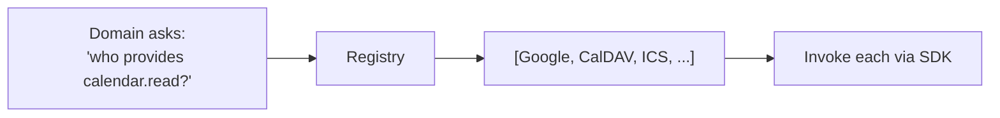

# Plugin & capability system

The rule is **nothing hardcoded**. Every integration — calendars, travel, fares, map tiles, geocoding,
routing, notifications — is a **plugin** discovered at runtime. The core knows only **capabilities**,
never specific services. Built-in providers (Google, Microsoft, CalDAV, ICS, TripIt, MapLibre…) ship as
**first-party plugins** so they exercise the exact same SDK as third parties.

- [1. Concepts](#1-concepts)
- [2. The two plugin kinds](#2-the-two-plugin-kinds)
- [3. Manifest specification](#3-manifest-specification)
- [4. Declarative connectors (read APIs & load them)](#4-declarative-connectors-read-apis--load-them)
- [5. Assembly plugins & the SDK contract](#5-assembly-plugins--the-sdk-contract)
- [6. Authentication broker](#6-authentication-broker)
- [7. Loading, isolation & lifecycle](#7-loading-isolation--lifecycle)
- [8. Security & sandboxing](#8-security--sandboxing)
- [9. Schema-driven configuration UI](#9-schema-driven-configuration-ui)
- [10. Distribution & versioning](#10-distribution--versioning)

---

## 1. Concepts

- **Capability** — a named contract the core understands (e.g. `calendar.read`, `flight.price`,
  `geo.route`). The capability catalog lives in [ARCHITECTURE.md §5](ARCHITECTURE.md#5-capability-catalog).
- **Plugin** — a unit that declares a manifest and provides one or more capabilities.
- **Registry** — the host index mapping `capability → [plugins]`. The domain layer queries it; it never
  references a provider by name.
- **Host services** — what a plugin is given at init: a scoped `HttpClient` (egress-filtered), the
  **auth broker**, a logger, a cache, and a config object validated against the plugin's schema.



## 2. The two plugin kinds

| | **Declarative connector** | **Assembly plugin** |
| --- | --- | --- |
| Form | Manifest + OpenAPI spec + field mapping | Compiled .NET DLL implementing SDK interfaces |
| Code? | **None** | Yes (C#) |
| Use for | REST/JSON APIs with standard auth | Non-REST or complex logic (CalDAV `REPORT`, Graph delta, sync tokens, EventKit bridge) |
| Isolation | Runs in the built-in **connector engine** | Own `AssemblyLoadContext`; optionally out-of-process |
| Safety | High (data, not code) — **default** | Requires signing / trust tier |

Most integrations should be **declarative**. Reach for an assembly plugin only when the protocol or
logic can't be expressed as "call endpoints, map JSON."

## 3. Manifest specification

Every plugin has a `plugin.yaml`. Common fields:

```yaml
id: com.acme.flights            # reverse-DNS unique id
name: Acme Flight Prices
version: 1.2.0
sdkVersion: "1.x"               # host refuses incompatible SDK majors
kind: declarative               # declarative | assembly
capabilities: [flight.price]    # must match the SDK capability catalog
publisher: { name: Acme, signature: <detached-sig> }

auth:                           # what the plugin needs; the HOST runs it
  scheme: oauth2-pkce           # none | apikey | basic | app-password | oauth2-pkce | oauth2-cc
  authorizationUrl: https://acme/oauth/authorize
  tokenUrl: https://acme/oauth/token
  scopes: [fares.read]

network:
  allow: ["api.acme.com"]       # egress allowlist — host blocks everything else

config:                         # JSON Schema → host auto-renders the settings form
  type: object
  properties:
    market: { type: string, title: "Market", default: "US" }
  required: []

# declarative only — see §4
openapi: ./acme-openapi.yaml
operations: { ... }
```

## 4. Declarative connectors (read APIs & load them)

A declarative plugin points at an **OpenAPI** document (read at load via `Microsoft.OpenApi`) and
declares **operations** that map endpoints to capability methods. A **mapping expression**
(JSONata/JMESPath) converts the API's JSON into the domain model. No compilation, no deploy.

```yaml
openapi: ./acme-openapi.yaml
operations:
  searchFares:                          # implements flight.price → SearchFares
    call: GET /v2/flights/cheapest      # operationId or method+path from the spec
    query:                              # bind capability args → request params
      origin: "{q.from}"
      destination: "{q.to}"
      departureDate: "{q.date}"
    map: |                              # response JSON → FareOffer[]  (JSONata)
      results[].{
        "price":    price.total,
        "currency": price.currency,
        "from":     segments[0].departure.iataCode,
        "to":       segments[-1].arrival.iataCode,
        "date":     segments[0].departure.at,
        "deepLink": links.book
      }
```

The connector engine handles: auth (via broker), pagination (declared in the manifest), retries/backoff
(Polly), egress filtering, response validation against the OpenAPI schema, and time-zone/recurrence
normalization handed to the host. The **same approach serves** `calendar.read` (map JSON events →
`Event`), `stay.price`, `geo.geocode`, `geo.route`, etc. — any capability whose I/O is JSON.

> When an API isn't quite standard (odd pagination, signed requests, GraphQL, XML/CalDAV), write an
> **assembly plugin** instead — same manifest, real code.

## 5. Assembly plugins & the SDK contract

Plugins compile against **`Calendar.Plugin.Abstractions`** — a small, stable, semver'd assembly. It is
the *only* shared type boundary between host and plugin. The excerpt below is a summary; the **complete,
authoritative surface (every interface, DTO, and enum) is pinned in [SDK-CONTRACT.md](SDK-CONTRACT.md)** —
when names differ, that document wins.

```csharp
namespace Calendar.Plugin.Abstractions;

public interface IPlugin
{
    PluginManifest Manifest { get; }
    Task InitializeAsync(IPluginHost host, CancellationToken ct);
}

// Host services handed to every plugin (plugins never touch secrets or arbitrary network).
public interface IPluginHost
{
    HttpClient CreateClient();                 // egress-filtered to manifest.network.allow
    IAuthBroker Auth { get; }                  // get scoped, short-lived tokens
    IPluginCache Cache { get; }
    ILogger Logger { get; }
    T GetConfig<T>();                          // validated against manifest.config schema
}

// Capability contracts (one interface per capability in the catalog):
public interface ICalendarSource : IPlugin {
    Task<IReadOnlyList<RemoteCalendar>> ListCalendarsAsync(CancellationToken ct);
    Task<SyncResult> SyncAsync(string remoteCalendarId, string? syncToken, CancellationToken ct);
}
public interface IFlightPricing : IPlugin {
    FareCoverage Coverage { get; }
    Task<IReadOnlyList<FareOffer>> SearchAsync(FareQuery q, CancellationToken ct);
}
public interface IRouteProvider : IPlugin {
    Task<RouteResult> RouteAsync(GeoPoint from, GeoPoint to, TravelMode mode, DateTimeOffset when, CancellationToken ct);
}
public interface IGeocoder : IPlugin {
    Task<GeoPoint?> GeocodeAsync(string query, GeoBias? bias, CancellationToken ct);
    Task<Place?> ReverseGeocodeAsync(GeoPoint point, CancellationToken ct);   // map click-to-place
}
public interface IPlaceSearch : IPlugin {                                     // geo.places autocomplete
    Task<IReadOnlyList<PlaceSuggestion>> SuggestAsync(string query, GeoBias? bias, CancellationToken ct);
}
public interface ITileProvider : IPlugin {                                    // geo.tiles basemap/style
    Task<StyleDescriptor> GetStyleAsync(CancellationToken ct);                // MapLibre style URL/JSON + attribution
}
// ... ICalendarWriter, IItinerarySource, IStayPricing, INotifier
```

Adding a capability = adding an interface here. Existing plugins are unaffected (they simply don't
implement it).

## 6. Authentication broker

A single host component runs **all** auth so plugins never see client secrets or stored tokens — the
key to being provider-agnostic.

- Schemes: `none`, `apikey`, `basic`, `app-password`, `oauth2-pkce` (authorization code + PKCE),
  `oauth2-cc` (client credentials). Declared in the manifest; endpoints come from the manifest or the
  OpenAPI `securitySchemes`.
- Flow: host performs the OAuth dance → stores the refresh/access token in the **encrypted vault** →
  hands the plugin a **scoped, short-lived handle** at call time. Refresh is automatic.
- Result: a new OAuth provider needs **no host code** — just manifest fields.

## 7. Loading, isolation & lifecycle

```
discover ─▶ validate ─▶ load ─▶ register ─▶ configure ─▶ run ─▶ (unload/upgrade)
 dir/registry  sdkVer,sig,   ALC or       capabilities  schema-    sandboxed,
               permissions   connector    → registry    driven UI  budgeted
```

- **Assembly plugins** load into a **collectible `AssemblyLoadContext`** — independent dependency
  versions and **hot load/unload/upgrade** without restarting the app.
- **Declarative plugins** are data; the shared connector engine runs them (no ALC).
- **Untrusted code** can run **out-of-process** behind gRPC over stdio/named pipe, so a crash or hostile
  plugin can't read host memory or take down the app.

## 8. Security & sandboxing

.NET has no full code-access-security sandbox, so isolation is **structural**:

1. **Host owns secrets** (§6) — biggest risk removed.
2. **Permission manifest, enforced by host**: egress **allowlist** (the `HttpClient` literally cannot
   reach other hosts), declared capabilities only, config bounded by schema.
3. **Trust tiers**: in-box (first-party) · signed (verified publisher) · community · local-dev. Untrusted
   tiers default to **out-of-process**.
4. **Signature + SDK-version checks** before load.
5. **Resource budgets / circuit breakers** per plugin (shared with the fallback aggregator), so a plugin
   can't exhaust quota or hammer an API.
6. **Audit log** of plugin loads, permission grants, and outbound hosts.

## 9. Schema-driven configuration UI

A plugin's `config` JSON Schema drives the **auto-generated settings form** and the "Add account" flow.
No per-provider UI code. Auth scheme determines the connect button (e.g. "Sign in with…", "Enter API
key", "App-specific password"). This is what keeps the *UI* free of hardcoded providers too.

## 10. Distribution & versioning

- **Package**: manifest + (assembly | OpenAPI + mapping) + signature, as a single bundle.
- **Sources**: install from local file, URL, or a future registry/marketplace.
- **Versioning**: plugin `version` (semver) + `sdkVersion` compatibility range. The host upgrades a
  plugin by loading the new ALC and unloading the old — no downtime.
- **Compatibility promise**: the SDK contract assembly only makes additive changes within a major
  version; breaking changes bump the SDK major and plugins opt in.
