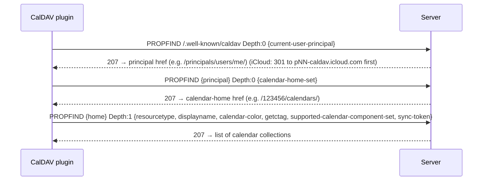

# Deep dive: the CalDAV plugin

CalDAV is the highest-leverage assembly plugin: one implementation gives **iCloud, Fastmail, Nextcloud,
mailbox.org, Posteo, Synology**, and any standards-compliant server. It's also the trickiest, because
unlike a clean REST API it's **WebDAV + XML + iCalendar** with per-host quirks. This document specifies
the plugin end to end.

- [1. What CalDAV is](#1-what-caldav-is)
- [2. Capability & SDK mapping](#2-capability--sdk-mapping)
- [3. Auth (per host)](#3-auth-per-host)
- [4. Discovery flow](#4-discovery-flow)
- [5. Enumerate calendars](#5-enumerate-calendars)
- [6. Initial event fetch](#6-initial-event-fetch)
- [7. Incremental sync](#7-incremental-sync)
- [8. Normalization to the domain model](#8-normalization-to-the-domain-model)
- [9. Write-back (later phase)](#9-write-back-later-phase)
- [10. .NET implementation notes](#10-net-implementation-notes)
- [11. Provider quirks](#11-provider-quirks)
- [12. Manifest](#12-manifest)
- [13. Failure modes & tests](#13-failure-modes--tests)

---

## 1. What CalDAV is

- **WebDAV (RFC 4918)** — HTTP extended with `PROPFIND` (read properties), `PROPPATCH`, `REPORT`,
  `MKCALENDAR`, plus `Depth` headers and `207 Multi-Status` XML responses.
- **CalDAV (RFC 4791)** — calendar collections of resources, each resource an **iCalendar** (RFC 5545)
  object (usually one `VEVENT` master + overrides). Adds the `calendar-query` and `calendar-multiget`
  REPORTs.
- **Sync (RFC 6578)** — the `sync-collection` REPORT returns a **sync-token** and the set of changed/
  removed resources since a prior token. The delta mechanism.
- **Discovery (RFC 6764)** — `/.well-known/caldav` + the `current-user-principal` /
  `calendar-home-set` properties locate a user's calendars without hardcoding paths.

So the plugin is: **discover → enumerate → fetch (initial) → sync (delta) → parse iCalendar → normalize.**

## 2. Capability & SDK mapping

Implements `ICalendarSource` (and later `ICalendarWriter`):

```csharp
public sealed class CalDavPlugin : ICalendarSource
{
    public PluginManifest Manifest { get; }
    public Task InitializeAsync(IPluginHost host, CancellationToken ct);          // grab HttpClient + creds
    public Task<IReadOnlyList<RemoteCalendar>> ListCalendarsAsync(CancellationToken ct);   // §4–5
    public Task<SyncResult> SyncAsync(string calendarUrl, string? syncToken, CancellationToken ct); // §6–7
}
```

`SyncResult { IReadOnlyList<RemoteEvent> Upserts; IReadOnlyList<string> Deletes; string NewSyncToken; }`.

## 3. Auth (per host)

**No OAuth** — CalDAV uses HTTP Basic over TLS. The host's auth broker supplies credentials via the
`app-password` / `basic` schemes; the plugin only sets the `Authorization: Basic` header.

| Host | Credential |
| --- | --- |
| **iCloud** | Apple ID + **app-specific password** (required; normal password fails with 2FA). |
| **Fastmail** | Username + **app password** (scoped to "Calendars (CalDAV)"). |
| **Nextcloud** | Username + password or **app password** (Settings → Security). |

The plugin **never stores** these — they live in the encrypted vault; the broker injects them per call.

## 4. Discovery flow



- **Base URLs** to seed discovery (then follow returned hrefs — never hardcode beyond these):
  iCloud `https://caldav.icloud.com` (expect a redirect to `https://pNN-caldav.icloud.com`),
  Fastmail `https://caldav.fastmail.com/dav/`, Nextcloud `https://<host>/remote.php/dav/`.
- **Always follow hrefs** from responses; resolve relative hrefs against the response URL.

Example `current-user-principal` request body:

```xml
<d:propfind xmlns:d="DAV:">
  <d:prop><d:current-user-principal/></d:prop>
</d:propfind>
```

## 5. Enumerate calendars

`PROPFIND` the calendar-home with `Depth: 1` and request these props per collection:

- `resourcetype` — keep only collections whose type contains `{urn:ietf:params:xml:ns:caldav}calendar`.
- `supported-calendar-component-set` — keep those advertising `VEVENT` (skip task-only `VTODO`).
- `displayname` → `RemoteCalendar.Name`.
- `{http://apple.com/ns/ical/}calendar-color` → `Color` (drop alpha hex if present).
- `getctag` (legacy change indicator) and/or `sync-token` → seed for delta.

Map each to `RemoteCalendar { RemoteId = collectionHref, Name, Color, IsReadOnly = !canWrite }`.

## 6. Initial event fetch

For each calendar, a `calendar-query` REPORT (`Depth: 1`), optionally time-bounded to the active window
(expand later as the user scrolls):

```xml
<c:calendar-query xmlns:d="DAV:" xmlns:c="urn:ietf:params:xml:ns:caldav">
  <d:prop><d:getetag/><c:calendar-data/></d:prop>
  <c:filter>
    <c:comp-filter name="VCALENDAR">
      <c:comp-filter name="VEVENT">
        <c:time-range start="20260101T000000Z" end="20270101T000000Z"/>
      </c:comp-filter>
    </c:comp-filter>
  </c:filter>
</c:calendar-query>
```

The `207` response yields, per resource: `href`, `getetag`, and `calendar-data` (raw iCalendar text).
Parse with Ical.Net. Persist each resource's **ETag** for change detection.

> Tip: for large calendars, first fetch only `getetag` (cheap), diff against stored ETags, then
> `calendar-multiget` just the changed hrefs to pull `calendar-data`.

## 7. Incremental sync

Prefer **`sync-collection`** (RFC 6578):

```xml
<d:sync-collection xmlns:d="DAV:">
  <d:sync-token>https://server/cal/123/sync/0042</d:sync-token>   <!-- empty on first run -->
  <d:sync-level>1</d:sync-level>
  <d:prop><d:getetag/></d:prop>
</d:sync-collection>
```

- Response = changed hrefs (with new ETags) + removed hrefs (`404` status) + a **new `sync-token`**.
- Fetch changed bodies via `calendar-multiget`; emit `Deletes` for removed hrefs; store the new token.
- **Fallback** when `sync-collection` is unsupported: compare the collection **CTag**; if changed, list
  ETags and diff against stored ones (the ETag-diff path from §6). iCloud and Nextcloud support
  `sync-collection`; always feature-detect and degrade gracefully.

## 8. Normalization to the domain model

| Domain field | From |
| --- | --- |
| `Event.RemoteId` | resource `href` |
| `Event.Uid` | iCalendar `UID` (stable across servers — feeds dedup) |
| `Event.Title` | `SUMMARY` |
| `Event.StartUtc`/`EndUtc` | `DTSTART`/`DTEND` (resolve `VTIMEZONE`; honor `VALUE=DATE` → all-day) |
| `Event.AllDay` | `DTSTART;VALUE=DATE` |
| `Event.Rrule` | `RRULE` on the master; `RECURRENCE-ID` overrides handled by Ical.Net |
| `Event.Location` → `Place` | `LOCATION` (then `geo.geocode`); `GEO` lat/lng if present |
| change token | resource `ETag` |

Recurrence is **not** materialized — store the master + rule; expand per visible range with Ical.Net.
Time zones: trust `VTIMEZONE`/IANA ids; convert to UTC for storage, render in the user's zone.

## 9. Write-back (later phase)

`ICalendarWriter` for `calendar.write`:

- **Create:** `PUT` a new `.ics` to `{calendarHref}/{newuid}.ics` with `If-None-Match: *`.
- **Update:** `PUT` with `If-Match: <etag>` (optimistic concurrency); on `412` re-fetch and merge.
- **Delete:** `DELETE` with `If-Match: <etag>`.
- Scheduling/invites (`SCHEDULE-*`) are a further step — defer.

## 10. .NET implementation notes

- **Custom HTTP methods:** `new HttpMethod("PROPFIND")`, `"REPORT"`; set `Depth` header (`0`/`1`),
  `Content-Type: application/xml; charset=utf-8`.
- **XML:** build/parse with `System.Xml.Linq` (`XDocument`/`XNamespace`). Namespaces: `DAV:`,
  `urn:ietf:params:xml:ns:caldav`, `http://apple.com/ns/ical/`, `http://calendarserver.org/ns/` (CTag).
- **207 Multi-Status:** iterate `<d:response>`; check per-prop `<d:status>` (a 207 can mix 200/404 per
  property — don't assume success).
- **Redirects:** allow them but capture the final URL (iCloud's principal redirect) to resolve relative
  hrefs correctly.
- **HttpClient:** comes from `IPluginHost.CreateClient()` (egress-filtered to the manifest allowlist);
  per-host timeouts + Polly retry/backoff for 429/5xx.
- **iCalendar:** Ical.Net for parse + RRULE expansion; do not roll your own.

## 11. Provider quirks

| Server | Notes |
| --- | --- |
| **iCloud** | Principal redirect to `pNN-caldav.icloud.com`; app-specific password mandatory; supports `sync-collection`; colors via Apple ns. |
| **Fastmail** | Clean RFC compliance; app password scoped to CalDAV; base `/dav/`. |
| **Nextcloud** | Base `/remote.php/dav/`; `sync-collection` + CTag; app passwords recommended. |
| **Google (CalDAV)** | Exists but **prefer the Google API plugin** (sync tokens, push, Holidays/Birthdays). Use CalDAV only as a fallback. |
| **Proton** | ❌ No CalDAV at all (E2E encryption) — see ICS share-link workaround in PLUGIN-RESEARCH.md. |

## 12. Manifest

```yaml
id: org.unifiedcalendar.caldav
name: CalDAV
kind: assembly
capabilities: [calendar.read]            # calendar.write later
auth:
  scheme: app-password                   # broker injects Basic creds
config:
  type: object
  properties:
    serverUrl: { type: string, title: "Server URL", description: "e.g. https://caldav.fastmail.com/dav/" }
    username:  { type: string, title: "Username / Apple ID" }
  required: [serverUrl, username]
network:
  allow: ["caldav.icloud.com", "*.caldav.icloud.com", "caldav.fastmail.com", "*"]  # tighten per preset
presets:                                  # UI shortcuts; just prefill serverUrl
  - { name: iCloud,    serverUrl: "https://caldav.icloud.com" }
  - { name: Fastmail,  serverUrl: "https://caldav.fastmail.com/dav/" }
  - { name: Nextcloud, serverUrl: "https://<host>/remote.php/dav/" }
```

> The wildcard egress is illustrative — production presets should pin hosts; a user-entered Nextcloud
> URL implies a per-account allowlist entry added at connect time.

## 13. Failure modes & tests

- **Auth:** 401 → surface "use an app-specific password" guidance (the #1 iCloud support issue).
- **No `sync-collection`:** verify CTag/ETag fallback path produces identical upserts/deletes.
- **Recurrence:** master + `RECURRENCE-ID` overrides + `EXDATE`; assert correct occurrence expansion.
- **All-day vs timed:** `VALUE=DATE`, multi-day all-day, and DST boundary events.
- **Time zones:** non-UTC `VTIMEZONE`, floating times, and unknown TZIDs.
- **Multi-Status partials:** a response mixing 200/404 per prop is parsed without dropping good data.
- **Large collections:** ETag-diff path avoids re-downloading unchanged resources.
- Integration tests run against a **Nextcloud/Radicale container** in CI (no live Apple/Fastmail creds).
