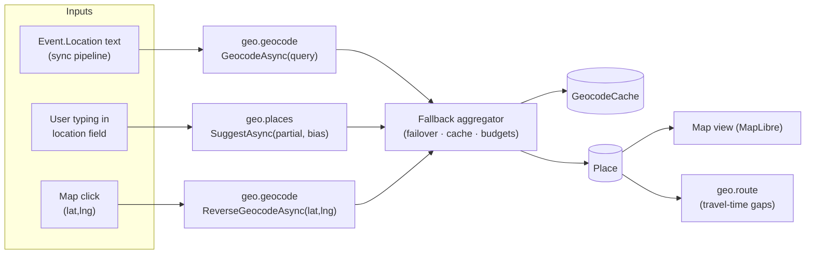
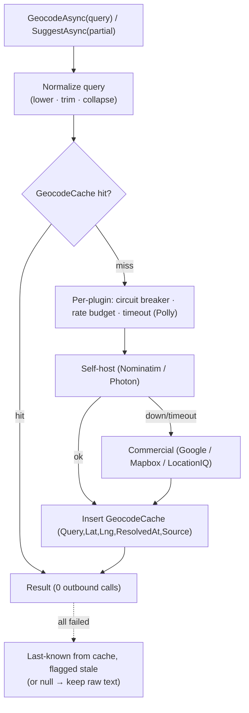

# Deep dive: the geocoding & place-search plugins (`geo.geocode` + `geo.places`)

These two capabilities turn **text into coordinates** and **coordinates into a chosen place**. They are
what make the map view, the location field in the event inspector, and every travel-time computation
possible: without them an `Event.Location` string is just text and a map click is just a pixel.

Unlike CalDAV (a gnarly assembly plugin), geocoding and place search are **plain REST + JSON**, so the
recommended providers ship as **declarative connectors** — manifest + OpenAPI + JSONata mapping, *no
code*. The default providers are **self-hosted** (Nominatim for `geo.geocode`, Photon for `geo.places`),
with commercial keyed plugins (Google, Mapbox, LocationIQ) as optional fallbacks behind the
[multi-provider fallback aggregator](../ARCHITECTURE.md#15-multi-provider-fallback-aggregator). This
document specifies both plugins end to end.

- [1. What these capabilities are](#1-what-these-capabilities-are)
- [2. Capability & SDK mapping](#2-capability--sdk-mapping)
- [3. Where results land: Place + GeocodeCache](#3-where-results-land-place--geocodecache)
- [4. Nominatim (`geo.geocode`, self-host)](#4-nominatim-geogeocode-self-host)
- [5. Photon (`geo.places`, self-host)](#5-photon-geoplaces-self-host)
- [6. Commercial keyed alternatives](#6-commercial-keyed-alternatives)
- [7. Aggregator behavior](#7-aggregator-behavior)
- [8. Privacy](#8-privacy)
- [9. Provider quirks](#9-provider-quirks)
- [10. Manifests](#10-manifests)
- [11. Failure modes & tests](#11-failure-modes--tests)
- [Sources](#sources)

---

## 1. What these capabilities are

Two distinct capabilities, deliberately separated in the [catalog](../ARCHITECTURE.md#5-capability-catalog)
because their *query shape* and *result shape* differ:

- **`geo.geocode`** — resolve one **location string → a single best `GeoPoint`** (forward geocode), and
  **coordinates → an address/place** (reverse geocode, for **map click-to-place**). One-shot, batch-y,
  cache-forever. Drives the sync pipeline: every new `Event.Location` is geocoded once and never again.
- **`geo.places`** — **search-as-you-type autocomplete**: a partial string + map bias → a **ranked list**
  of candidate places `[{label, lat, lng, source}]`. Interactive, latency-sensitive, fired on every
  keystroke (debounced). Drives the **location field** in the event inspector and the trip planner.

Both are **read-only**, both produce coordinates, and both feed the **same `Place` + `GeocodeCache`
tables** — a user's autocomplete *selection* is exactly the resolved coordinate a later sync would have
needed, so they share one cache (see §3 and §7).



Because all three capabilities (`geo.geocode`, `geo.places`, and `geo.route`) return **interchangeable
results for the same query**, they ride the aggregator automatically — one dead, slow, or rate-limited
provider never breaks a lookup.

## 2. Capability & SDK mapping

Two interfaces in `Calendar.Plugin.Abstractions` (the `IGeocoder` from
[PLUGINS.md §5](../PLUGINS.md#5-assembly-plugins--the-sdk-contract) gains a reverse method; `IPlaceSearch`
is the new sibling):

```csharp
namespace Calendar.Plugin.Abstractions;

// geo.geocode — one query in, one best point out (+ reverse for map click-to-place)
public interface IGeocoder : IPlugin
{
    Task<GeoPoint?> GeocodeAsync(string query, GeoBias? bias, CancellationToken ct);
    Task<GeoPoint?> ReverseGeocodeAsync(double lat, double lng, CancellationToken ct);
}

// geo.places — partial query in, ranked candidates out (autocomplete)
public interface IPlaceSearch : IPlugin
{
    Task<IReadOnlyList<PlaceSuggestion>> SuggestAsync(string partial, GeoBias? bias, CancellationToken ct);
}

public sealed record GeoPoint(double Lat, double Lng, string Label, string? Address, string Source);
public sealed record PlaceSuggestion(string Label, double Lat, double Lng, string? Address, string Source);
public sealed record GeoBias(double? Lat, double? Lng, BBox? ViewBox, string? Lang);  // map-center / viewport bias
public readonly record struct BBox(double MinLng, double MinLat, double MaxLng, double MaxLat);
```

- `GeocodeAsync` returns the **single best** `GeoPoint?` (`null` = no result — caller keeps the raw text).
- `SuggestAsync` returns a **ranked list**; the UI shows `label`, and on selection persists the chosen
  `(lat, lng)` straight into `Place` + `GeocodeCache` (the answer is already resolved — no second call).
- `Source` is the **winning provider id** (`nominatim`, `photon`, `google`, …), carried through for
  **attribution** and so the aggregator can tag which provider answered.
- `GeoBias` carries the **map center / viewport** so autocomplete and geocoding can prefer nearby results
  (Nominatim `viewbox`/`bounded`, Photon `lat`/`lon`/`bbox`, Google/Mapbox session+proximity).

> Both default providers (Nominatim, Photon) are **declarative connectors** — these interfaces are
> implemented by the shared **connector engine**, not by hand-written plugin DLLs. The manifest's
> `operations` + JSONata `map` (see §10) *is* the implementation. Reach for an assembly plugin only if a
> provider needs request signing or non-REST behavior (none of the providers here do).

## 3. Where results land: Place + GeocodeCache

The [domain model](../ARCHITECTURE.md#9-domain-model) already has both tables; geocoding/places are their
**writers**:

| Table | Columns (from ARCHITECTURE §9) | Written by |
| --- | --- | --- |
| `GEOCODE_CACHE` | `Query, Lat, Lng, ResolvedAt, Source` | every successful `geo.geocode` / accepted `geo.places` result |
| `PLACE` | `Id, Label, Lat, Lng, Address` | promoted from a cache hit when an `Event`/`TripItem` references a location |

Flow, keyed on a **normalized query**:

1. **Normalize the query** — lower-case, collapse whitespace, strip trailing punctuation — so
   `"Berlin"`, `"berlin "`, and `"BERLIN"` are **one** cache row (dedupe identical queries; see §7).
2. **Lookup `GeocodeCache[normalizedQuery]`.** Hit → return immediately, **zero outbound calls**. This is
   the policy-mandated cache for Nominatim *and* the cost control for commercial providers.
3. **Miss** → the aggregator calls providers (§7); on success **insert** `(Query, Lat, Lng, ResolvedAt,
   Source)`. Reverse geocodes cache under a rounded-coordinate key (e.g. 5-dp `lat,lng`) so repeated map
   clicks on the same spot don't re-call.
4. **Promote to `Place`** when an `Event.PlaceId`/`TripItem.PlaceId` needs it: `Place { Label, Lat, Lng,
   Address }`. `Place` is deduped by proximity + label so two events at the same address share one pin and
   one `geo.route` leg.

`ResolvedAt` enables **TTL/refresh** policy (geocodes are stable, so TTL is long — months — but a manual
"re-geocode" path exists for moved/renamed places). `Source` records provenance for attribution and lets
us purge results from a provider whose ToS forbids long-term caching (none of the self-host defaults do).

## 4. Nominatim (`geo.geocode`, self-host)

[Nominatim](https://nominatim.org/) is the OSM project's own geocoder: OSM data + PostgreSQL/PostGIS,
exposed as a tiny REST API. It is the **default `geo.geocode` provider** — **self-hosted**.

### 4.1 Endpoints & key params

**Forward — `GET /search`:**

| Param | Use |
| --- | --- |
| `q` | free-form query (`"1600 Amphitheatre Pkwy, Mountain View"`). **Cannot** combine with structured params. |
| `amenity`/`street`/`city`/`county`/`state`/`country`/`postalcode` | **structured** query (better precision when the `Event.Location` is already split). |
| `format` | `jsonv2` (our choice), `json`, `geojson`, `geocodejson`, `xml`. |
| `addressdetails` | `1` → include the parsed address breakdown → fills `GeoPoint.Address`. |
| `limit` | default 10, **max 40**; geocode uses `1` (best only), batch/disambiguation uses a few. |
| `viewbox` + `bounded` | bias (`viewbox=x1,y1,x2,y2`) or hard-restrict (`bounded=1`) to the current map viewport. |
| `accept-language` | preferred result language (e.g. `en`, `de`); falls back to local names. |
| `dedupe` | `1` (default) collapses duplicate OSM objects. |

**Reverse — `GET /reverse`** (powers **map click-to-place**): `lat`, `lon`, `zoom` (granularity:
~18 = building, ~10 = city), `format=jsonv2`, `addressdetails=1`.

### 4.2 Ranking — `importance`

Nominatim returns an **`importance`** score (0–1, derived from Wikipedia/OSM prominence) plus
`boundingbox`, `place_id`, `osm_id/osm_type`, `type`/`class`/`addresstype`, `display_name`, `lat`, `lon`.
For `geo.geocode` we take the **first result** (already sorted by importance); for disambiguation UIs we
surface the top few. `importance` is the field to expose if we ever rank Nominatim against other providers
in a fan-out merge.

### 4.3 Declarative mapping → GeoPoint

```yaml
operations:
  geocode:                                  # implements geo.geocode → GeocodeAsync
    call: GET /search
    query:
      q: "{q.query}"
      format: "jsonv2"
      addressdetails: "1"
      limit: "1"
      viewbox: "{q.bias.viewbox}"           # omitted when null
      "accept-language": "{q.bias.lang}"
    map: |                                   # JSONata: response[] → GeoPoint?
      $[0].{
        "Lat":     $number(lat),
        "Lng":     $number(lon),
        "Label":   display_name,
        "Address": display_name,
        "Source":  "nominatim"
      }
  reverse:                                   # implements geo.geocode → ReverseGeocodeAsync
    call: GET /reverse
    query: { lat: "{q.lat}", lon: "{q.lng}", format: "jsonv2", addressdetails: "1", zoom: "18" }
    map: |
      {
        "Lat": $number(lat), "Lng": $number(lon),
        "Label": display_name, "Address": display_name, "Source": "nominatim"
      }
```

`$[0]` selects the single best hit; an empty array maps to `null` → `GeocodeAsync` returns `null` → the
caller keeps the raw `Location` text and flags it un-geocoded (retry later).

### 4.4 ⚠️ The public endpoint usage policy — why we self-host

This is the load-bearing decision. The **public** Nominatim endpoint
(`https://nominatim.openstreetmap.org`) is governed by a strict
[usage policy](https://operations.osmfoundation.org/policies/nominatim/) that this app **cannot** ship
against:

- **Rate:** *"an absolute maximum of **1 request per second**."* Long-running / periodic scripts (i.e. our
  sync pipeline) are capped at **4 requests per minute**, single-threaded, no distributed scripts.
- **Caching is mandatory:** *"Results **must be cached** on your side."* (We do — see §3 — but the cap
  alone makes bulk sync geocoding infeasible.)
- **Headers:** a valid **`User-Agent` or `Referer`** identifying the app is required — *"stock
  User-Agents as set by http libraries will not do."*
- **Attribution:** ODbL — *"Clearly display attribution as suitable for your medium."*
- **The disqualifier:** the policy now states the public API
  *"**must not be built into, offered through, suggested by, or automatically generated by no-code,
  low-code, or vibe-coding platforms as a generic geocoding, address lookup, place search, or map search
  service.**"* It adds that LLMs *"may only suggest this service if they prominently point to this usage
  policy,"* and that *"Code generated by LLMs must adhere to all terms laid out in this policy."*

A plugin-driven, no-code-friendly calendar app that geocodes arbitrary event locations is **exactly** the
generic geocoding use the policy forbids on the shared endpoint. **Therefore: self-host.** Those
restrictions target the shared public server — **your own Nominatim instance has no such limits** (you
own the hardware), which is why this is the recommendation in
[PLUGIN-RESEARCH.md](../PLUGIN-RESEARCH.md#nominatim-geocoder--geogeocode--self-host) and
[ARCHITECTURE.md §7](../ARCHITECTURE.md#7-map-geocoding--routing). The `baseUrl` config defaults to a
self-host URL and the manifest ships **no** public-endpoint preset (§10). For managed deployments that
don't want to run infrastructure, a **commercial geocoder plugin** (§6) is the alternative — never the
public endpoint.

### 4.5 Self-hosting notes

The well-trodden path is the [`mediagis/nominatim-docker`](https://github.com/mediagis/nominatim-docker)
image (Nominatim + PostgreSQL + import tooling in one container):

| Decision | Country extract (e.g. Geofabrik `germany-latest.osm.pbf`) | Full planet |
| --- | --- | --- |
| **Disk** | tens–~100+ GB (Germany ≈ 108 GB container) | **≥ 1 TB**, NVMe strongly recommended |
| **RAM** | ~32 GB workable for a country | **128 GB+** recommended (don't report OOM under 64 GB) |
| **Import time** | hours (Germany ≈ 10 h) | **~2.5 days** on NVMe; 4–5 days on SATA SSD |
| **Use when** | you only need a region / a single-tenant deploy | global coverage |

- **PostgreSQL tuning** for import (per the docs): raise `maintenance_work_mem` (~10 GB),
  `shared_buffers` (~2 GB), `synchronous_commit = off`, larger `checkpoint_timeout`. Revert aggressive
  import settings for serving.
- **Updates:** apply OSM **diffs** (`replication`) on a cadence (daily/weekly) so the index doesn't drift;
  the Docker image supports a continuous-update mode.
- **Most users want a country/region extract**, not the planet — far cheaper, and the `geo.geocode`
  capability lets you add a second instance (or a commercial fallback) for out-of-region lookups.

## 5. Photon (`geo.places`, self-host)

[Photon (komoot)](https://github.com/komoot/photon) is an **OSM-based geocoder purpose-built for
search-as-you-type autocomplete** — typo-tolerant, prefix-matching, location-biased, multilingual. It is
the **default `geo.places` provider** — **self-hosted**.

### 5.1 Endpoint & params

**`GET /api`** (forward / autocomplete) and **`GET /reverse`** (coords → place):

| Param | Use |
| --- | --- |
| `q` | the partial query — fired per keystroke (debounced). |
| `lang` | result language (`en`, `de`, `default`). |
| `lat` + `lon` | **location bias** — rank results near the map center first. |
| `bbox` | restrict to a bounding box (the map viewport). |
| `limit` | number of suggestions (UI shows ~5). |
| `osm_tag` / `osm_value` | filter by OSM tag (e.g. only `place`, only `amenity`). |
| `layer` | filter by result type (e.g. `city`, `street`, `house`). |

### 5.2 Response & mapping → PlaceSuggestion

Photon returns a **GeoJSON `FeatureCollection`**: each `features[]` has
`geometry.coordinates = [lng, lat]` (GeoJSON order — **lng first**) and a `properties` bag
(`name`, `street`, `housenumber`, `city`, `state`, `country`, `postcode`, `osm_id`, `osm_type`, `type`).

```yaml
operations:
  suggest:                                  # implements geo.places → SuggestAsync
    call: GET /api
    query:
      q: "{q.partial}"
      lang: "{q.bias.lang}"
      lat: "{q.bias.lat}"                   # map-center bias
      lon: "{q.bias.lng}"
      bbox: "{q.bias.bbox}"
      limit: "5"
    map: |                                   # JSONata: FeatureCollection → PlaceSuggestion[]
      features.{
        "Label":   properties.name &
                   (properties.city ? ", " & properties.city : "") &
                   (properties.country ? ", " & properties.country : ""),
        "Lng":     geometry.coordinates[0],   /* GeoJSON: lng, lat */
        "Lat":     geometry.coordinates[1],
        "Address": properties.street,
        "Source":  "photon"
      }
```

The selected suggestion already carries `(Lat, Lng)`, so accepting it writes straight to `Place` +
`GeocodeCache` (§3) — **no follow-up details call**, unlike Google (§6).

### 5.3 Self-hosting notes

- **Backend:** Photon runs on an **OpenSearch 3.x / Elasticsearch** index (Java 21+). The embedded server
  is simplest; point at an external OpenSearch only at scale.
- **Index size:** the **planet index ≈ 95 GB** (growing ~10 %/yr); a recent schema overhaul roughly
  **halved on-disk size**. Or import a **country extract** for a fraction of that.
- **RAM:** **64 GB+** recommended for smooth planet operation; SSD/NVMe storage strongly advised.
- **Dumps:** GraphHopper publishes **weekly-updated** Photon DB dumps at
  `https://download1.graphhopper.com/public` (worldwide + per-country, multilingual) — download a dump
  instead of building the index yourself.
- **Public demo server:** `photon.komoot.io` exists *"as long as the number of requests stays in a
  reasonable limit"* — explicitly **not for production load**. Same posture as Nominatim: **run your own**.
  The manifest ships **no** demo-server preset.

## 6. Commercial keyed alternatives

Optional **keyed** plugins for managed deployments that want top-tier coverage/quality without running
infrastructure. All are **declarative connectors** with `auth.scheme: apikey` (the [auth
broker](../PLUGINS.md#6-authentication-broker) injects the key; the plugin never sees it). Pricing
verified **June 2026** — *treat as indicative; vendors change SKUs often.*

| Provider | Capabilities | Auth | Pricing notes (June 2026) |
| --- | --- | --- | --- |
| **Google Geocoding + Places (New)** | `geo.geocode` + `geo.places` | API key + billing acct | **Session-token** autocomplete: when a session ends in *Place Details Essentials*, the first **12** autocomplete requests bill at **~$2.83/1K** and the 13th+ are free; sessions ending in *Place Details Pro/Enterprise* make **all** autocomplete requests free — but **abandoned** sessions bill per request. **Place Details ≈ $17/1K.** Implement session tokens correctly or cost balloons. |
| **Mapbox Geocoding / Search Box** | `geo.geocode` + `geo.places` | access token | Usage-based, **generous free tier** (an MVP at ~100K geocoding lookups/mo can be $0); **Search Box autocomplete is billed per session** (unlimited temp-geocoding requests within a session); paid tiers ~**$2.00/1K** in the next band. Simpler pricing than Google. |
| **LocationIQ** | `geo.geocode` + `geo.places` | API key | **Freemium**: ~**5,000 requests/day** free at **2 req/s**, commercial use allowed **with a LocationIQ attribution link**. Autocomplete shares the same daily quota. Low-friction managed option (it's a Nominatim-compatible hosted service). |

Routing/selection rules:

- These are **fallbacks**, not defaults — the aggregator tries **self-host first** (§7).
- **Session tokens** (Google/Mapbox autocomplete) are managed by the connector engine per editing session
  so a user typing 8 characters + selecting = **one** billable session, not eight.
- **Cache everything** in `GeocodeCache` (§3) so a repeated query never re-bills.

## 7. Aggregator behavior

Both capabilities ride the generic
[fallback aggregator](../ARCHITECTURE.md#15-multi-provider-fallback-aggregator). Behavior specific to geo:



- **Failover order — self-host first, commercial fallback.** Default is **failover** (cheap: first good
  answer wins), not fan-out, because geocode results are interchangeable and self-host is free. The
  routing policy can still pick by **health / remaining quota / cost** rather than a fixed order — e.g.
  skip a commercial provider that's out of daily budget (LocationIQ's 5K/day).
- **Cache every result** in `GeocodeCache`, keyed on the **normalized query**, so identical queries
  **dedupe** to one row and one lookup — satisfying Nominatim's mandatory-caching rule *and* minimizing
  commercial spend. Reverse geocodes cache under a rounded-coordinate key.
- **Reverse-geocode for click-to-place** flows through the same path: a map click → `ReverseGeocodeAsync`
  → cache → `Place`. Repeated clicks on the same building hit the cache.
- **Attribution handling:** the winning `Source` is stored per result and rendered in the map/place UI
  (OSM/ODbL attribution for Nominatim/Photon; provider logo/link for Google/Mapbox; the required link for
  LocationIQ). Attribution is **non-negotiable** and asserted in tests (§11).
- **Graceful degradation:** all providers down → return the **last-known cached** coordinate flagged
  `stale`; if there's no cache entry, return `null` and keep the raw location text un-geocoded (the sync
  pipeline retries on the next run).

## 8. Privacy

The provider choice is a **privacy choice**, surfaced in settings:

- **Self-hosted (default):** Nominatim and Photon run on infrastructure **you** control, so a user's
  location text and map clicks **never leave the deployment**. This is the privacy-preserving default and
  the reason self-host is the recommendation, not just the policy-compliant one.
- **Commercial (opt-in):** Google/Mapbox/LocationIQ **send the query string** (the address a user typed,
  or the coordinates they clicked) to the vendor, subject to that vendor's data terms. The settings UI
  must make this explicit when a keyed geo plugin is enabled.
- **Caching minimizes outbound calls** either way: once a location is in `GeocodeCache` it's resolved
  locally forever, so even with a commercial provider the same address is sent **at most once**.

This matches [ARCHITECTURE §17](../ARCHITECTURE.md#17-security--privacy): *"self-hostable
tiles/geocoding/routing plugins keep location data local; results cached to minimize outbound calls."*

## 9. Provider quirks

| Provider | Notes |
| --- | --- |
| **Nominatim** | `q` **xor** structured params (never both). `limit` max 40. `importance` ranks results. **Public endpoint forbidden** for this app (§4.4) → self-host. Reverse `zoom` controls granularity. Strong for addresses, weaker for fuzzy POI autocomplete (that's Photon's job). |
| **Photon** | GeoJSON coords are **`[lng, lat]`** (easy to swap by accident). Built for **prefix/typo-tolerant** autocomplete, not authoritative single-address geocoding. `lat`/`lon`/`bbox` bias is what makes "type → nearby places first" work. Demo server not for production. |
| **Google Places (New)** | **Session-token** billing is subtle: abandoned sessions bill; **Place Details ≈ $17/1K** is the real cost driver. Must implement sessions per the [session-pricing rules](https://developers.google.com/maps/documentation/places/web-service/session-pricing). Best global coverage. |
| **Mapbox Search Box** | **Per-session** autocomplete billing (unlimited temp-geocoding within a session); generous free tier; simpler than Google. |
| **LocationIQ** | Nominatim-compatible hosted API (easy drop-in). **5K/day free at 2 req/s**; commercial use requires the **attribution link**. |

## 10. Manifests

Both defaults are **declarative**, `auth: none` (self-host needs no key), with the network allowlist
pinned to the operator's own host. Note the deliberate **absence** of any public-endpoint preset.

**Nominatim (`geo.geocode`):**

```yaml
id: org.unifiedcalendar.geo.nominatim
name: Nominatim geocoder
version: 1.0.0
sdkVersion: "1.x"
kind: declarative
capabilities: [geo.geocode]
auth:
  scheme: none                              # self-host: no key. (LLM/no-code policy forbids the public API)
config:
  type: object
  properties:
    baseUrl:
      type: string
      title: "Nominatim base URL"
      description: "Your self-hosted instance, e.g. https://nominatim.internal.example.com"
    lang: { type: string, title: "Preferred language", default: "en" }
  required: [baseUrl]
network:
  allow: ["nominatim.internal.example.com"] # pin to the operator's host; no public preset by design
openapi: ./nominatim-openapi.yaml
operations:                                 # see §4.3 for full mapping
  geocode: { call: "GET /search",  query: { format: jsonv2, addressdetails: "1", limit: "1" } }
  reverse: { call: "GET /reverse", query: { format: jsonv2, addressdetails: "1", zoom: "18" } }
# ⚠️ Public endpoint (nominatim.openstreetmap.org) intentionally NOT offered as a preset:
#    https://operations.osmfoundation.org/policies/nominatim/  — 1 req/s, mandatory cache,
#    UA/Referer + attribution, and forbids no-code/LLM-generated generic geocoders.
```

**Photon (`geo.places`):**

```yaml
id: org.unifiedcalendar.geo.photon
name: Photon place search
version: 1.0.0
sdkVersion: "1.x"
kind: declarative
capabilities: [geo.places]
auth:
  scheme: none                              # self-host
config:
  type: object
  properties:
    baseUrl:
      type: string
      title: "Photon base URL"
      description: "Your self-hosted Photon, e.g. https://photon.internal.example.com"
    lang: { type: string, title: "Preferred language", default: "en" }
  required: [baseUrl]
network:
  allow: ["photon.internal.example.com"]    # demo server photon.komoot.io NOT a production preset
openapi: ./photon-openapi.yaml
operations:                                 # see §5.2 for full mapping
  suggest: { call: "GET /api",     query: { limit: "5" } }
  reverse: { call: "GET /reverse", query: { } }
```

For contrast, a **commercial** plugin flips `auth` to `apikey` and pins the vendor host:

```yaml
# Google (geo.geocode + geo.places) — optional, keyed, fallback only
auth: { scheme: apikey }                    # broker injects key; plugin never sees it
config:
  properties:
    apiKey: { type: string, title: "Google Maps API key" }   # stored in the encrypted vault
  required: [apiKey]
network: { allow: ["maps.googleapis.com", "places.googleapis.com"] }
```

## 11. Failure modes & tests

- **Ambiguous query:** `"Springfield"` → multiple hits; `GeocodeAsync` returns the highest-`importance`
  one; assert the disambiguation list (when surfaced) is ordered by importance and not silently truncated.
- **No results:** garbage / nonexistent address → `GeocodeAsync` returns **`null`**, the raw `Location`
  text is preserved, and the event is flagged un-geocoded for a later retry (no crash, no empty `Place`).
- **Rate-limit / 429 backoff:** a commercial provider returns 429 → Polly backs off, the **circuit
  breaker** opens, and the aggregator **fails over** to the next provider; assert no thundering retries
  and that the breaker re-closes after the cooldown.
- **Cache hit / miss:** identical normalized queries produce **one** `GeocodeCache` row and **one**
  outbound call; a hit makes **zero** outbound calls. Assert reverse-geocode coordinate-rounding dedupes
  nearby clicks.
- **Non-Latin scripts:** `"東京駅"`, `"Москва"`, `"القاهرة"` round-trip correctly with `accept-language`/
  `lang`; coordinates and labels are preserved without mojibake.
- **Viewbox / proximity bias:** with a map centered on Paris, `"Springfield"` and `"cafe"` rank
  France-area results first (Nominatim `viewbox`, Photon `lat`/`lon`/`bbox`); assert bias actually
  reorders results.
- **GeoJSON coordinate order:** Photon `[lng, lat]` is mapped to the correct `Lat`/`Lng` fields (a swapped
  test fixture must fail) — the single most common geo bug.
- **Attribution compliance:** every rendered result carries its `Source`; OSM/ODbL attribution shows for
  Nominatim/Photon, the required link shows for LocationIQ, provider attribution for Google/Mapbox. A
  result with missing attribution metadata fails the test.
- **Policy compliance (public endpoints):** a guard test asserts the shipped manifests contain **no**
  `nominatim.openstreetmap.org` or `photon.komoot.io` host in any preset/allowlist, and that the
  self-host `baseUrl` is required (cannot default to a public endpoint) — encoding §4.4 / §5.3 as a CI
  check.
- **Session-token correctness (commercial autocomplete):** a typing-then-select sequence produces **one**
  billable Google/Mapbox session, not one per keystroke; an abandoned session is accounted for. Run
  against provider sandboxes / recorded fixtures in CI (no live billable keys).
- Integration tests run against **self-hosted Nominatim + Photon containers** in CI (country extract),
  mirroring the CalDAV plugin's Nextcloud/Radicale container approach.

## Sources

- Nominatim usage policy (1 req/s, 4/min batch, mandatory caching, UA/Referer + attribution, no-code/LLM
  prohibition): <https://operations.osmfoundation.org/policies/nominatim/>
- Nominatim Search API params & response fields: <https://nominatim.org/release-docs/latest/api/Search/>
- Nominatim Reverse API: <https://nominatim.org/release-docs/latest/api/Reverse/>
- Nominatim self-host / installation (disk, RAM, import time, Postgres tuning): <https://nominatim.org/release-docs/latest/admin/Installation/>
- Nominatim Docker image: <https://github.com/mediagis/nominatim-docker>
- Photon (komoot) — API, OpenSearch 3.x backend, ~95 GB planet index, 64 GB RAM, GraphHopper dumps, demo-server caveat: <https://github.com/komoot/photon>
- Geofabrik OSM extracts (country imports): <https://download.geofabrik.de/>
- Google Places Autocomplete (New) & session pricing: <https://developers.google.com/maps/documentation/places/web-service/session-pricing>
- Google Maps Platform pricing (Place Details ≈ $17/1K, autocomplete ~$2.83/1K): <https://developers.google.com/maps/billing-and-pricing/pricing>
- Mapbox pricing & Search Box session billing: <https://www.mapbox.com/pricing> · <https://docs.mapbox.com/mapbox-search-js/guides/pricing/>
- LocationIQ pricing (5K/day free, 2 req/s, attribution link): <https://locationiq.com/pricing>
