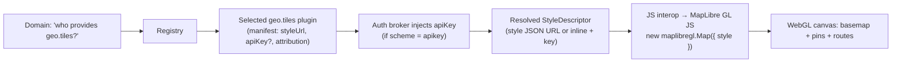
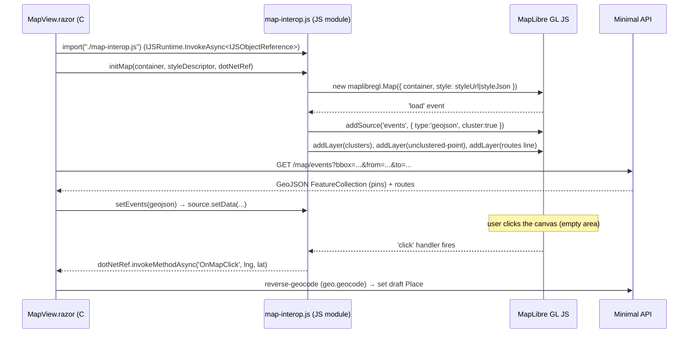

# Deep dive: the map-tiles (`geo.tiles`) plugin

The Map view is the most visual part of the product — a world map that answers *"where am I, over time?"*
Unlike a calendar source, a `geo.tiles` plugin contributes almost **no runtime code**: it hands the core a
**MapLibre style** (a JSON document that names tile sources, layers, fonts, sprites, and an attribution
string), and the **browser** does the rendering via **MapLibre GL JS** over Blazor JS interop. So this
plugin is overwhelmingly **declarative config** — but the contract it feeds (a valid style + any key + an
allowlisted endpoint) and the interop bridge that consumes it have real quirks worth pinning down.

This document specifies the capability, the providers, the Blazor ⇄ MapLibre bridge, and the failure modes.

- [1. What `geo.tiles` is](#1-what-geotiles-is)
- [2. Capability & SDK mapping](#2-capability--sdk-mapping)
- [3. Vector vs raster tiles](#3-vector-vs-raster-tiles)
- [4. The Blazor ⇄ MapLibre interop](#4-the-blazor--maplibre-interop)
- [5. Providers & how to add each](#5-providers--how-to-add-each)
- [6. Privacy](#6-privacy)
- [7. Performance](#7-performance)
- [8. Manifest](#8-manifest)
- [9. Provider quirks](#9-provider-quirks)
- [10. Failure modes & tests](#10-failure-modes--tests)
- [11. Sources](#11-sources)

---

## 1. What `geo.tiles` is

A `geo.tiles` plugin supplies the **basemap** for the Map view ([UI.md §5](../UI.md#5-map-view)). Concretely
it resolves to a **MapLibre GL style** — the [MapLibre Style Spec](https://maplibre.org/maplibre-style-spec/)
JSON that declares:

- **`sources`** — where tiles come from (a vector tileset, a raster tile template, or a `pmtiles://` archive),
- **`layers`** — how to paint them (fill/line/symbol for vector; a single raster layer for raster),
- **`glyphs`/`sprite`** — fonts and icons for labels and markers,
- **`attribution`** — the legally-required credit line.

The core never knows whether those tiles are OpenMapTiles from a self-hosted server, a PMTiles file on S3, or
MapTiler Cloud. It asks the registry *"who provides `geo.tiles`?"*, takes the selected plugin's resolved style
(URL or inline JSON) **plus any API key the auth broker holds**, and passes it to MapLibre in the browser. The
plugin is the **config carrier**; MapLibre is the renderer.



So the plugin is: **declare a style + endpoint + (optional) key → host resolves it → MapLibre renders it.**

## 2. Capability & SDK mapping

`geo.tiles` is the one capability where the **declarative path is the default and almost always sufficient**:
there is no JSON-to-domain mapping to do (no `Event`/`Place` to produce), just static config the host forwards
to the browser. The SDK still defines an assembly interface — `ITileProvider` ([PLUGINS.md §5](../PLUGINS.md#5-assembly-plugins--the-sdk-contract))
— for the rare provider that must **compute** a style or sign a tile URL per session (e.g. Google's session
tokens, §5/§9). Most providers never need it.

```csharp
namespace Calendar.Plugin.Abstractions;

// The host calls this once when the Map view mounts (and on style switch).
public interface ITileProvider : IPlugin
{
    // Resolve the basemap the browser should render. For declarative plugins the
    // connector engine builds this straight from the manifest config; an assembly
    // plugin can compute it (inline style, signed URLs, session tokens).
    Task<StyleDescriptor> GetStyleAsync(CancellationToken ct);
}

public sealed record StyleDescriptor(
    string?  StyleUrl,        // e.g. https://.../style.json?key=...  (mutually exclusive with StyleJson)
    string?  StyleJson,       // inline MapLibre style (for self-hosted / PMTiles assembled at runtime)
    string   Attribution,     // required credit line shown in the map's attribution control
    string   TileKind,        // "vector" | "raster" — informational; the style itself is authoritative
    bool     SupportsOffline  // may the host PWA cache visited tiles? (license-dependent — see §7)
);
```

> **Declarative resolution.** For a manifest-only plugin the host produces the `StyleDescriptor` from
> `config.styleUrl` + the broker-injected `apiKey` (substituted into the URL or sent as a header per the
> manifest's `auth` block) + `config.attribution`. No plugin code runs. This is the path for OpenMapTiles,
> PMTiles, MapTiler, Mapbox, and the MapLibre demo style — see §5.

The selected `geo.tiles` plugin is chosen in the sidebar/settings; it is **not** an interchangeable
fallback-aggregator capability (the aggregator only fronts `*.price`/`geo.route`/`geo.geocode`, where many
providers return the same query result — [ARCHITECTURE.md §15](../ARCHITECTURE.md#15-multi-provider-fallback-aggregator)).
A basemap is a single chosen surface; if its style fails to load the host falls back to a **bundled default
style** (§10), not to "the next provider."

## 3. Vector vs raster tiles

| | **Vector tiles** (preferred) | **Raster tiles** |
| --- | --- | --- |
| Payload | Geometry + attributes (Mapbox Vector Tile / `.mvt`, or PMTiles) | Pre-rendered PNG/JPEG/WebP images |
| Styling | **Client-side** — restyle, dark mode, label languages without re-fetching | Baked in; a new look means a new tileset |
| Zoom | Smooth/continuous; crisp labels at any DPI | Stepped; blurry between zoom levels / on retina |
| Bandwidth | Small, cacheable; one tileset serves many styles | Larger; more tiles for high-DPI |
| Rendering | WebGL in MapLibre | Simple `raster` layer (also MapLibre) |
| Use when | The default for the world map (pins, clustering, routes overlay cleanly) | A provider only offers images, or you want satellite imagery |

**Default to vector.** It keeps thousands of pins and route lines crisp at any zoom, supports dark/light theme
switching client-side (matching [UI.md §10](../UI.md#10-accessibility-theming--offline)), and lets one tileset
back multiple styles. Raster is the **fallback** for providers that only emit images (the OSM standard tile
server, §5; satellite layers) — MapLibre renders both, so a raster `geo.tiles` plugin is a one-source,
one-`raster`-layer style. The event-pin and route layers the host adds (§4) sit **on top** of either basemap
identically.

## 4. The Blazor ⇄ MapLibre interop

MapLibre GL JS is a browser library; Blazor WASM drives it through a **JS module** loaded via `IJSRuntime`.
The C# side owns *data and intent* (which style, which events, which click happened); the JS side owns the
*WebGL map instance*. They talk over a thin, stable bridge.



**Module loading.** `MapView.razor` lazy-imports the interop module
(`await JS.InvokeAsync<IJSObjectReference>("import", "./js/map-interop.js")`) on first render and keeps the
`IJSObjectReference`. A `DotNetObjectReference<MapView>` is passed into `initMap` so JS can call back into C#
(`[JSInvokable] OnMapClick`, `OnPinSelected`, `OnViewportChanged`). Both references are disposed in
`DisposeAsync` to avoid leaks across view switches.

**Initializing the map.** `initMap(container, styleDescriptor, dotNetRef)`:
1. registers the **PMTiles protocol** if the style uses one (`maplibregl.addProtocol('pmtiles', ...)`, §5);
2. constructs `new maplibregl.Map({ container, style })` — `style` is either the `styleUrl` (most providers) or
   the inline `styleJson` (self-hosted/PMTiles assembled by the host);
3. adds an `AttributionControl` seeded with `styleDescriptor.attribution` (compliance, §10);
4. on the map's `load` event, wires the host's overlay layers (below).

**Event/trip pins (GeoJSON + clustering).** The host fetches geocoded events from
`GET /map/events?bbox&from&to` — a **GeoJSON `FeatureCollection`** where each `Point` carries the event id,
title, color, and category. JS adds it as a **single GeoJSON source with `cluster: true`** and three layers:

- a **`circle` layer** for cluster bubbles (sized/colored by `point_count`),
- a **`symbol` layer** for the cluster count,
- a **`circle`/`symbol` layer** for unclustered pins (colored by source calendar).

This is the standard MapLibre clustering pattern and is what keeps **thousands of pins smooth**
([UI.md §9](../UI.md#9-performance)). When the date scrubber or filters change, C# calls `setEvents(geojson)`
which does a single `source.setData(...)` — no re-init, no per-pin DOM.

**Trip routes (line layer).** Consecutive trip legs ([UI.md §5](../UI.md#5-map-view)) come from `geo.route`
geometry as a GeoJSON `LineString` collection; JS adds a **`line` layer** (flight arcs / drive lines) under the
pin layers so routes never occlude clickable pins.

**Markers & popups.** Selecting a pin opens a popup (`maplibregl.Popup`) anchored to the feature; clicking it
raises `OnPinSelected(eventId)` so the C# **Inspector** ([UI.md §2](../UI.md#2-layout)) shows the event. For a
handful of emphasized items the host may use HTML `maplibregl.Marker`s instead of symbol layers — but pins at
scale stay in the clustered GeoJSON source for performance.

**Click-to-place.** A `click` on empty canvas calls back `OnMapClick(lng, lat)`; C# runs reverse geocoding
(`geo.geocode`) and sets the draft event's `Place` ([UI.md §5/§8](../UI.md#5-map-view)). A `moveend` handler
reports the viewport (`OnViewportChanged(bbox)`) so the host can refetch `/map/events` for the new bounds and
drive geographic filtering of the other views.

> The interop surface is deliberately **small and declarative**: `initMap`, `setStyle`, `setEvents`,
> `setRoutes`, `flyTo`, `dispose`, plus the three C# callbacks. All map *state* lives in JS; all map *intent*
> lives in C#. This keeps the Blazor side testable and the JS module swappable.

## 5. Providers & how to add each

Every provider below is the **same plugin shape** (`kind: declarative`, capability `[geo.tiles]`) differing only
in `styleUrl`, `auth.scheme`, and the network allowlist. The **self-hosted / open options are the private
default**; commercial keyed options are opt-in.

### Self-hosted / open (the private default)

- **OpenMapTiles + TileServer GL.** Generate or download an OpenMapTiles (`.mbtiles`) vector tileset and serve
  it with [TileServer GL](https://github.com/maptiler/tileserver-gl) (MapLibre GL Native server-side; serves
  vector tiles, TileJSON, and GL styles). Point `styleUrl` at the server's `style.json` (or build an inline
  style whose source is the server's TileJSON). `auth: none`; allowlist your own host. Fully private, no quotas.
- **PMTiles (single-file, serverless).** A whole planet (or a country extract) as **one `.pmtiles` file** on
  any static host (S3/R2/GCS/Azure or a CDN). MapLibre doesn't speak PMTiles natively — the interop registers
  `maplibregl.addProtocol('pmtiles', new pmtiles.Protocol().tile)` and the style source uses `pmtiles://…`.
  The host must serve **HTTP Range requests** with permissive **CORS** (`Access-Control-Allow-Origin` +
  `Access-Control-Allow-Headers: Range`); MapLibre fetches only the byte ranges it needs. Zero tile backend,
  zero maintenance — ideal for the local-first ethos. `auth: none`.
- **MapLibre demo style.** `https://demotiles.maplibre.org/style.json` — serverless, hosted on GitHub Pages,
  **no key**. Low-detail; perfect as the **bundled fallback / dev default** (§10), not a production basemap.
- **MapTiler styles (key).** Also usable in self-managed deployments that don't want to run a tile server:
  point at a MapTiler style URL with a key (below). Convenient, but sends viewport requests off-device (§6).

### Commercial keyed alternatives

- **MapTiler.** `styleUrl: https://api.maptiler.com/maps/{style}/style.json?key={apiKey}` (styles like
  `streets-v2`, `dataviz-dark`, `satellite`). `auth.scheme: apikey`; the broker injects `{apiKey}`. Free tier
  ~100k map loads/month; **attribution `© MapTiler © OpenStreetMap contributors` is required**. The smoothest
  managed vector option that stays in the MapLibre ecosystem.
- **Mapbox.** Mapbox styles + an access token work as a `geo.tiles` source, **but** — Mapbox GL JS v2+ is
  **proprietary** and tied to a Mapbox subscription. We render with **MapLibre GL JS** (BSD-3-Clause, §9), so a
  Mapbox plugin must use Mapbox **styles/tiles** under a Mapbox token while keeping the **MapLibre** renderer.
  Verify the chosen Mapbox tiles' ToS permits use outside Mapbox GL JS. `auth.scheme: apikey` (token).
- **Google (constraint).** Google's basemap is **not a drop-in MapLibre style**. Google 2D Map Tiles require a
  Google API key, a **per-session token** before requesting tiles, and are normally consumed via the **Google
  Maps JS SDK** — *not* MapLibre. Integrating Google into MapLibre means a custom `addProtocol('google', …)`
  raster shim (e.g. the community `maplibre-google-maps` plugin) and is **raster-only**, losing client-side
  styling/clustering benefits. Treat Google `geo.tiles` as an **assembly** plugin (it must mint session tokens
  via `ITileProvider`) and a documented edge case, not the default. See §9.

### The public OSM raster tile server — **not for production**

`https://tile.openstreetmap.org/{z}/{x}/{y}.png` exists and is tempting, but the **OSMF Tile Usage Policy
forbids the way an app like this would use it**:

- **No bulk/prefetch downloading** — *"any pre-emptive fetching of tiles other than those a user is actively
  viewing"* is prohibited, which **rules out the PWA's offline tile caching for visited areas** (§7).
- **No heavy use** — *"Heavy or inappropriate use harms others' ability to edit and view the map,"* and
  *"access may be blocked without notice."* It is a **best-effort, no-SLA** community service on donated
  hardware.
- **Identification & attribution required** — a distinct `User-Agent` and valid `Referer`; default/library
  User-Agents *"will be blocked."* Tiles must be cached per HTTP headers (min 7 days), and *"© OpenStreetMap
  contributors"* must be shown.
- The policy explicitly tells commercial/donation-seeking apps that *"access may be withdrawn at any point"* and
  recommends you *"use an alternative OSM-derived service, or run your own."* OSMF's experimental **vector**
  endpoint (`vector.openstreetmap.org`, Shortbread schema) carries the **same no-SLA, no-bulk caveats** — also
  not a production basemap.

**Verdict (consistent with [PLUGIN-RESEARCH.md](../PLUGIN-RESEARCH.md) geo.tiles 🟢):** ship **self-hosted
OpenMapTiles/PMTiles** as the private default and **MapTiler** as the easy keyed option; never wire the public
OSM tile server as a shipped basemap. The MapLibre demo style is the bundled fallback only.

## 6. Privacy

The basemap is the one geo capability that can be **fully local**:

- **Self-hosted (TileServer GL) / PMTiles on your own storage** → every tile request goes to *your* host. No
  third party learns which places, trips, or dates the user is looking at. This matches the local-first,
  geo-private stance in [ARCHITECTURE.md §17](../ARCHITECTURE.md#17-security--privacy).
- **Commercial tiles (MapTiler / Mapbox / Google)** → the browser sends **viewport tile requests** (the `z/x/y`
  the user pans/zooms over) to the vendor, plus the API key. That reveals *roughly where the user is browsing*.
  It does **not** send event content — pins/routes are drawn client-side from the host's own
  `GET /map/events` — but the map extent is observable by the tile vendor.

So the privacy story is a direct function of the chosen plugin: pick a self-hosted/PMTiles `geo.tiles` plugin to
keep map usage on-device; a keyed plugin trades a little privacy for zero ops. The UI should surface which mode
is active (consistent with "self-hosted tiles keep it fully private", [UI.md §5](../UI.md#5-map-view)).

## 7. Performance

- **Vector tiles + clustering.** Vector basemap + a single clustered GeoJSON source (§4) keeps **thousands of
  pins** and route lines smooth — the explicit map performance bar in [UI.md §9](../UI.md#9-performance). One
  `source.setData` updates all pins on scrub/filter; no per-pin DOM.
- **Tile caching.** MapLibre caches fetched tiles in-session; the PWA service worker can cache tile responses
  for **visited areas** so revisiting a region is instant and works offline
  ([UI.md §10](../UI.md#10-accessibility-theming--offline)). **PMTiles is ideal here** — a bounded set of byte
  ranges from one file caches cleanly. **Offline/precache is only license-permitted for self-hosted/PMTiles or
  providers whose ToS allows it — never for the public OSM server** (§5).
- **Style/source economy.** One vector tileset serves light *and* dark styles (client-side restyle), so theme
  switching costs no new downloads. Raster needs separate tilesets per look.
- **Bounded fetches.** `/map/events` is `bbox`-scoped and refetched on `moveend`, so pin payloads stay small;
  recurrence is expanded host-side for the visible range only ([ARCHITECTURE.md §10](../ARCHITECTURE.md#10-sync-engine)).

## 8. Manifest

A typical self-hosted / PMTiles plugin (no auth, private):

```yaml
id: org.unifiedcalendar.tiles.openmaptiles
name: OpenMapTiles (self-hosted)
version: 1.0.0
sdkVersion: "1.x"
kind: declarative
capabilities: [geo.tiles]
auth:
  scheme: none
config:
  type: object
  properties:
    styleUrl:    { type: string, title: "Style URL", description: "TileServer GL style.json or a .pmtiles-backed style" }
    attribution: { type: string, title: "Attribution", default: "© OpenStreetMap contributors" }
  required: [styleUrl, attribution]
network:
  allow: ["tiles.local", "*.local"]      # your own tile host / storage bucket
```

A keyed commercial plugin (MapTiler) — the broker injects `apiKey`:

```yaml
id: org.unifiedcalendar.tiles.maptiler
name: MapTiler
version: 1.0.0
sdkVersion: "1.x"
kind: declarative
capabilities: [geo.tiles]
auth:
  scheme: apikey                          # broker substitutes {apiKey} into styleUrl
config:
  type: object
  properties:
    styleUrl:    { type: string, title: "Style URL",
                   default: "https://api.maptiler.com/maps/streets-v2/style.json?key={apiKey}" }
    apiKey:      { type: string, title: "API key", format: "secret" }
    attribution: { type: string, default: "© MapTiler © OpenStreetMap contributors" }
  required: [apiKey, attribution]
network:
  allow: ["api.maptiler.com"]             # tight, per-provider egress allowlist
presets:
  - { name: "Streets",  styleUrl: "https://api.maptiler.com/maps/streets-v2/style.json?key={apiKey}" }
  - { name: "Dark",     styleUrl: "https://api.maptiler.com/maps/dataviz-dark/style.json?key={apiKey}" }
  - { name: "Satellite",styleUrl: "https://api.maptiler.com/maps/satellite/style.json?key={apiKey}" }
```

> The egress **allowlist is per-provider and tight** ([PLUGINS.md §8](../PLUGINS.md#8-security--sandboxing)): the
> host's `HttpClient`/fetch literally cannot reach hosts the manifest didn't declare, so a tiles plugin can't
> exfiltrate to anywhere but its own tile endpoint. PMTiles plugins allowlist the storage/CDN host; Mapbox would
> add `api.mapbox.com`; a Google assembly plugin would add `tile.googleapis.com`.

## 9. Provider quirks

| Provider / topic | Quirk |
| --- | --- |
| **MapLibre vs Mapbox GL JS license** | Mapbox GL JS **v2+ is proprietary** (Dec 2020) and requires a Mapbox subscription/token even to run the renderer. We use **MapLibre GL JS**, the **BSD-3-Clause** hard-fork of Mapbox GL JS 1.x — free to embed in closed-source/PWA, only the copyright notice must be retained. A "Mapbox" plugin means Mapbox **tiles/styles** under a token, rendered by **MapLibre**. |
| **Google needs its own JS SDK** | Google's basemap is normally consumed via the **Google Maps JS SDK**, not MapLibre. 2D Map Tiles require an API key **and a per-session token** before tile requests. In MapLibre it works only via a custom `addProtocol('google', …)` **raster** shim — losing vector styling/clustering. Implement as an **assembly** `ITileProvider` (must mint session tokens). Documented edge case, not the default. |
| **Public OSM tile policy** | `tile.openstreetmap.org` **prohibits bulk/prefetch** (so no offline precache), **prohibits heavy use** (no SLA, may block without notice), requires a **distinct User-Agent + valid Referer** (defaults are blocked) and **© OpenStreetMap contributors** attribution. Not a production basemap — self-host or use MapTiler. |
| **PMTiles range-request hosting** | Single `.pmtiles` file on static storage; MapLibre needs `addProtocol('pmtiles', …)`. The host **must** support **HTTP Range requests** and send **CORS** (`Access-Control-Allow-Origin` + `Access-Control-Allow-Headers: Range`) or tiles silently fail to load. Serverless, but the storage/CDN config is the gotcha. |
| **Attribution is non-optional** | OSM-derived data (OpenMapTiles, MapTiler, PMTiles planet) requires *"© OpenStreetMap contributors"*; MapTiler additionally requires *"© MapTiler"*. The style's `attribution` must render in MapLibre's attribution control (§10). |
| **Vector tile schema lock-in** | A MapLibre style is written against a specific **source-layer schema** (OpenMapTiles vs Shortbread vs Mapbox Streets vs a Protomaps basemap). Swapping tilesets under a style requires a style built for that schema — styles and tilesets are **paired**, not freely mixable. |

## 10. Failure modes & tests

- **Missing / invalid API key.** Keyed style returns 401/403 → surface *"Add your MapTiler key in settings"*
  and fall back to the **bundled default style** (MapLibre demo / a packaged minimal style) so the Map view
  still renders. Test: empty key, wrong key, expired key.
- **Style load failure → default-style fallback.** Style URL 404/5xx, malformed JSON, or unreachable host →
  catch MapLibre's `error` event, log, and `setStyle(bundledDefault)`; never leave a blank canvas. Test: bad
  `styleUrl`, offline at first load, CORS-blocked style.
- **Tile 404 / 429.** Individual tiles missing or rate-limited → MapLibre shows blank tiles, not a crash;
  surface a non-blocking toast on sustained 429 (keyed quota exhausted). Test: a tileset with holes; a throttled
  endpoint.
- **PMTiles CORS / Range misconfig.** Storage host missing `Access-Control-Allow-Headers: Range` or not
  honoring Range → tiles never load. Test: assert the protocol handler registers and a known `z/x/y` byte range
  returns 206.
- **Huge pin counts.** 10k+ events in the viewport → assert clustering keeps frame time bounded and
  `setEvents` is a single `setData` (no per-pin markers). Test: synthetic 50k-pin FeatureCollection; verify no
  main-thread stall and clusters expand correctly on zoom.
- **Offline fallback.** No network → PWA serves cached tiles for **visited** areas only; unvisited areas show a
  graceful "offline" placeholder. Test: cache a region, go offline, pan into cached vs uncached bounds. Assert
  precache is **disabled for the public-OSM plugin** (policy compliance).
- **Attribution compliance.** Assert the rendered map always shows the provider's required attribution
  (`© OpenStreetMap contributors`, plus `© MapTiler` for MapTiler) and that the string can't be hidden by the
  layout. Test: each provider preset renders its mandated credit.
- **Style switch / disposal.** Switching `geo.tiles` plugin or theme calls `setStyle` and **re-adds** the
  event/route layers on the new style's `load` (a `setStyle` drops custom sources/layers). Test: switch
  light↔dark and provider↔provider; pins and routes survive. Disposing the view releases the `IJSObjectReference`
  and `DotNetObjectReference` (no leak across repeated Map opens).

## 11. Sources

- MapLibre GL JS (BSD-3-Clause, Mapbox GL 1.x fork): <https://github.com/maplibre/maplibre-gl-js>
- MapLibre — origin as open-source fork after Mapbox's license change: <https://www.maptiler.com/news/2021/01/maplibre-mapbox-gl-open-source-fork/>
- Mapbox GL JS v2 proprietary license change: <https://wptavern.com/mapbox-gl-js-is-no-longer-open-source>, <https://carto.com/blog/our-thoughts-as-mapboxgl-js-2-goes-proprietary/>
- MapLibre Style Spec: <https://maplibre.org/maplibre-style-spec/>
- MapLibre demo style/tiles (serverless, no key): <https://github.com/maplibre/demotiles>
- OSMF Standard Tile Usage Policy (bulk/heavy use, User-Agent, attribution): <https://operations.osmfoundation.org/policies/tiles/>
- OSMF Vector Tile Usage Policy (best-effort, no SLA): <https://operations.osmfoundation.org/policies/vector/>
- PMTiles (single-file, serverless, range requests): <https://github.com/protomaps/PMTiles>, <https://docs.protomaps.com/pmtiles/>
- MapLibre + PMTiles protocol patterns: <https://github.com/maplibre/maplibre-agent-skills/blob/main/skills/maplibre-pmtiles-patterns/SKILL.md>
- TileServer GL (self-host OpenMapTiles, MapLibre GL Native): <https://github.com/maptiler/tileserver-gl>, <https://openmaptiles.org/docs/host/tileserver-gl/>
- MapTiler maps API / styles with MapLibre + attribution: <https://docs.maptiler.com/guides/maps-apis/maps-platform/how-to-use-maplibre/>, <https://docs.maptiler.com/cloud/api/maps/>
- Google Map Tiles API (key + session tokens; own SDK): <https://developers.google.com/maps/documentation/tile/overview>
- Google tiles in MapLibre via raster shim plugin: <https://github.com/traccar/maplibre-google-maps>
