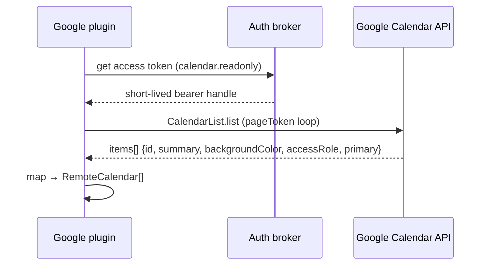
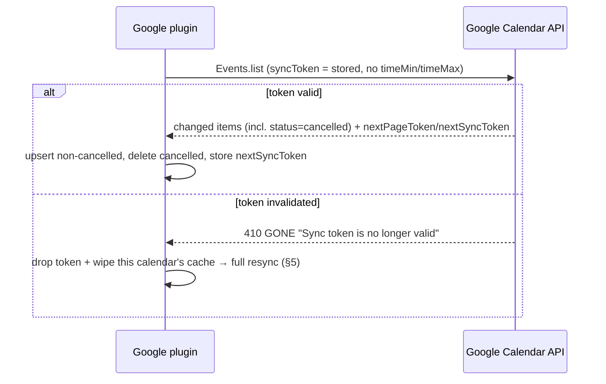

# Deep dive: the Google Calendar plugin

Google Calendar is the highest-value **OAuth** calendar source: a single account commonly carries the
user's primary calendar plus shared calendars, **Holidays**, and **Birthdays** — all first-class dedup
sources. Unlike CalDAV's WebDAV/XML grind, this is a clean REST API with a real delta protocol
(`syncToken`), optional push, and an official, well-maintained **.NET** client. This document specifies
the plugin end to end.

It is an **assembly plugin** (not a declarative connector): OAuth refresh-token plumbing, `410`-driven
resync, and `syncToken` pagination semantics are stateful flows that don't reduce to "call endpoints,
map JSON." It compiles against `Calendar.Plugin.Abstractions` and uses the official
[`Google.Apis.Calendar.v3`](https://www.nuget.org/packages/Google.Apis.Calendar.v3) +
[`Google.Apis.Auth`](https://www.nuget.org/packages/Google.Apis.Auth) libraries.

- [1. What the Google Calendar API is](#1-what-the-google-calendar-api-is)
- [2. Capability & SDK mapping](#2-capability--sdk-mapping)
- [3. Auth (OAuth2 + PKCE via the broker)](#3-auth-oauth2--pkce-via-the-broker)
- [4. Enumerate calendars](#4-enumerate-calendars)
- [5. Initial event fetch (full sync)](#5-initial-event-fetch-full-sync)
- [6. Incremental sync (syncToken)](#6-incremental-sync-synctoken)
- [7. Recurrence](#7-recurrence)
- [8. Delta → SyncResult mapping](#8-delta--syncresult-mapping)
- [9. Normalization to the domain model](#9-normalization-to-the-domain-model)
- [10. Push notifications (optional)](#10-push-notifications-optional)
- [11. Write-back (later phase)](#11-write-back-later-phase)
- [12. .NET implementation notes](#12-net-implementation-notes)
- [13. Quirks](#13-quirks)
- [14. Manifest](#14-manifest)
- [15. Failure modes & tests](#15-failure-modes--tests)
- [Sources](#sources)

---

## 1. What the Google Calendar API is

- **REST/JSON over HTTPS** at `https://www.googleapis.com/calendar/v3` — collections of `Calendar`,
  `CalendarList`, `Event`, `Colors`, `Acl`, `Channels`.
- **`CalendarList.list`** enumerates the calendars *subscribed in the user's account* (primary, shared,
  Holidays, Birthdays) — distinct from `Calendars` (the calendar metadata resource).
- **`Events.list`** reads events, with a real **delta protocol**: a full pass returns a `nextSyncToken`;
  later passes send that token in `syncToken` and get back only changes (including deletions).
- **Push (`Events.watch`)** can notify a webhook on change, but channels expire and drops are expected,
  so **polling the delta is the baseline** and push is an optimization.

So the plugin is: **OAuth (host broker) → enumerate (`CalendarList.list`) → full fetch (`Events.list`
+ `timeMin`/`timeMax`) → delta (`syncToken`) → normalize.**

## 2. Capability & SDK mapping

Implements `ICalendarSource` (and later `ICalendarWriter`):

```csharp
public sealed class GoogleCalendarPlugin : ICalendarSource
{
    public PluginManifest Manifest { get; }
    public Task InitializeAsync(IPluginHost host, CancellationToken ct);                   // build CalendarService with broker creds
    public Task<IReadOnlyList<RemoteCalendar>> ListCalendarsAsync(CancellationToken ct);   // §4
    public Task<SyncResult> SyncAsync(string calendarId, string? syncToken, CancellationToken ct); // §5–6
}
```

`SyncResult { IReadOnlyList<RemoteEvent> Upserts; IReadOnlyList<string> Deletes; string NewSyncToken; }`.
The `calendarId` is the Google calendar id (e.g. `primary`, `…@group.calendar.google.com`,
`…@group.v.calendar.google.com` for Holidays); `syncToken` is Google's opaque `nextSyncToken`.

## 3. Auth (OAuth2 + PKCE via the broker)

**The plugin never sees a token.** The host's **auth broker** runs the **OAuth 2.0 Authorization Code
flow with PKCE** (`oauth2-pkce`), stores the refresh token in the encrypted vault, and hands the plugin
a scoped, short-lived access-token handle at call time. The manifest declares Google's endpoints and the
requested scopes; the broker needs no provider-specific host code.

| Field | Value |
| --- | --- |
| `authorizationUrl` | `https://accounts.google.com/o/oauth2/v2/auth` |
| `tokenUrl` | `https://oauth2.googleapis.com/token` |
| Flow | Authorization Code + **PKCE** (`code_challenge`/`code_verifier`, `S256`) |
| Refresh | `access_type=offline` + `prompt=consent` to obtain a **refresh token**; broker refreshes silently |

**Least-privilege scopes** (request the narrowest, add write later):

| Phase | Scope | Grants |
| --- | --- | --- |
| `calendar.read` (now) | `https://www.googleapis.com/auth/calendar.readonly` | See/download any calendar you can access. |
| (narrower alt) | `https://www.googleapis.com/auth/calendar.events.readonly` | View events only (no calendar metadata/ACLs). |
| `calendar.write` (later) | `https://www.googleapis.com/auth/calendar.events` | View **and edit** events on all calendars. |

We start with **`calendar.readonly`** because the plugin enumerates calendars *and* their metadata
(color, access role) via `CalendarList`. If we ever want strictly event access we can narrow to
`calendar.events.readonly`, but that omits calendar-level metadata. We deliberately avoid the broad
`…/auth/calendar` (full manage/delete) — `calendar.events` is sufficient for write-back.

> **App verification.** Calendar event scopes are **sensitive** (not "restricted," but still reviewed).
> For **personal/dev use** the unverified app works immediately for the developer and a small set of
> test users added to the OAuth consent screen (with the "unverified app" interstitial). **Before a
> public release** that requests sensitive scopes, Google requires completing **sensitive-scope
> verification** (Cloud Console Verification Center: declare all scopes, justify each, provide a demo
> video, keep contact info current). This gates *publishing*, not building — fine for the local-first /
> self-hosted model where each user supplies their own OAuth client, but a hosted/managed offering must
> budget for the review. See [Sources](#sources).

## 4. Enumerate calendars



`CalendarList.list` returns each subscribed calendar; page with `pageToken` until no `nextPageToken`.
Map per item:

- `id` → `RemoteCalendar.RemoteId` (the value passed back to `Events.list`).
- `summary` → `Name` (use `summaryOverride` if the user renamed it).
- `backgroundColor` → `Color` (or resolve `colorId` via the `Colors` endpoint).
- `accessRole` → `IsReadOnly = accessRole is "reader" or "freeBusyReader"`.
- `primary == true` flags the main calendar.

**Holidays & Birthdays are first-class.** They appear here like any other calendar:

| Built-in | Identity | Dedup role |
| --- | --- | --- |
| **Holidays** | id like `…holiday@group.v.calendar.google.com`; read-only | feeds holiday dedup (same date + fuzzy title across accounts collapses) |
| **Birthdays** | the **Birthdays** calendar sourced from Google Contacts; read-only, all-day recurring | feeds birthday dedup (keyed on recurring `iCalUID`/contact) |

The plugin does **not** special-case them in code — it surfaces them as ordinary `RemoteCalendar`s and
the domain dedup engine (ARCHITECTURE §12) does the collapsing. It simply must not *drop* them.

## 5. Initial event fetch (full sync)

On first sync (`syncToken == null`), call `Events.list` for the calendar with the active window and
record the returned `nextSyncToken`:

| Param | Value | Why |
| --- | --- | --- |
| `calendarId` | the `RemoteCalendar.RemoteId` | target calendar |
| `timeMin` / `timeMax` | active window (e.g. now − 1y … now + 2y), RFC3339 | bound the initial payload; expand as the user scrolls |
| `singleEvents` | **`false`** (default) | return recurring **masters + RRULE**, not expanded instances (see §7) |
| `showDeleted` | `false` on full sync | full sync doesn't need tombstones |
| `maxResults` | up to 2500 | fewer round-trips |
| `pageToken` | from `nextPageToken` | paginate |

Loop on `nextPageToken`; **`nextSyncToken` appears only on the final page** — persist it as the
account/calendar `SyncToken`. If the result is paginated, never trust an intermediate page's token.

> ⚠️ **`timeMin`/`timeMax` + `syncToken` are mutually exclusive.** Once you have a sync token you may
> **not** pass time bounds on incremental requests (Google rejects it). The token's window is fixed at
> *first* full-sync time. To widen the window later (user scrolls to next year), you must do a **new
> full sync** with the wider `timeMin`/`timeMax` and obtain a fresh token. Plan the initial window
> generously, or maintain one token per fetched window. This is the central trade-off of §7.

## 6. Incremental sync (syncToken)



- Send the stored token in **`syncToken`** (with `showDeleted=true`, which is implied — incremental
  results **always** include deleted entries so clients can remove them).
- Page with `pageToken` (same query) until `nextSyncToken` arrives on the last page; store it.
- **`410 GONE`** ("Sync token is no longer valid, a full sync is required") can happen for token
  expiry, ACL changes, or (notably) on **Holidays** calendars Google periodically rebuilds → **drop the
  token, wipe that calendar's cached events, and run a full sync (§5).** Idempotent upserts keyed on
  Google `id` make the resync safe.

## 7. Recurrence

Two strategies, mirroring the CalDAV plugin's decision:

| | `singleEvents=false` (chosen) | `singleEvents=true` |
| --- | --- | --- |
| Returns | **master** event + `recurrence` (RRULE/EXDATE…), plus **exception instances** carrying `recurringEventId` | every occurrence pre-expanded into separate events |
| Storage | one `Event` master + `Rrule`; expand on demand with Ical.Net for the visible range | many rows; window-bound; re-fetch to extend |
| Sync token | works; deltas are per-master + per-exception | works **but** `syncToken` + `singleEvents=true` re-expands and can churn |

**Recommendation: store masters and expand on demand** (consistent with ARCHITECTURE §9). Persist the
master's `recurrence` into `Event.Rrule`; expand occurrences per visible range with **Ical.Net**.
**Exceptions** (a single moved/edited occurrence) come back as their own items with `recurringEventId`
pointing at the master and `originalStartTime` identifying which occurrence they override — store them
as override `Event`s linked to the master so expansion can splice them in.

> **Trade-off.** Google's cleanest delta with the smallest payload is `singleEvents=false` + `syncToken`
> (you sync masters, not thousands of instances). The cost is that the **client** owns RRULE expansion
> (Ical.Net) and must reconcile `recurringEventId` exceptions and `EXDATE` cancellations. We accept
> that — it's the same engine the CalDAV and ICS plugins already use, and it keeps storage compact.

## 8. Delta → SyncResult mapping

The plugin reduces a page-loop of `Events.list` results into the host's `SyncResult`:

| `SyncResult` field | Source |
| --- | --- |
| `Upserts` | items with `status` ∈ {`confirmed`, `tentative`} → normalized `RemoteEvent` (§9) |
| `Deletes` | items with **`status == "cancelled"`** → emit the Google `id` (a cancelled *master* deletes the series; a cancelled *instance* is an `EXDATE`-style occurrence removal) |
| `NewSyncToken` | the `nextSyncToken` from the **final** page |

Deleted events come back as **tombstones** (`status=cancelled`) precisely so the host can remove them;
never treat their absence as the delete signal. Cancelled instances of a recurring event (with
`recurringEventId`) are occurrence removals, not full-series deletes — route them to the master's
exception handling rather than deleting the whole `Event`.

## 9. Normalization to the domain model

| Domain field | From (Google `Event`) | Notes |
| --- | --- | --- |
| `Event.RemoteId` | `id` | unique per calendar; instances differ, share `iCalUID` |
| `Event.Uid` | `iCalUID` | stable across systems → **feeds dedup** (Holidays/Birthdays across accounts) |
| `Event.Title` | `summary` | |
| `Event.StartUtc` / `EndUtc` | `start.dateTime`/`end.dateTime` (timed) **or** `start.date`/`end.date` (all-day) | resolve `start.timeZone`/IANA → UTC for storage |
| `Event.AllDay` | presence of `start.date` (no `dateTime`) | Google all-day uses **`date`** (yyyy-mm-dd), `end.date` is **exclusive** |
| `Event.Rrule` | `recurrence[]` (RRULE/EXDATE/RDATE) on the master | expand with Ical.Net (§7) |
| recurrence link | `recurringEventId` + `originalStartTime` | identifies the master + overridden occurrence |
| `Event.Location` → `Place` | `location` (free-form) | then `geo.geocode`; cache in `GeocodeCache` |
| color | `colorId` (resolve via `Colors`) or calendar `backgroundColor` | optional UI hint |
| change token | `etag` + `updated` | per-event concurrency / last-modified |

Time zones: trust `start.timeZone`/`end.timeZone` (IANA ids); recurring events always carry them.
Store UTC, render in the user's zone. All-day events have **no** zone — treat `date` as floating.

## 10. Push notifications (optional)

`Events.watch` opens a **channel** that POSTs a lightweight notification to an HTTPS **webhook** when
the watched calendar changes (the notification carries no event data — it's a "go sync" ping that
triggers an incremental `Events.list`). Why it's **not** the baseline:

- **Channels expire** (≈ days/up to a week); a background job must re-`watch` before expiry.
- **Delivery isn't guaranteed** — a small fraction of notifications drop under normal conditions.
- It requires a **publicly reachable HTTPS endpoint**, which the local-first / self-hosted topology
  often doesn't have.

So the design is **polling-first** (Quartz delta on a schedule, ARCHITECTURE §10), with push as an
**optional latency optimization** for hosted deployments: webhook handles the fast path, the scheduled
incremental sync remains the safety net that catches dropped notifications. Push never replaces the
poll; it just lets us poll *sooner*.

## 11. Write-back (later phase)

`ICalendarWriter` for `calendar.write` (scope `calendar.events`):

- **Create:** `Events.insert(calendarId, event)`.
- **Update:** `Events.patch(calendarId, eventId, partial)` (partial update; less clobber than `update`).
- **Delete:** `Events.delete(calendarId, eventId)`.
- **Concurrency:** send **`If-Match: <etag>`** on patch/update/delete (optimistic concurrency). On
  **`412 Precondition Failed`** re-fetch the event, merge, and retry — mirrors the CalDAV `ETag`/`412`
  path so the host's conflict policy is uniform across plugins.
- Recurring edits ("this event" vs "this and following" vs "all") and invites/attendees are a further
  step — defer.

## 12. .NET implementation notes

- **Client setup:** build a `CalendarService` with a `BaseClientService.Initializer` whose
  `HttpClientInitializer` is a credential **wrapping the broker's access token** (a custom
  `IHttpExecuteInterceptor`/`ICredential` that asks `IPluginHost.Auth` for a fresh handle and sets the
  `Authorization: Bearer` header). The plugin holds **no** `ClientSecrets` — the broker owns them.
  Construct the `HttpClient` from `IPluginHost.CreateClient()` so egress is filtered to the manifest
  allowlist.
- **Batching:** `Google.Apis.Requests.BatchRequest` bundles up to **1000** sub-requests in one HTTP
  round-trip (e.g. resolving `colorId`s or fetching many calendars' first pages). Use sparingly — batch
  members still consume per-request quota.
- **Quota & backoff:** quota is **per Cloud project** *and* **per-user**. `rateLimitExceeded` /
  `userRateLimitExceeded` return **`403` or `429`** (treat identically) → **exponential backoff with
  jitter**: `wait = min((2^n) + rand(≤1000ms), maxBackoff)` with `maxBackoff` 32–64 s. This rides the
  host's **Polly** policy (retry/circuit-breaker per plugin, ARCHITECTURE §2/§10); also set `quotaUser`
  to the account id so per-user limits are attributed correctly.
- **Pagination:** the client surfaces `NextPageToken`; loop until null, capturing `NextSyncToken` only
  from the terminal page.
- **Time zones:** `EventDateTime` exposes `DateTimeDateTimeOffset` (timed) vs `Date` (all-day). Prefer
  the `DateTimeOffset` accessor over the deprecated `DateTime` string; key the all-day branch on `Date`
  being non-null.
- **Cancellation/timeouts:** thread the `CancellationToken` into every `ExecuteAsync`; per-call timeouts
  via the host `HttpClient`.

## 13. Quirks

| Area | Note |
| --- | --- |
| **`syncToken` ⊕ time bounds** | can't combine `syncToken` with `timeMin`/`timeMax`/`q`/`updatedMin` — widening the window needs a fresh full sync. |
| **Holidays `410`** | Google rebuilds Holiday calendars periodically → spurious `410` on those tokens; resync, don't error. |
| **All-day `end.date` exclusive** | a one-day all-day event has `end.date` = next day; subtract a day for inclusive domain semantics. |
| **`nextSyncToken` only last page** | mid-pagination has only `nextPageToken`; storing an early token loses changes. |
| **Birthdays calendar** | sourced from Contacts; recurring all-day; read-only; may vanish if the user disables the Contacts birthday calendar. |
| **`iCalUID` vs `id`** | recurring instances share `iCalUID` but differ by `id`; dedup on `iCalUID`, address resources by `id`. |
| **CalDAV alternative** | Google *does* speak CalDAV, but this API is strictly better (sync tokens, push, Holidays/Birthdays) — see [caldav-plugin.md](caldav-plugin.md) §11. |

## 14. Manifest

```yaml
id: org.unifiedcalendar.google
name: Google Calendar
version: 0.1.0
sdkVersion: "1.x"
kind: assembly
capabilities: [calendar.read]            # calendar.write later
publisher: { name: Unified Calendar, signature: <detached-sig> }

auth:
  scheme: oauth2-pkce                     # broker runs Auth-Code + PKCE; plugin never sees tokens
  authorizationUrl: https://accounts.google.com/o/oauth2/v2/auth
  tokenUrl: https://oauth2.googleapis.com/token
  scopes: ["https://www.googleapis.com/auth/calendar.readonly"]   # + .../auth/calendar.events for write
  params:                                 # broker passes these to get a refresh token
    access_type: offline
    prompt: consent

network:
  allow:
    - "www.googleapis.com"                # Calendar API + batch
    - "oauth2.googleapis.com"             # token endpoint (broker)
    - "accounts.google.com"               # authorization endpoint (broker)

config:                                   # minimal — auth carries identity
  type: object
  properties:
    syncWindowMonthsPast:   { type: integer, title: "Months in the past",   default: 12 }
    syncWindowMonthsFuture: { type: integer, title: "Months in the future", default: 24 }
  required: []
```

> Egress is pinned to Google hosts only. A managed/hosted deployment that requests sensitive scopes for
> many users must complete Google's sensitive-scope verification (§3) before publishing the OAuth client.

## 15. Failure modes & tests

- **Token expiry/refresh:** access token expires mid-sync → broker silently refreshes; assert the plugin
  retries transparently and never persists a token itself.
- **`410` resync:** inject an invalidated `syncToken` (and the Holidays-rebuild case) → assert token is
  dropped, calendar cache wiped, full sync re-runs, and final upserts/deletes match a clean sync.
- **Rate-limit backoff:** `403`/`429 rateLimitExceeded` → assert exponential backoff + jitter via Polly,
  honoring `quotaUser`, with bounded retries.
- **All-day vs timed:** `start.date` (all-day, exclusive `end.date`) vs `start.dateTime` with a non-UTC
  zone; DST-boundary timed events; multi-day all-day.
- **Recurrence exceptions:** master + RRULE + `EXDATE`; a moved single occurrence (`recurringEventId` +
  `originalStartTime`); a cancelled instance (occurrence removal, **not** series delete).
- **Deletions:** `status=cancelled` master (series delete) vs cancelled instance; assert correct
  `Deletes` vs exception routing.
- **Pagination correctness:** large calendar that paginates → assert `nextSyncToken` taken only from the
  last page and no changes dropped across pages.
- **Holidays/Birthdays surfaced:** assert both appear as `RemoteCalendar`s (read-only) and reach the
  dedup engine rather than being filtered out.
- **Large calendars / quota:** thousands of masters → batching where useful, backoff under load, bounded
  memory while streaming pages.
- Integration tests run against a **recorded-cassette / mocked `CalendarService`** in CI (no live Google
  OAuth); a manual smoke test uses a dev OAuth client against a throwaway account.

## Sources

- Choose Google Calendar API scopes: <https://developers.google.com/workspace/calendar/api/auth>
- OAuth 2.0 scopes for Google APIs (exact scope strings): <https://developers.google.com/identity/protocols/oauth2/scopes>
- Sensitive-scope verification: <https://developers.google.com/identity/protocols/oauth2/production-readiness/sensitive-scope-verification>
- Synchronize resources efficiently (full/incremental sync, `nextSyncToken`, pagination, `410`): <https://developers.google.com/workspace/calendar/api/guides/sync>
- Handle API errors (`410`, `403`/`429` rate limits, backoff): <https://developers.google.com/workspace/calendar/api/guides/errors>
- Usage limits / quota (per-project + per-user, `quotaUser`): <https://developers.google.com/workspace/calendar/api/guides/quota>
- Events resource reference (`id`, `iCalUID`, `start`/`end`, `status=cancelled`, `recurringEventId`, `recurrence`, `colorId`, `etag`): <https://developers.google.com/workspace/calendar/api/v3/reference/events>
- Events: list (params `timeMin`/`timeMax`/`singleEvents`/`syncToken`/`pageToken`): <https://developers.google.com/workspace/calendar/api/v3/reference/events/list>
- Events: watch (push channels): <https://developers.google.com/workspace/calendar/api/v3/reference/events/watch>
- Push notifications (channel expiry, webhook, polling fallback): <https://developers.google.com/workspace/calendar/api/guides/push>
- CalendarList reference (calendars incl. Holidays/Birthdays, `accessRole`, `backgroundColor`): <https://developers.google.com/workspace/calendar/api/v3/reference/calendarList>
- `Google.Apis.Calendar.v3` NuGet: <https://www.nuget.org/packages/Google.Apis.Calendar.v3>
- `Google.Apis.Auth` NuGet: <https://www.nuget.org/packages/Google.Apis.Auth>
