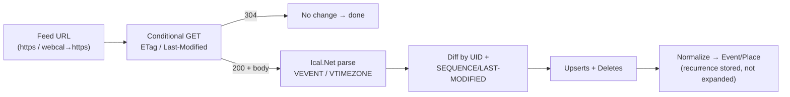
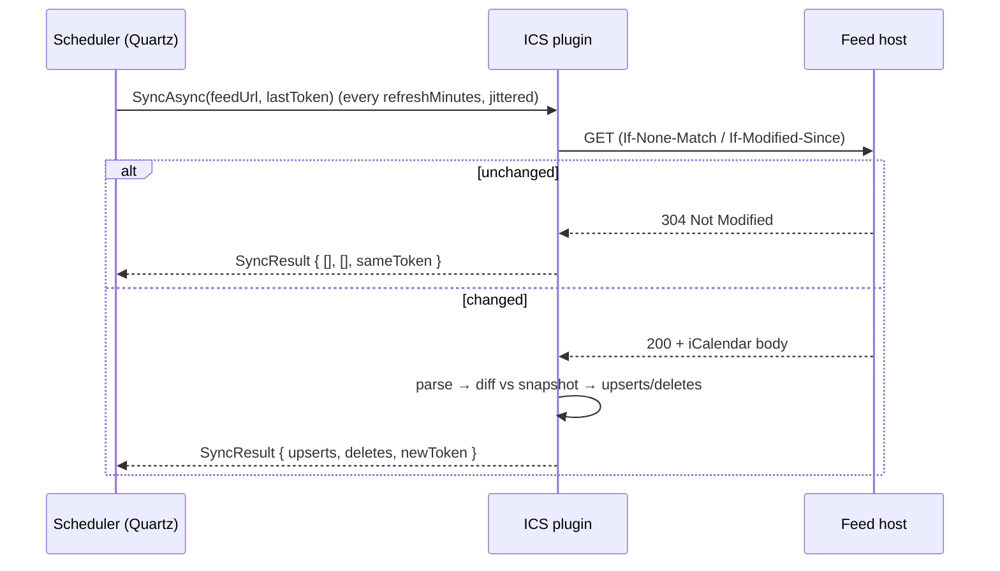

# Deep dive: the ICS / iCalendar feed plugin

The ICS feed plugin is the **first plugin to build and the most leverage per line of code**: any
public/private feed URL becomes a read-only `calendar.read` source with **zero OAuth**. It is also the
**carrier for two providers that have no API** — **Proton** (E2E-encrypted, no CalDAV by design) and
**TripIt** (public API closed to new integrations). Both expose a read-only `.ics` URL, so shipping a
solid ICS plugin unlocks them for free. Unlike CalDAV there is no server protocol — just **fetch a
document, parse it, diff it, expand recurrence** — but the subtlety is all in conditional fetching,
recurrence, time zones, and computing deltas a feed will never hand you.

- [1. What an ICS feed is](#1-what-an-ics-feed-is)
- [2. Capability & SDK mapping](#2-capability--sdk-mapping)
- [3. Auth](#3-auth)
- [4. Fetching the feed](#4-fetching-the-feed)
- [5. Polling & refresh scheduling](#5-polling--refresh-scheduling)
- [6. Parsing with Ical.Net](#6-parsing-with-icalnet)
- [7. Diffing — synthesizing a delta a feed won't give you](#7-diffing--synthesizing-a-delta-a-feed-wont-give-you)
- [8. Recurrence (expanded on demand)](#8-recurrence-expanded-on-demand)
- [9. Normalization to the domain model](#9-normalization-to-the-domain-model)
- [10. Read-only (write-back N/A)](#10-read-only-write-back-na)
- [11. Carrying Proton](#11-carrying-proton)
- [12. Carrying TripIt](#12-carrying-tripit)
- [13. .NET implementation notes](#13-net-implementation-notes)
- [14. Feed quirks](#14-feed-quirks)
- [15. Manifest](#15-manifest)
- [16. Failure modes & tests](#16-failure-modes--tests)
- [Sources](#sources)

---

## 1. What an ICS feed is

- **iCalendar (RFC 5545)** — the text serialization (`BEGIN:VCALENDAR … END:VCALENDAR`) of one or more
  `VEVENT` (and `VTODO`/`VTIMEZONE`/`VFREEBUSY`) components. The same object model CalDAV serves per
  resource, here concatenated into **one document**.
- **A "feed"** — that whole document published at a stable URL, fetched over HTTP(S). There is **no
  per-resource addressing, no `REPORT`, no sync-token** — you `GET` the entire calendar every time.
- **`webcal://`** — Apple's pseudo-scheme (2002) that signals "subscribe to this iCalendar"; it is
  **not a real transport**. Rewrite the host part to `https://` (or `http://` only if explicitly given)
  and fetch normally. See §4.
- **Subscribe vs. download** — *subscribing* keeps re-fetching the live URL so edits propagate;
  *downloading/importing* takes a one-time static snapshot. Our plugin is always a **subscriber**: it
  re-polls the URL on a schedule (§5). This distinction is the crux of the Proton/TripIt sections.

So the plugin is: **fetch (conditional) → parse → diff against last snapshot → upsert/delete → expand
recurrence on demand.** No discovery, no delta protocol, no write path.



## 2. Capability & SDK mapping

Implements `ICalendarSource` (read-only — no `ICalendarWriter`). A single feed *is* a single calendar,
so `ListCalendarsAsync` returns exactly one `RemoteCalendar` synthesized from the manifest config.

```csharp
public sealed class IcsPlugin : ICalendarSource
{
    public PluginManifest Manifest { get; }
    public Task InitializeAsync(IPluginHost host, CancellationToken ct);            // grab HttpClient + config

    // One feed = one calendar. RemoteId = the (rewritten) feed URL; Name from X-WR-CALNAME or config.
    public Task<IReadOnlyList<RemoteCalendar>> ListCalendarsAsync(CancellationToken ct);

    // syncToken here is our OWN opaque cursor: "etag|lastmod|bodyhash" from the previous poll (§7).
    public Task<SyncResult> SyncAsync(string remoteCalendarId, string? syncToken, CancellationToken ct);
}
```

`SyncResult { IReadOnlyList<RemoteEvent> Upserts; IReadOnlyList<string> Deletes; string NewSyncToken; }`
— same shape as CalDAV, but `NewSyncToken` is a value **we mint** (validators + content hash), not one
the server gave us. The host treats it as opaque and replays it on the next `SyncAsync`.

## 3. Auth

**Scheme: `none`.** The defining feature of this plugin — no OAuth, no app password, no Basic. Feed
URLs are **capability URLs**: the unguessable token *is* the credential (Proton share links, TripIt feed
URLs, Google "secret address in iCal format"). Two consequences:

- The URL is a **secret**. It is stored in the encrypted vault as account config (not surfaced in logs,
  redacted in the audit trail), even though the auth `scheme` is `none`. Treat the whole `feedUrl` like
  a bearer token.
- **URL rotation** is the only revocation mechanism — see §14 and the failure-modes table. If a feed
  starts returning `401/403/404`, the user has likely reset the link (TripIt "Reset Calendar Feed URL",
  Proton "Stop sharing"); surface a re-enter-URL prompt rather than retrying forever.

A small number of feeds sit behind HTTP Basic. If a preset needs it, the manifest can declare
`scheme: basic` and the broker injects the header — but the default and all three shipped presets are
`none`.

## 4. Fetching the feed

### URL handling

- **`webcal://` and `webcals://`** → rewrite scheme to `https://` (`webcals` is unambiguously TLS;
  bare `webcal` we also upgrade to `https` and only fall back to `http` if the host explicitly fails TLS
  *and* the user opted into insecure). Preserve host/path/query verbatim.
- **`http://`** → allowed only if the user typed it; warn (calendar tokens in cleartext). Prefer HTTPS.
- Validate the final host against the manifest **egress allowlist** before the first byte leaves.

### Conditional GET (the heart of polite polling)

Feeds are re-fetched whole on every poll, so **conditional GET is mandatory** to avoid re-downloading an
unchanged (often multi-MB) document:

```
GET /feed.ics HTTP/1.1
Host: feeds.example.com
If-None-Match: "a1b2c3d4"                       ← stored ETag from last 200
If-Modified-Since: Tue, 02 Jun 2026 12:00:00 GMT ← stored Last-Modified from last 200
Accept-Encoding: gzip, deflate, br
User-Agent: UnifiedCalendar/1.0 (+https://app.example)
```

- **`304 Not Modified`** → nothing changed. Return `SyncResult` with **no upserts/deletes** and the
  **same** `NewSyncToken`. This is the common case and should be nearly free.
- **`200 OK`** → store the new `ETag` / `Last-Modified`, read the body, continue to parse + diff.
- Send **both** validators when we have them; servers honor one or the other (Google ICS feeds favor
  `ETag`; some static-file hosts only emit `Last-Modified`). If a server returns neither validator, we
  fall back to **content hashing** the body (§7) so we still suppress no-op work downstream.

### Transport details

| Concern | Handling |
| --- | --- |
| **gzip / deflate / br** | Request and transparently decompress (`DecompressionMethods.All` on the handler). Large feeds compress ~10×. |
| **Redirects** | Follow (≤5). `webcal→https` rewrite happens *before* the request; HTTP 3xx after that is normal (CDN/edge). Capture the final URL but **do not** persist redirects as the new `feedUrl` (the token-bearing original is canonical). |
| **Large feeds** | Stream the response into Ical.Net rather than buffering a giant string; cap at a configurable `maxBytes` (default ~25 MB) and fail loud if exceeded. Multi-year recurring feeds stay small because recurrence is a rule, not materialized rows. |
| **Timeouts / retries** | Per-poll timeout (default 30 s) + Polly retry/backoff on `429`/`5xx`; honor `Retry-After`. A slow feed must never block other plugins' sync jobs. |
| **Content-Type** | Accept `text/calendar`; tolerate misconfigured hosts serving `text/plain`/`application/octet-stream` — sniff for `BEGIN:VCALENDAR` rather than trusting the header. |
| **Encoding** | Respect charset; default UTF-8. Strip a UTF-8 BOM before parsing. Unfold long lines per RFC 5545 (Ical.Net handles this). |

## 5. Polling & refresh scheduling

Feeds have **no push** — there is no webhook, no `sync-collection`, no long-poll. The plugin is driven
by the host scheduler (Quartz) at a **refresh interval** chosen to respect the publisher:

- `refreshMinutes` (manifest config, default **60**) sets the poll cadence. The scheduler must **never**
  poll faster than this, and should **clamp to a floor** (e.g. 15 min) regardless of config — TripIt's
  own feed only refreshes every **15 min–24 h** upstream, so sub-15-minute polling is pure waste.
- **Respect server hints.** If a response carries `Cache-Control: max-age` / `Expires`, treat
  `max(refreshMinutes, server max-age)` as the effective interval — never poll inside a freshness window
  the server declared.
- **Conditional GET makes frequent polling cheap** (a `304` is a few hundred bytes), so the cost of a
  short interval is latency-vs-load, not bandwidth. Default to hourly; let power users tighten it.
- **Jitter** poll times across feeds so N accounts don't stampede a host on the hour.
- **Backoff on failure**: exponential backoff on repeated `5xx`/timeout, capped; reset on the next
  `200`/`304`. Persistent `401/403/404` → stop and flag for user action (URL rotation, §14), don't
  hammer.



## 6. Parsing with Ical.Net

Parse the body with **Ical.Net** (`Calendar.Load(stream)`); never hand-roll RFC 5545. Read these from
each `VEVENT`:

| iCalendar | Use |
| --- | --- |
| `UID` | Stable identity for diffing (§7) and cross-source dedup. **Required**; synthesize a fallback (`hash(SUMMARY+DTSTART)`) only if a sloppy feed omits it. |
| `SEQUENCE` | Monotonic revision counter — primary change signal in the diff. |
| `LAST-MODIFIED` (and `DTSTAMP`) | Secondary change signal when `SEQUENCE` is absent/static. |
| `DTSTART` / `DTEND` (or `DURATION`) | Start/end. Resolve `TZID` against `VTIMEZONE`/IANA; `VALUE=DATE` ⇒ all-day. |
| `RRULE` / `RDATE` / `EXDATE` | Recurrence rule, extra dates, excluded dates — **stored, not expanded** (§8). |
| `RECURRENCE-ID` | Marks an **override** instance of a recurring master (a moved/edited single occurrence). |
| `SUMMARY` | `Event.Title`. |
| `LOCATION` | `Event.Location` text → `Place` via `geo.geocode`. |
| `GEO` | Lat/lng if present → seed `Place` without geocoding. |
| `CATEGORIES` | → domain categories (§9); the carrier feeds tag travel here. |
| `STATUS` | `CANCELLED` ⇒ treat as a delete (tentative/confirmed otherwise). |
| `DESCRIPTION`, `URL` | Optional detail / deep-link. |

### Time zones

- Honor inline `VTIMEZONE` blocks and `TZID` references; Ical.Net maps these to IANA zones. Convert all
  resolved instants to **UTC for storage**; render in the user's zone in the UI.
- **Floating times** (no `TZID`, not `Z`) are interpreted in the user's local zone at render time — flag
  them so DST math is done lazily, not frozen at ingest.
- **All-day** (`DTSTART;VALUE=DATE`) carries **no zone**; store as a date, never shift it across
  midnight by accidental UTC conversion (a classic off-by-one). Multi-day all-day events use an
  **exclusive** `DTEND` date per RFC 5545 — subtract a day for inclusive display.

## 7. Diffing — synthesizing a delta a feed won't give you

There is **no delta protocol**. Every successful `200` is a **full snapshot**; the plugin computes the
delta itself.

**Two-layer change detection:**

1. **Feed level (cheap, short-circuit):**
   - `304` → no change, done (§4).
   - On `200`, compute `bodyHash = SHA-256(rawBytes)`. If it equals the stored hash (validators lied or
     are absent), emit an empty `SyncResult` and skip parsing entirely.
   - The `NewSyncToken` is the tuple **`etag | lastModified | bodyHash`** — opaque to the host, fully
     reconstructible by us.

2. **Event level (when the body actually changed):** build a map `UID → (SEQUENCE, LAST-MODIFIED,
   RECURRENCE-ID)` for the new snapshot and compare to the persisted prior snapshot for this feed:

   | Situation | Action |
   | --- | --- |
   | UID present now, absent before | **Upsert** (new event). |
   | UID in both, `SEQUENCE` increased, **or** equal `SEQUENCE` but newer `LAST-MODIFIED`, **or** body bytes for that VEVENT differ | **Upsert** (changed). |
   | UID in both, identical `SEQUENCE`/`LAST-MODIFIED`/bytes | **Skip** (unchanged). |
   | UID present before, absent now | **Delete**. |
   | `STATUS:CANCELLED` | **Delete** (even if still present in the body). |

   - **Override instances** (`RECURRENCE-ID`) are keyed by **`(UID, RECURRENCE-ID)`**, not `UID` alone,
     so a moved single occurrence is upserted/deleted independently of its master.
   - Persist the per-feed prior snapshot as `(UID, RECURRENCE-ID) → {seq, lastmod, veventHash}` (compact
     — no full bodies) so the next diff is a cheap dictionary compare.

This mirrors the sync-engine contract in [ARCHITECTURE.md §10](../ARCHITECTURE.md#10-sync-engine):
*"ICS diffed by `Uid` + `LAST-MODIFIED`."* Upserts are **idempotent** (UID-keyed), so a missed delete
self-heals on the next full snapshot.

## 8. Recurrence (expanded on demand)

Recurrence is **never materialized** at ingest — consistent with the domain model
([ARCHITECTURE.md §9](../ARCHITECTURE.md#9-domain-model)):

- Store the **master** `VEVENT` with its `RRULE`/`RDATE`/`EXDATE` as `Event.Rrule` (+ exception data).
- Store `RECURRENCE-ID` **overrides** as their own rows linked to the master UID.
- **Expand on demand** for the visible range only, via Ical.Net's
  `GetOccurrences(rangeStart, rangeEnd)`, which applies `EXDATE`/`RDATE` and substitutes
  `RECURRENCE-ID` overrides automatically. Switching views never re-queries or re-materializes.
- A 10-year weekly event is **one row**, not 520 — keeps storage and the diff small and the feed body
  tiny.

## 9. Normalization to the domain model

| Domain field | From |
| --- | --- |
| `Event.RemoteId` | `(UID, RECURRENCE-ID?)` — stable within the feed |
| `Event.Uid` | iCalendar `UID` (drives cross-source dedup — holidays/birthdays collapse) |
| `Event.Title` | `SUMMARY` |
| `Event.StartUtc` / `EndUtc` | `DTSTART`/`DTEND` (resolve `VTIMEZONE`/IANA; `DURATION` if no `DTEND`) |
| `Event.AllDay` | `DTSTART;VALUE=DATE` (exclusive `DTEND` for multi-day) |
| `Event.Rrule` | `RRULE` on the master (+ `RDATE`/`EXDATE`); overrides via `RECURRENCE-ID` |
| `Event.Location` → `Place` | `LOCATION` text → `geo.geocode`; `GEO` lat/lng if present (skip geocode) |
| categories | `CATEGORIES` → `Category` match rules ([ARCHITECTURE.md §13](../ARCHITECTURE.md#13-categories--visibility)) |
| change cursor | per-feed `etag|lastmod|bodyHash`; per-event `SEQUENCE`/`LAST-MODIFIED` |

- **Calendar identity:** one feed ⇒ one `RemoteCalendar`. Name from `X-WR-CALNAME` (a non-standard but
  near-universal calendar-name property) else the manifest `name`/preset; color from `X-APPLE-CALENDAR-COLOR`
  if present, else preset default.
- **Categories from `CATEGORIES`:** values flow into the category engine — the **carrier presets force a
  category** (Proton → as-is; **TripIt → `Travel`**, see §12) so itinerary items light up the
  travel/map features even when the feed omits `CATEGORIES`.
- Resolved `Place`s ride the geocode cache and feed the map view + travel-time gaps like any other
  source.

## 10. Read-only (write-back N/A)

ICS feeds are **fundamentally one-way**: a published `.ics` URL is a document, not an API — there is no
`PUT`/`POST`/`DELETE` endpoint, no auth scope that would permit a write, and the carrier providers
(Proton, TripIt) deliberately expose **read-only** links. The plugin therefore implements
`ICalendarSource` only and **never** `ICalendarWriter`; the synthesized `RemoteCalendar` is marked
`IsReadOnly = true`, so the UI suppresses create/drag-create/edit affordances for these calendars. There
is no later "write-back phase" for ICS — write capability lives in the CalDAV/Google/Graph plugins.

## 11. Carrying Proton

**Proton Calendar has no CalDAV and no public API — by design.** Events are end-to-end encrypted
on-device, so a zero-knowledge server fundamentally cannot serve CalDAV. The decade-old feature request
remains open and is not coming. This matches the 🔴→🟡 verdict in
[PLUGIN-RESEARCH.md](../PLUGIN-RESEARCH.md). The **only** integration path is Proton's own
**"Share with anyone → Create link"** feature, which produces a URL whose iCalendar can be fetched.

**User setup (verified June 2026):** Settings → All settings → **Calendars** → pick the calendar →
**Share with anyone** → **Create link** → choose a view → copy the link into our "Add ICS feed" form
(Proton preset).

- **View modes (chosen at link creation):**
  - **Full view** — all event details (title, time, location). This is what makes Proton genuinely
    usable in our app.
  - **Limited view** — **busy/free only**, no details. Useful for privacy but yields title-less blocks;
    we surface them as opaque "Busy" events.
- **Subscribe (live) vs. download (static) — the critical distinction:**
  - Entering the link's **URL** lets a client **download an ICS snapshot** — a *static* import that
    **will not reflect later edits**.
  - Our plugin instead **subscribes**: it re-polls that same URL on the `refreshMinutes` schedule (§5)
    with conditional GET, so Proton-side edits *do* propagate. **Always treat the Proton link as a live
    subscription, never a one-time import** — this is the whole point of using the plugin rather than
    importing a file by hand.
- **Limits & rotation:** up to **5 links per calendar**; the user can stop sharing a link at any time
  (revocation = rotation). A previously-working Proton feed returning `404/403` means the link was
  revoked → prompt for a fresh link (§14).
- **Direction is one-way:** read-only, consistent with §10. There is no way to write back into the
  E2E-encrypted calendar over a share link.

> No first-party "Proton plugin" is possible or planned — Proton is an **ICS-feed integration** delivered
> entirely through this plugin's `Proton (share link)` preset. Revisit only if Proton ships an API.

## 12. Carrying TripIt

TripIt is the best itinerary aggregator (forward a confirmation → flights/hotels/cars/rail/dining), but
its **public API is closed to new integrations** (existing keys keep working; new OAuth/API access is
partnership-only). So TripIt ships as an **ICS-feed integration**, not an API plugin — framed as
`itinerary.import` *expressed through* `calendar.read`, per
[ARCHITECTURE.md §14](../ARCHITECTURE.md#14-travel-itineraries-stays--fares) and the 🔴→🟡
[PLUGIN-RESEARCH.md](../PLUGIN-RESEARCH.md) verdict.

**User setup (verified June 2026):** Profile icon → **Settings** → **Calendar Feed** (left nav) →
**enable** → **copy the read-only `.ics` URL** into our "Add ICS feed" form (TripIt preset).

- **Read-only & refreshable:** the feed is non-editable; upstream **refresh is 15 min – 24 h** depending
  on calendar type — so clamp our poll floor to 15 min (§5); polling faster gains nothing.
- **Resettable URL = revocation:** TripIt offers **Reset Calendar Feed URL**, which invalidates the old
  link. A reset shows up to us as the old URL `404`-ing → prompt the user to paste the new one (§14).
- **Detail level:** TripIt lets the user choose **trip title only** vs **all detailed plans**; recommend
  "all detailed plans" so flights/hotels/cars arrive as distinct events with locations the map can pin.
- **Time-zone toggle:** TripIt has an "automatically adjust time zone" setting (recommended). We still
  resolve `VTIMEZONE` ourselves (§6); if a user reports off-by-hours times, the fix is usually that
  upstream toggle, not our parser.
- **Mapping to the travel model:** items conceptually map to **Trip → TripItem**
  (`Flight|Stay|Car|Rail|Activity`) and then **project into `Event`s tagged `Travel`**. Because the raw
  ICS rarely sets `CATEGORIES`, the **TripIt preset forces the `Travel` category** at normalization (§9),
  so itinerary events automatically join dedup, multi-month planning, and the map/route features.

> TripIt is therefore an **ICS-feed integration** with a dedicated preset — a true `itinerary.import` API
> plugin is built only if/when partner API access is obtained.

## 13. .NET implementation notes

- **HttpClient** from `IPluginHost.CreateClient()` (egress-filtered to `manifest.network.allow`); set
  `AutomaticDecompression = DecompressionMethods.All`, `MaxAutomaticRedirections = 5`, per-feed timeout,
  Polly retry/backoff for `429`/`5xx` honoring `Retry-After`.
- **Conditional GET:** stash `ETag`/`Last-Modified` per feed; set `If-None-Match` /
  `If-Modified-Since`; handle `304` as a first-class no-op (don't read the body).
- **`webcal://` rewrite:** do it in code before constructing the request URI; `webcals→https`,
  `webcal→https`. Re-validate the rewritten host against the allowlist.
- **Parsing:** `Ical.Net` `Calendar.Load(stream)`; stream rather than buffer for large feeds; strip BOM;
  sniff `BEGIN:VCALENDAR` if `Content-Type` is wrong.
- **Recurrence:** `CalendarEvent.GetOccurrences(start, end)` for on-demand expansion; never persist
  occurrences.
- **Hashing:** SHA-256 over raw bytes for the feed-level short-circuit; per-VEVENT hash (serialized
  component) for the event-level fallback when `SEQUENCE`/`LAST-MODIFIED` are static.
- **Token:** `NewSyncToken = $"{etag}|{lastModified:R}|{bodyHashB64}"`; parse it back on the next call.
- **Could this be declarative?** The connector engine handles JSON, not iCalendar text + RRULE +
  VTIMEZONE math, so ICS is a **light assembly plugin** (it leans on Ical.Net). Per
  [PLUGINS.md §4](../PLUGINS.md#4-declarative-connectors-read-apis--load-them), non-REST/non-JSON
  formats are exactly when you reach for an assembly plugin.

## 14. Feed quirks

| Source / case | Notes |
| --- | --- |
| **`webcal://` links** | Apple pseudo-scheme; rewrite to `https://`. `webcals://` ⇒ TLS. Never fetch `webcal` literally. |
| **Proton share link** | Full vs Limited view chosen at link creation; up to 5 links/calendar; **revoke = rotate URL**; subscribe (live) not download (static). |
| **TripIt calendar feed** | Read-only `.ics`; upstream refresh 15 min–24 h; **Reset URL** rotates it; title-only vs detailed-plans toggle; force `Travel` category. |
| **Google "secret iCal address"** | Public/secret `.ics`; honors `ETag`; can lag upstream edits by up to a day — our poll interval is the floor, not the ceiling, on freshness. |
| **Missing `UID`** | RFC violation but seen in the wild; synthesize `hash(SUMMARY+DTSTART)` as a stable fallback key. |
| **Static `SEQUENCE`/no `LAST-MODIFIED`** | Many publishers never bump these; rely on per-VEVENT byte hash for change detection. |
| **No validators (`ETag`/`Last-Modified`)** | Fall back to whole-body SHA-256 to short-circuit unchanged feeds. |
| **Misconfigured `Content-Type`** | Served as `text/plain`/`octet-stream`; sniff for `BEGIN:VCALENDAR`. |
| **`X-WR-CALNAME` / `X-APPLE-CALENDAR-COLOR`** | Non-standard but common; use for calendar name/color when present. |
| **Limited-view feeds** | Detail-free busy blocks; render as "Busy", don't try to geocode an empty `LOCATION`. |

## 15. Manifest

A **light assembly** plugin (it requires Ical.Net), auth `none`, configured by a feed URL + refresh
interval, with presets for the generic case and the two carriers.

```yaml
id: org.unifiedcalendar.ics
name: ICS / iCalendar feed
version: 1.0.0
sdkVersion: "1.x"
kind: assembly                      # light assembly: needs Ical.Net (non-JSON, non-REST)
capabilities: [calendar.read]       # read-only; no calendar.write ever (§10)
publisher: { name: Unified Calendar, signature: <detached-sig> }

auth:
  scheme: none                      # the feed URL token IS the credential — stored encrypted regardless

config:                             # JSON Schema → host auto-renders the "Add ICS feed" form
  type: object
  properties:
    feedUrl:
      type: string
      title: "Feed URL"
      description: "https://, or webcal:// (auto-rewritten to https). Paste a Proton/TripIt/Google link."
    refreshMinutes:
      type: integer
      title: "Refresh interval (minutes)"
      default: 60
      minimum: 15                   # floor: never poll faster than carriers refresh upstream
  required: [feedUrl]

network:
  allow: ["*"]                      # ICS feeds live anywhere; tighten per preset (below)

presets:                            # UI shortcuts; prefill + scope egress where known
  - name: Generic ICS
    # user supplies any feed URL; allowlist stays open or is pinned at connect time
  - name: Proton (share link)
    network: { allow: ["calendar.proton.me"] }
    config: { refreshMinutes: 240 } # Proton-style links update slowly; hourly+ is plenty
    hint: "Settings → Calendars → Share with anyone → Create link (Full view for details)."
  - name: TripIt (calendar feed)
    network: { allow: ["www.tripit.com", "*.tripit.com"] }
    config: { refreshMinutes: 60 }
    forceCategory: Travel           # tag every item Travel (§12) so it joins map/planner
    hint: "Settings → Calendar Feed → enable → copy the read-only .ics URL."
```

> The generic `allow: ["*"]` is illustrative — presets pin known hosts, and a user-entered generic feed
> adds a per-account allowlist entry for its host at connect time (same pattern as the CalDAV plugin's
> Nextcloud URL).

## 16. Failure modes & tests

- **Malformed ICS:** truncated body, missing `END:VEVENT`, bad line folding, stray non-UTF-8 bytes →
  parse must fail *gracefully* (surface a feed-level error, keep the last good snapshot, don't wipe
  events).
- **No-op poll:** `304`, and `200`-with-identical-bytes, both produce empty `SyncResult` with an
  unchanged token (assert zero upserts/deletes and no re-parse on the byte-identical path).
- **Huge feeds:** multi-MB / many-thousand-VEVENT feed streams within `maxBytes`; gzip path
  decompresses; memory stays bounded (no full-string buffering).
- **Time-zone edge cases:** non-UTC `VTIMEZONE`, floating times, unknown/aliased `TZID`, DST-boundary
  events — all resolve to correct UTC instants.
- **All-day / multi-day:** `VALUE=DATE` single and multi-day with **exclusive** `DTEND` (assert no
  off-by-one and no accidental UTC shift across midnight).
- **Recurrence overrides:** master + `RRULE` + `EXDATE` + `RDATE` + `RECURRENCE-ID` override; assert
  on-demand expansion for a window yields the right occurrences including the moved/deleted ones, keyed
  by `(UID, RECURRENCE-ID)`.
- **Diff correctness:** new UID ⇒ upsert; `SEQUENCE`++ ⇒ upsert; `STATUS:CANCELLED` and vanished UID ⇒
  delete; static-`SEQUENCE` body change caught by per-VEVENT hash; missing-`UID` fallback key is stable
  across polls.
- **Feed URL rotation:** a previously-good feed returning `401/403/404` (TripIt reset / Proton
  unshare) ⇒ backoff stops, account flagged "re-enter feed URL", **events retained** until replaced.
- **`webcal://` rewrite:** `webcal`/`webcals` → correct `https` request; allowlist re-checked
  post-rewrite.
- **Validator-less feed:** server emits no `ETag`/`Last-Modified` ⇒ body-hash short-circuit still
  suppresses no-op syncs.
- **Carrier smoke tests:** a captured Proton **Full** and **Limited** export, and a captured TripIt
  detailed feed, normalize to the expected `Event`s (Limited ⇒ busy blocks; TripIt ⇒ `Travel`-tagged).
- Integration tests run against a **static-file fixture server** (canned `.ics` documents + tunable
  `ETag`/`Last-Modified`/`Cache-Control` headers) in CI — no live Proton/TripIt accounts required.

## Sources

- Proton — share a calendar via link (Full vs Limited view, ICS download, 5 links/calendar): <https://proton.me/support/share-calendar-via-link>
- Proton — subscribe to an external calendar (subscription = live/read-only vs static import; 4–16 h sync): <https://proton.me/support/subscribe-to-external-calendar>
- Proton — Calendar sharing & subscription overview: <https://proton.me/support/calendar/using-calendar/calendar-sharing-subscription>
- Proton CalDAV not supported (E2E, by design): <https://blog.mailfence.com/proton-calendar-support-caldav/>, <https://protonmail.uservoice.com/forums/284483-proton-mail-calendar/suggestions/49566101-caldav>
- TripIt — Calendar feed setup & sync (read-only `.ics`, refresh 15 min–24 h, detail toggle, TZ toggle): <https://help.tripit.com/en/support/solutions/articles/103000063280-calendar-feed-setup-and-sync>
- TripIt — Reset your calendar feed (URL rotation/revocation): <https://help.tripit.com/en/support/solutions/articles/103000063325-reset-your-calendar-feed>
- TripIt — Public API (closed to new integrations): <https://help.tripit.com/en/support/solutions/articles/103000391296-tripit-public-api>
- iCalendar (RFC 5545): <https://datatracker.ietf.org/doc/html/rfc5545>
- webcal:// scheme (Apple subscription pseudo-scheme; rewrite to https): <https://www.davx5.com/faq/subscribe-ics-file>, <https://en.wikipedia.org/wiki/Webcal>
- Ical.Net (RFC 5545 parsing + occurrence expansion): <https://github.com/ical-org/ical.net>
