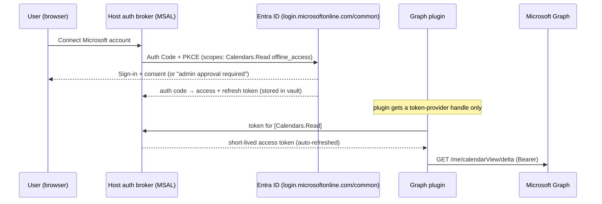
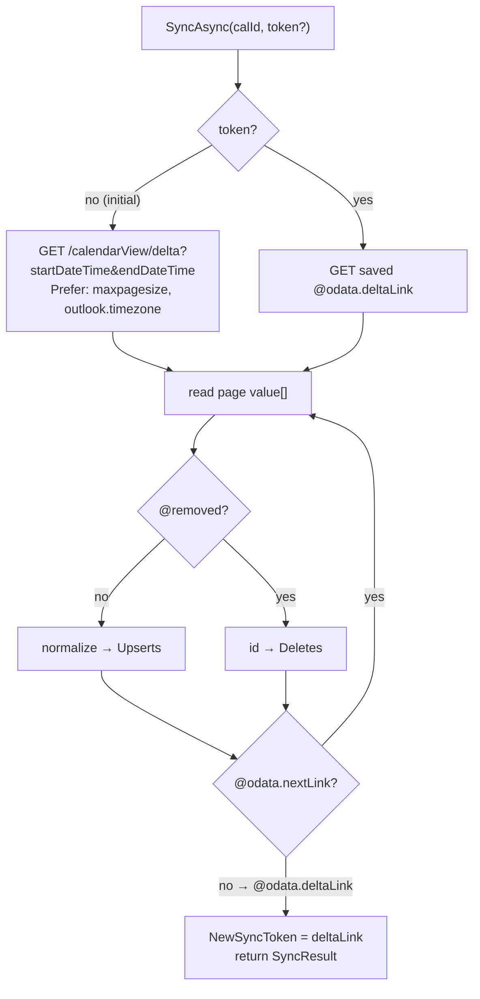

# Deep dive: the Microsoft Graph plugin

The Microsoft Graph plugin is the **Outlook / Microsoft 365 / work-calendar** source. One assembly plugin
covers **personal Microsoft accounts** (outlook.com, hotmail, live) *and* **work/school accounts**
(Microsoft 365 / Entra ID tenants) through the same `common` authority. Unlike CalDAV it's a clean REST
API with first-class **delta queries** for incremental sync — but the quirks live in **auth/consent**,
**recurrence shapes**, and **time-zone semantics**. This document specifies the plugin end to end.

- [1. What Microsoft Graph is](#1-what-microsoft-graph-is)
- [2. Capability & SDK mapping](#2-capability--sdk-mapping)
- [3. Auth (OAuth2 + PKCE via the broker)](#3-auth-oauth2--pkce-via-the-broker)
- [4. Enumerate calendars](#4-enumerate-calendars)
- [5. Initial event fetch](#5-initial-event-fetch)
- [6. Incremental sync (delta queries)](#6-incremental-sync-delta-queries)
- [7. Recurrence](#7-recurrence)
- [8. Normalization to the domain model](#8-normalization-to-the-domain-model)
- [9. Change notifications (webhooks, optional)](#9-change-notifications-webhooks-optional)
- [10. Write-back (later phase)](#10-write-back-later-phase)
- [11. .NET implementation notes](#11-net-implementation-notes)
- [12. Quirks](#12-quirks)
- [13. Manifest](#13-manifest)
- [14. Failure modes & tests](#14-failure-modes--tests)
- [15. Sources](#15-sources)

---

## 1. What Microsoft Graph is

- **Microsoft Graph** — the single REST API (`https://graph.microsoft.com/v1.0`) over Microsoft 365 data,
  including the **Outlook calendar** (Exchange Online for work/school, outlook.com for personal). Returns
  JSON; everything is OData (`$select`, `$filter`, `@odata.nextLink`, `@odata.deltaLink`).
- **Microsoft identity platform (Entra ID)** — the OAuth2/OIDC authority that issues tokens. Apps are
  registered in Entra ID; the `common` authority multiplexes personal + work/school sign-in.
- **Delta query** — Graph's native change-tracking protocol: a sync round returns pages via
  `@odata.nextLink`, ending with a durable `@odata.deltaLink` you replay next time to get only what
  changed. The delta mechanism — analogous to CalDAV's `sync-token`, but richer (it returns the changed
  bodies inline and emits tombstones via `@removed`).
- **Change notifications (subscriptions)** — optional webhooks that push a "something changed" signal so
  you can run a delta round immediately instead of polling.

So the plugin is: **sign in (broker) → enumerate calendars → calendarView/delta (initial full) →
persist deltaLink → replay deltaLink (incremental) → normalize.**

## 2. Capability & SDK mapping

Implements `ICalendarSource` (and later `ICalendarWriter`):

```csharp
public sealed class MicrosoftGraphPlugin : ICalendarSource
{
    public PluginManifest Manifest { get; }
    public Task InitializeAsync(IPluginHost host, CancellationToken ct);          // build GraphServiceClient + broker auth provider
    public Task<IReadOnlyList<RemoteCalendar>> ListCalendarsAsync(CancellationToken ct);   // §4
    public Task<SyncResult> SyncAsync(string remoteCalendarId, string? syncToken, CancellationToken ct); // §5–6
}
```

`SyncResult { IReadOnlyList<RemoteEvent> Upserts; IReadOnlyList<string> Deletes; string NewSyncToken; }`
— for this plugin **`NewSyncToken` is the `@odata.deltaLink` URL** (opaque; persist verbatim per calendar).

SDK packages (assembly plugin, .NET 9):

- **`Microsoft.Graph`** (v5.x) — `GraphServiceClient`, Kiota request builders, `PageIterator`.
- **`Microsoft.Identity.Client`** (MSAL) / **`Microsoft.Identity.Web`** — token acquisition. In our model
  the **host's auth broker** owns MSAL; the plugin receives a token-provider handle, never a client secret.

## 3. Auth (OAuth2 + PKCE via the broker)

**OAuth2 Authorization Code + PKCE** is the scheme (manifest `auth.scheme: oauth2-pkce`). The host runs the
whole dance and stores tokens in the encrypted vault; the plugin only ever asks the broker for a scoped,
short-lived access token at call time. The plugin **never sees** the client secret, the refresh token, or
the raw access token store.

### Authority

Use the **`common`** authority — `https://login.microsoftonline.com/common` — so one app registration
serves **both** personal Microsoft accounts and work/school (Entra ID) tenants. Alternatives, for context:

| Authority | Who can sign in |
| --- | --- |
| `common` | Personal MSAs **and** any work/school tenant (the default for this plugin). |
| `organizations` | Any work/school tenant, no personal accounts. |
| `consumers` | Personal Microsoft accounts only. |
| `{tenantId}` | One specific tenant (single-tenant deployments). |

The app registration's **supported account types** must be set to *"Accounts in any organizational
directory and personal Microsoft accounts"* (multi-tenant + MSA) to match `common`.

### Scopes

Request **delegated** (not application) permissions — this is a user signing in to their own mailbox:

- `Calendars.Read` — read calendars and events (phase 1).
- `Calendars.ReadWrite` — create/update/delete events (write phase; superset of read — request only when
  the write capability is enabled).
- `offline_access` — required to receive a **refresh token** so the broker can refresh silently.
- `openid`, `profile` — standard OIDC scopes for sign-in/account identity (MSAL adds these implicitly).

Pass these as fully-qualified resource scopes to MSAL, e.g.
`https://graph.microsoft.com/Calendars.Read offline_access openid profile`.

> Least privilege: ship `Calendars.Read` only. `Calendars.ReadBasic` exists (no body/attendees) and is even
> lower-privilege, but it strips fields we normalize (location, body) — prefer `Calendars.Read`.

### Admin consent (work tenants)

Consent rules changed in late 2025. As of June 2026:

- **Personal accounts** — `Calendars.Read` and `Calendars.ReadWrite` are user-consentable; the individual
  clicks through the consent screen, no admin involved.
- **Work/school tenants** — a **Microsoft-managed policy (effective end of October 2025)** now requires
  **admin consent** for the Calendar Graph permissions (`Calendars.Read`, `Calendars.ReadBasic`,
  `Calendars.ReadWrite`, and their `.Shared` variants) when accessing Exchange mailbox data. Where the
  tenant requires it, a non-admin user hits an **"Approval required" / `AADSTS65001`** wall and a Global/
  Privileged Role admin must grant tenant-wide consent (Entra admin center → Enterprise applications →
  Permissions → *Grant admin consent*, or the `/adminconsent` endpoint).

The broker surfaces consent failures (`AADSTS65001` user-needs-consent, `AADSTS90094` admin-consent-
required) so the UI can show **"Your IT admin must approve this app"** with the admin-consent URL — see
[§14](#14-failure-modes--tests).



## 4. Enumerate calendars

A mailbox has calendars, optionally grouped into **calendarGroups**. For most users a flat list is enough:

- `GET /me/calendars` — all calendars the user owns/has access to. `$select=id,name,color,hexColor,canEdit,owner,isDefaultCalendar,changeKey` to keep the payload small.
- `GET /me/calendarGroups` then `GET /me/calendarGroups/{id}/calendars` — only if you want to mirror the
  group hierarchy (e.g. "My calendars" vs "Other calendars"/shared). Optional; the flat enumeration already
  includes grouped calendars.

Map each to `RemoteCalendar { RemoteId = calendar.id, Name = name, Color, IsReadOnly = !canEdit }`. Graph
exposes a coarse enum `color` (`auto`, `lightBlue`, …) and a precise `hexColor` — prefer `hexColor` when
present, fall back to the enum.

> The mailbox's primary calendar is also reachable as `/me/calendar` (singular). `calendarView/delta`
> ([§6](#6-incremental-sync-delta-queries)) on `/me/...` targets the **default** calendar; to sync a
> non-default calendar, scope the path to that calendar (see below).

## 5. Initial event fetch

Two read shapes exist — pick **calendarView** for syncing:

| Endpoint | Returns | Recurrence |
| --- | --- | --- |
| `GET /me/events` (or `/me/calendars/{id}/events`) | **series masters** + single instances | Recurring series appear **once** as a `seriesMaster`; occurrences are *not* expanded. |
| `GET /me/calendarView?startDateTime=&endDateTime=` (or `/me/calendars/{id}/calendarView`) | events **expanded within the window** | Recurring series are expanded into `occurrence`/`exception` instances inside `[start,end)`. |

**Use `calendarView` (and its `delta`).** It is bounded by a date window and pre-expands recurrence, which
matches the app's "show the visible range" model and gives a deterministic sync set. `/me/events` is useful
only if you want to store the **master + RRULE** and expand locally with your own engine
(see [§7](#7-recurrence)).

The window: seed it to the app's active planning range (e.g. **now − 1 month → now + 12 months**) and
**widen it** as the user scrolls into new territory (a wider window = a *new* delta baseline; see the
deltaLink note in [§6](#6-incremental-sync-delta-queries)).

Initial full sync is just the first delta round with **no token** — see the next section.

## 6. Incremental sync (delta queries)

The `v1.0` delta for calendars is the **calendarView delta**, bound to a fixed window:

```http
GET /me/calendarView/delta?startDateTime=2026-01-01T00:00:00Z&endDateTime=2027-01-01T00:00:00Z
Prefer: odata.maxpagesize=50
Prefer: outlook.timezone="UTC"
```

> Note: `/me/events/delta` (unbounded, not tied to a window) exists only in **beta**, not `v1.0`. For a
> shipping plugin, use `/me/calendarView/delta` on `v1.0`. To sync a non-default calendar, target
> `/me/calendars/{id}/calendarView/delta`.

The flow (RFC-like state-token paging):

1. **Initial round** — issue the request above with `startDateTime`/`endDateTime`. The response is a page of
   events plus **either**:
   - `@odata.nextLink` (contains a `$skiptoken`) → more pages remain; GET it (no need to repeat
     `startDateTime`/`endDateTime`, they're encoded in the token), or
   - `@odata.deltaLink` (contains a `$deltatoken`) → this round is complete.
2. **Follow `@odata.nextLink`** until a response carries `@odata.deltaLink`. Accumulate `value[]` across
   pages.
3. **Persist `@odata.deltaLink`** as the calendar's sync token (`SyncResult.NewSyncToken`).
4. **Next round** — GET the saved `@odata.deltaLink`. It returns only events **added/updated/removed**
   since, ending again with a fresh `@odata.deltaLink`. Removed items arrive as tombstones:

```json
{
  "@odata.type": "#microsoft.graph.event",
  "id": "AAMkAD...AAA=",
  "@removed": { "reason": "deleted" }
}
```

Mapping to `SyncResult`:

| `SyncResult` field | From the delta response |
| --- | --- |
| `Upserts` | every `value[]` item **without** `@removed` → normalized `RemoteEvent` ([§8](#8-normalization-to-the-domain-model)) |
| `Deletes` | every `value[]` item **with** `@removed` → its `id` |
| `NewSyncToken` | the final `@odata.deltaLink` URL (persist verbatim) |



**Headers that matter:**

- `Prefer: outlook.timezone="UTC"` — without it Graph returns `start`/`end` in the **mailbox's default time
  zone**. Forcing UTC makes normalization deterministic ([§8](#8-normalization-to-the-domain-model)). (You
  *can* request any IANA/Windows zone, but UTC-in/convert-on-render is simpler.)
- `Prefer: odata.maxpagesize={n}` — page size for the delta (e.g. 50). Smaller pages = more round-trips but
  lower per-request cost and (anecdotally) fewer pathological paging loops; see [§12](#12-quirks).
- `$select` is **not supported** on `calendarView/delta` — the delta decides the projection. Don't send it
  here (it *is* supported on plain `/calendarView` and `/events`).

**deltaLink expiry.** A `@odata.deltaLink` can become invalid (token aged out, or the window/mailbox state
diverged). Graph then responds **`410 Gone`** with error code `syncStateNotFound` (sometimes a
`Location`-style reset link). Treat this as **"discard the token and do a full re-sync"** for that
calendar — re-issue the initial windowed request from scratch. Changing the `startDateTime`/`endDateTime`
window likewise requires a **new initial round** (the old deltaLink encodes the old window).

## 7. Recurrence

Graph models recurrence with the event **`type`** property (`singleInstance`, `occurrence`, `exception`,
`seriesMaster`) plus `seriesMasterId` and a `recurrence` (`PatternedRecurrence`) object on the master.

Two viable strategies — and they map onto the two endpoints in [§5](#5-initial-event-fetch):

| Strategy | How | Trade-off |
| --- | --- | --- |
| **A. calendarView expansion (recommended)** | Sync `calendarView/delta`; Graph emits `occurrence`/`exception` rows already expanded in the window. Store each as a concrete `Event` keyed by `id`/`iCalUId`. | Simple, deterministic, exceptions handled by the server. **Cost:** bounded to the window — events outside it aren't materialized until you widen and re-baseline; long series = many rows. |
| **B. master + RRULE** | Sync `/me/events` (masters only), translate Graph `PatternedRecurrence` → iCalendar `RRULE`, store the master, expand locally (Ical.Net) per visible range. | Compact storage, infinite horizon. **Cost:** you must translate Graph's pattern model to RRULE *and* reconcile `exception`/`cancelledOccurrences` yourself; harder. |

This plugin uses **Strategy A** to stay consistent with the windowed sync engine, while persisting the
master's `recurrence`/`seriesMasterId` so a future migration to local expansion (Strategy B) is possible.
Note Graph quirks:

- An **`exception`** is a modified occurrence (different subject/time/etc.); a **canceled** occurrence is
  *omitted* from `calendarView` (and listed in the master's `cancelledOccurrences` if you query the master).
- `seriesMaster` rows themselves appear in `/me/events`, **not** in `calendarView` (which only emits the
  expanded instances). `iCalUId` **differs per occurrence**, so it is *not* a stable series key — use
  `seriesMasterId` to relate instances to their master.

## 8. Normalization to the domain model

Graph events normalize onto the domain `Event` (+ `Place`). Default `Prefer: outlook.timezone="UTC"` so
`start.timeZone`/`end.timeZone` come back as `"UTC"`.

| Domain field | From Graph |
| --- | --- |
| `Event.RemoteId` | `id` (request `Prefer: IdType="ImmutableId"` so the id survives moves — see [§11](#11-net-implementation-notes)) |
| `Event.Uid` | `iCalUId` (stable across calendars/mailboxes for the same meeting → feeds dedup; **note: differs per occurrence** in a series) |
| `Event.Title` | `subject` |
| `Event.StartUtc` / `Event.EndUtc` | `start.dateTime` + `start.timeZone`, `end.dateTime` + `end.timeZone` → convert to UTC (with `outlook.timezone="UTC"` they already are) |
| `Event.AllDay` | `isAllDay` (when true, start/end are midnight in the same zone) |
| *(recurrence kind)* | `type` ∈ {`singleInstance`, `occurrence`, `exception`, `seriesMaster`}; `seriesMasterId` links instances → master |
| `Event.Rrule` | `recurrence` (PatternedRecurrence) translated to RRULE — only when storing masters (Strategy B); empty under Strategy A |
| `Event.Location` → `Place` | `location.displayName` → `Place.Label`; `location.address` → `Place.Address`; `location.coordinates` (`latitude`/`longitude`) → `Place.Lat`/`Lng` if present, else `geo.geocode` the text |
| *(categories)* | `categories[]` (strings matching the user's Outlook categories) → category rules ([ARCHITECTURE §13](../ARCHITECTURE.md#13-categories--visibility)) |
| change token (per event) | `@odata.etag` / `changeKey` (optimistic concurrency for write-back, [§10](#10-write-back-later-phase)) |
| sync token (per calendar) | `@odata.deltaLink` |

Time zones: trust the `timeZone` label on each `DateTimeTimeZone`; convert to UTC for storage, render in the
user's zone. Graph uses **Windows time-zone names by default** (e.g. `"Pacific Standard Time"`) unless you
asked for an IANA zone — normalize via `TimeZoneInfo`/`TimeZoneConverter` so the value is unambiguous.

## 9. Change notifications (webhooks, optional)

Polling delta on the scheduler is the baseline. For near-real-time updates, **subscriptions** push a signal:

- `POST /subscriptions` with `changeType: "created,updated,deleted"`, `resource: "/me/calendars/{id}/events"`
  (or `/me/events`), a `notificationUrl` (an HTTPS endpoint the **host** exposes — not the plugin),
  `clientState` (shared secret), and `expirationDateTime`.
- **Calendar (Outlook) subscriptions max out at ~3 days** (`4230` minutes); the host must **renew** before
  expiry (`PATCH /subscriptions/{id}`) or re-create. Also handle **lifecycle notifications**
  (`reauthorizationRequired`, `subscriptionRemoved`) to re-authorize/re-create proactively.
- On validation, Graph sends a token you must echo within 10 s; thereafter notifications are "thin" (they
  tell you *something* changed, not the full payload).

**Pattern: notification → delta.** A notification is just a trigger to run a `calendarView/delta` round
([§6](#6-incremental-sync-delta-queries)) immediately. Never rely on notification payloads alone — they can
be missed; delta is the source of truth. This needs a reachable host endpoint
([ARCHITECTURE §16](../ARCHITECTURE.md#16-sharing) hybrid constraint), so it's an **optional enhancement**
for self-hosted/managed deployments; pure-local installs just poll.

## 10. Write-back (later phase)

`ICalendarWriter` for `calendar.write` (scope upgraded to `Calendars.ReadWrite`):

- **Create:** `POST /me/calendars/{id}/events` with the event JSON. Set a client `transactionId` to make
  retries idempotent. Returns the created event (capture `id`, `@odata.etag`).
- **Update:** `PATCH /me/events/{id}` with `If-Match: <etag>` (optimistic concurrency). On **`412
  Precondition Failed`** re-fetch and merge.
- **Delete:** `DELETE /me/events/{id}` (optionally `If-Match`).
- **Recurrence edits** (this occurrence vs whole series) and **invitations/attendee scheduling** are a
  further step — defer; they carry meeting-response semantics.

## 11. .NET implementation notes

- **GraphServiceClient + broker auth provider.** Construct `GraphServiceClient` with an
  `IAuthenticationProvider` that delegates to the host broker. In v5/Kiota, implement
  `IAccessTokenProvider` (returns the broker's short-lived token for the requested scopes) and wrap it in
  `BaseBearerTokenAuthenticationProvider`. The plugin never instantiates MSAL or holds a client secret —
  the host owns the `IPublicClientApplication`/token cache.
- **Egress-filtered HttpClient.** Build the client's `HttpClientRequestAdapter` over the host's
  `IPluginHost.CreateClient()` so all Graph traffic is pinned to the manifest allowlist
  (`graph.microsoft.com`, `login.microsoftonline.com`).
- **Pagination via `PageIterator`.** Use `PageIterator<Event, EventCollectionResponse>` to walk
  `@odata.nextLink` and, for delta, transition to `@odata.deltaLink` automatically; grab the final
  `OdataDeltaLink` to persist. Alternatively, follow links manually with `.WithUrl(nextOrDeltaLink)` on the
  delta request builder (the URL comes from the response's `OdataNextLink`/`OdataDeltaLink`).
- **`$select` to trim payloads.** On plain reads (`/events`, `/calendars`) request only the fields in
  [§8](#8-normalization-to-the-domain-model). (Not on `calendarView/delta`, which rejects `$select`.)
- **Throttling (429).** Graph returns **`429 Too Many Requests`** with a **`Retry-After`** header (seconds);
  Outlook calendar GETs are limited to roughly **4 req/s per app per mailbox** (burst ~10,000/10 min).
  Honor `Retry-After` exactly (it's the fastest recovery — Graph keeps counting usage while you're
  throttled). Use the host's Polly pipeline (respect `Retry-After`, exponential backoff + jitter, circuit
  breaker) shared with the fallback aggregator. Also handle **`503`/`504`** with backoff.
- **Immutable ids.** Send `Prefer: IdType="ImmutableId"` so an event `id` doesn't change when the item moves
  folders — important because `RemoteId` keys upserts/deletes.
- **Per-calendar tokens.** delta is per-calendar; store one `@odata.deltaLink` per `RemoteCalendar` in
  `ACCOUNT.SyncToken`/a per-calendar token table, not one global token.

```csharp
// Sketch: a delta round using PageIterator (host-provided auth + HttpClient under the hood)
var upserts = new List<RemoteEvent>();
var deletes = new List<string>();
string? deltaLink = null;

var page = syncToken is null
    ? await graph.Me.CalendarView.Delta.GetAsDeltaGetResponseAsync(rc => {
          rc.QueryParameters.StartDateTime = windowStart;   // "2026-01-01T00:00:00Z"
          rc.QueryParameters.EndDateTime   = windowEnd;
          rc.Headers.Add("Prefer", new[] { "odata.maxpagesize=50", "outlook.timezone=\"UTC\"" });
      }, ct)
    : await graph.Me.CalendarView.Delta.WithUrl(syncToken)  // saved deltaLink
          .GetAsDeltaGetResponseAsync(rc =>
              rc.Headers.Add("Prefer", new[] { "outlook.timezone=\"UTC\"" }), ct);

var iterator = PageIterator<Event, DeltaGetResponse>.CreatePageIterator(
    graph, page,
    e => { if (e.AdditionalData.ContainsKey("@removed")) deletes.Add(e.Id!);
           else upserts.Add(Normalize(e)); return true; });
await iterator.IterateAsync(ct);
deltaLink = iterator.Deltalink;                              // persist as NewSyncToken
```

## 12. Quirks

| Area | Note |
| --- | --- |
| **`calendarView/delta` paging loop** | Reported cases where pages repeat indefinitely: `$skiptoken` rotates each response but the payload is identical and `@odata.deltaLink` is never emitted. Mitigations: cap the window size, vary `odata.maxpagesize`, and add a **safety bound** (max pages / dedupe by id) so a sync round can't loop forever. |
| **`$select` unsupported on delta** | `calendarView/delta` ignores/refuses `$select`; you get the full projection. Use `$select` only on non-delta reads. |
| **Default time zone** | Without `Prefer: outlook.timezone`, times come back in the mailbox's zone (often not UTC) — silent off-by-hours bugs. Always set it. |
| **Windows vs IANA zones** | `timeZone` labels are Windows names by default (`"Pacific Standard Time"`). Convert with TimeZoneConverter; request an IANA zone explicitly if preferred. |
| **`iCalUId` per occurrence** | Differs for each occurrence in a series — not a series-level key. Relate instances via `seriesMasterId`. |
| **`seriesMaster` vs `calendarView`** | Masters appear in `/me/events`, not in `calendarView` (which emits expanded `occurrence`/`exception` rows). Canceled occurrences are simply absent. |
| **deltaLink → 410** | Expired/invalid deltaLink returns `410 Gone` (`syncStateNotFound`) → discard token, full re-sync. |
| **Personal vs work fields** | Some properties (online-meeting providers, sensitivity behaviors) differ between consumer and Exchange Online mailboxes; normalize defensively. |
| **Admin-consent wall** | Work tenants may block first sign-in (`AADSTS65001`/`90094`) until an admin consents — a connect-time UX issue, not a runtime bug ([§3](#3-auth-oauth2--pkce-via-the-broker)). |

## 13. Manifest

```yaml
id: org.unifiedcalendar.microsoft
name: Microsoft 365 / Outlook
version: 0.1.0
sdkVersion: "1.x"
kind: assembly
capabilities: [calendar.read]            # calendar.write later
publisher: { name: Unified Calendar, signature: <detached-sig> }

auth:
  scheme: oauth2-pkce                     # host broker runs Auth Code + PKCE; plugin never sees tokens
  authority: https://login.microsoftonline.com/common   # personal MSAs + work/school tenants
  authorizationUrl: https://login.microsoftonline.com/common/oauth2/v2.0/authorize
  tokenUrl:         https://login.microsoftonline.com/common/oauth2/v2.0/token
  scopes:
    - https://graph.microsoft.com/Calendars.Read        # + Calendars.ReadWrite in the write phase
    - offline_access
    - openid
    - profile

network:
  allow:
    - graph.microsoft.com
    - login.microsoftonline.com

config:                                   # JSON Schema → host auto-renders the settings form
  type: object
  properties:
    syncWindowMonthsBack:    { type: integer, title: "Sync window — months back",    default: 1,  minimum: 0 }
    syncWindowMonthsForward: { type: integer, title: "Sync window — months forward", default: 12, minimum: 1 }
  required: []
```

> The app's **client id** (and, for confidential deployments, secret) lives in the **host broker config**,
> not the plugin manifest — the plugin is provider-agnostic and secret-free by design.

## 14. Failure modes & tests

- **Token refresh:** access token expires mid-sync → broker silently refreshes via `offline_access`; assert
  the plugin retries the in-flight request transparently. Refresh-token revoked → surface "reconnect".
- **deltaLink expiry → full resync:** `410 Gone` / `syncStateNotFound` → token discarded, initial windowed
  round re-runs and produces the same materialized set (idempotent upserts).
- **429 backoff:** inject `429` + `Retry-After: 5` → the plugin waits exactly that long and resumes; verify
  it never busy-loops and that per-mailbox rate stays within budget.
- **Paging loop guard:** simulate a non-terminating `@odata.nextLink` (rotating `$skiptoken`, repeated
  payload) → the safety bound (max pages / id-dedupe) halts the round and logs, rather than hanging.
- **Time-zone handling:** events with and without `Prefer: outlook.timezone`; Windows-named zones; DST
  boundary events — all land at correct UTC instants.
- **All-day:** `isAllDay=true` single-day and multi-day; assert midnight-aligned, same-zone start/end and a
  correct `AllDay` flag.
- **Recurrence exceptions:** a series with one modified `exception` and one canceled occurrence → exception
  upserts with its own id; canceled instance is absent (and, on the master path, listed in
  `cancelledOccurrences`).
- **Removed tombstones:** `@removed` items map to `Deletes` and never to `Upserts`.
- **Work-tenant consent errors:** `AADSTS65001` (user consent needed) and `AADSTS90094` (admin consent
  required) map to a clear "your IT admin must approve this app" message with the admin-consent URL — not a
  generic auth failure.
- **Personal vs work parity:** the same normalization passes against a consumer outlook.com mailbox and an
  Exchange Online mailbox fixture.
- Integration tests run against **recorded Graph fixtures** (delta pages, `@removed`, recurrence) and the
  MSAL test harness — no live tenant required in CI.

## 15. Sources

- Delta query — calendar view events (endpoint, `@odata.nextLink`/`@odata.deltaLink`, `@removed`, `Prefer: odata.maxpagesize`): <https://learn.microsoft.com/en-us/graph/delta-query-events>
- Delta query overview (state tokens, full vs incremental, `410` resync): <https://learn.microsoft.com/en-us/graph/delta-query-overview>
- `event` resource (`type` = singleInstance/occurrence/exception/seriesMaster; `iCalUId`, `seriesMasterId`, `isAllDay`, `categories`, `location`, `changeKey`, immutable id): <https://learn.microsoft.com/en-us/graph/api/resources/event?view=graph-rest-1.0>
- `event: delta` (beta `/me/events/delta`, unbounded): <https://learn.microsoft.com/en-us/graph/api/event-delta?view=graph-rest-1.0>
- List events / `Prefer: outlook.timezone` & default-zone behavior: <https://learn.microsoft.com/en-us/graph/api/user-list-events?view=graph-rest-1.0>
- Outlook calendar API overview: <https://learn.microsoft.com/en-us/graph/outlook-calendar-concept-overview>
- Graph permissions overview & reference (`Calendars.Read`/`Calendars.ReadWrite`, delegated, personal-account consent): <https://learn.microsoft.com/en-us/graph/permissions-overview>, <https://learn.microsoft.com/en-us/graph/permissions-reference>
- Scopes & authorities (`common`/`organizations`/`consumers`), Microsoft identity platform: <https://learn.microsoft.com/en-us/entra/identity-platform/scopes-oidc>
- Admin consent for calendar permissions (Microsoft-managed policy, Oct 2025): <https://www.hetk.io/blog/microsoft-admin-consent-outlook-calendar/>, <https://learn.microsoft.com/en-us/answers/questions/39209/do-i-need-admin-consent-on-calendar-operations>
- Throttling guidance & `Retry-After`: <https://learn.microsoft.com/en-us/graph/throttling>
- Service-specific throttling limits (Outlook calendar ~4 req/s per app per mailbox): <https://learn.microsoft.com/en-us/graph/throttling-limits>
- .NET SDK v5 upgrade (auth provider, `IAccessTokenProvider`, `WithUrl`): <https://github.com/microsoftgraph/msgraph-sdk-dotnet/blob/main/docs/upgrade-to-v5.md>
- Paging with the SDKs / `PageIterator` + delta: <https://learn.microsoft.com/en-us/graph/sdks/paging>
- Change notifications (webhooks) overview & subscription lifecycle/expiration: <https://learn.microsoft.com/en-us/graph/change-notifications-overview>, <https://learn.microsoft.com/en-us/graph/api/resources/subscription?view=graph-rest-1.0>, <https://learn.microsoft.com/en-us/graph/change-notifications-lifecycle-events>
- Outlook change notifications (calendar resource): <https://learn.microsoft.com/en-us/graph/outlook-change-notifications-overview>
- calendarView/delta infinite-loop reports (paging-loop quirk): <https://github.com/microsoftgraph/msgraph-sdk-dotnet/issues/3082>, <https://learn.microsoft.com/en-us/answers/questions/5883982/calendarview-delta-returns-identical-event-pages-i>
