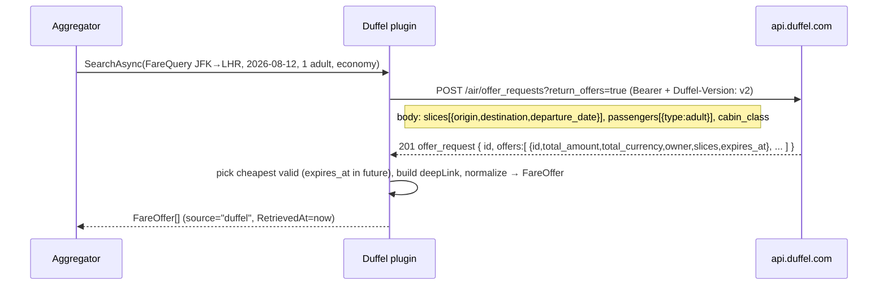
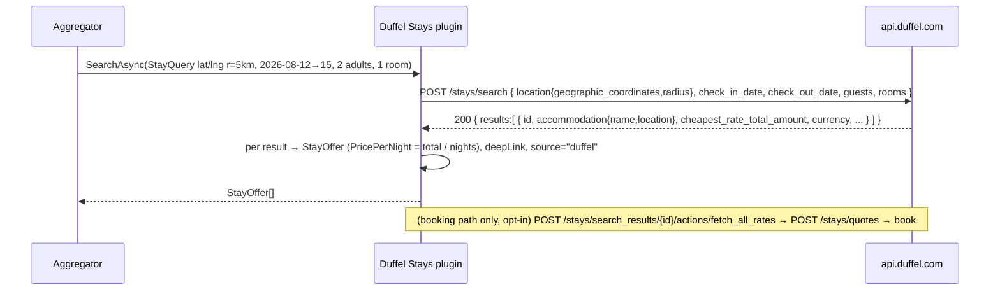
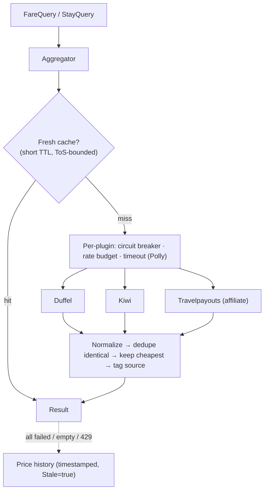
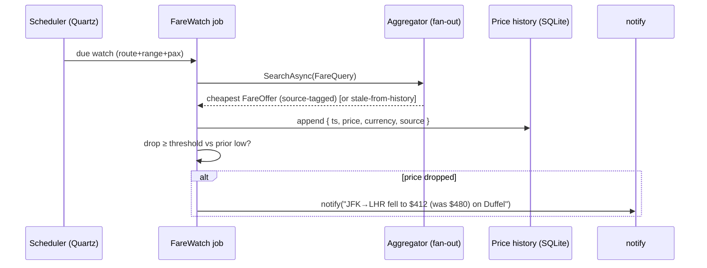

# Deep dive: the travel-fares plugins (flight.price / stay.price)

Two capabilities — **`flight.price`** and **`stay.price`** — power the planner's price overlays and fare
watches. Unlike calendars there is **no single "right" provider**: pricing answers are *interchangeable*,
so these plugins are first-class citizens of the [multi-provider fallback aggregator](../ARCHITECTURE.md#15-multi-provider-fallback-aggregator)
(failover + fan-out merge + dedupe + pick-cheapest + tag-source). The core never names a provider; it asks
the registry *"who prices flights?"* and the aggregator fans the query out across whoever is installed,
healthy, and within budget.

This document specifies the **Duffel Flights** (primary `flight.price`), **Duffel Stays** (`stay.price`),
and **Kiwi/Tequila** (fallback `flight.price`) connectors end to end: auth, the request flows, the quirks,
normalization to `FareOffer`/`StayOffer`, how the aggregator dedupes and degrades, how `FareWatch` polling
and price history feed the cheapest-date / nightly-rate overlays, and the failure-mode test matrix.

> ⚠️ **Amadeus Self-Service is decommissioned 2026-07-17** — do **not** build the starter plugin on it.
> Lead with **Duffel**; Kiwi/Tequila is the second source; everything else is partner- or affiliate-gated.
> See [PLUGIN-RESEARCH.md](../PLUGIN-RESEARCH.md) for the full survey.

- [1. What "fare pricing" is here](#1-what-fare-pricing-is-here)
- [2. Capability & SDK mapping](#2-capability--sdk-mapping)
- [3. Auth (per provider)](#3-auth-per-provider)
- [4. Duffel Flights — the primary `flight.price`](#4-duffel-flights--the-primary-flightprice)
- [5. Duffel Stays — `stay.price`](#5-duffel-stays--stayprice)
- [6. Kiwi / Tequila — fallback `flight.price`](#6-kiwi--tequila--fallback-flightprice)
- [7. Excluded & alternative providers](#7-excluded--alternative-providers)
- [8. Normalization to the domain model](#8-normalization-to-the-domain-model)
- [9. The aggregator: fan-out, dedupe, cheapest, degrade](#9-the-aggregator-fan-out-dedupe-cheapest-degrade)
- [10. Fare watches, price history & planner overlays](#10-fare-watches-price-history--planner-overlays)
- [11. Caveats: rate budgets, volatile quotes, caching ToS](#11-caveats-rate-budgets-volatile-quotes-caching-tos)
- [12. Manifests](#12-manifests)
- [13. Failure modes & tests](#13-failure-modes--tests)
- [Sources](#sources)

---

## 1. What "fare pricing" is here

We are **not** an OTA. The default product is **price display + deep-link**: show the cheapest fare/rate
for a route or stay on a candidate date, tag the winning source, and link out to book. Actual ticketing
(Duffel **orders**) or hotel booking (Duffel **quotes → bookings**) is regulated and optional — adopted
only if the deployment opts in (see §4, §5). So a pricing plugin's job is narrow:

- take a **`FareQuery`** (route + date range + pax) or **`StayQuery`** (place + dates + guests),
- call the provider's **shop/search** flow (offer-request → offers; or search → rates),
- normalize the cheapest, bookable-display answers into **`FareOffer[]` / `StayOffer[]`** with a
  `deepLink` and a `source` tag,
- and do it inside a **rate budget** with graceful degradation to **stored price history** when the
  provider is down, rate-limited, or empty.

Because quotes are **volatile and non-binding** (a Duffel offer "typically expires within 30 minutes"),
everything downstream — overlays, watches, history — is **timestamped** and can be flagged `stale`.

## 2. Capability & SDK mapping

Two interfaces from `Calendar.Plugin.Abstractions` ([PLUGINS.md §5](../PLUGINS.md#5-assembly-plugins--the-sdk-contract)).
Each carries a **`Coverage`** descriptor the aggregator's routing policy reads (which markets/regions a
provider serves, so it doesn't fan a JFK→LHR query out to a provider that only does EU rail).

```csharp
namespace Calendar.Plugin.Abstractions;

public interface IFlightPricing : IPlugin
{
    FareCoverage Coverage { get; }                                       // markets, currencies, one-way/multi-city
    Task<IReadOnlyList<FareOffer>> SearchAsync(FareQuery q, CancellationToken ct);
}

public interface IStayPricing : IPlugin
{
    FareCoverage Coverage { get; }
    Task<IReadOnlyList<StayOffer>> SearchAsync(StayQuery q, CancellationToken ct);
}

public sealed record FareQuery(
    string From, string To,                 // IATA codes (resolve city/place → IATA upstream)
    DateOnly DepartDate, DateOnly? ReturnDate,
    int Adults, CabinClass Cabin, string Currency, string Market);

public sealed record StayQuery(
    double Lat, double Lng, int RadiusKm,    // or an accommodation id
    DateOnly CheckIn, DateOnly CheckOut,
    int Adults, int Rooms, string Currency, string Market);

public sealed record FareOffer(
    decimal Price, string Currency,
    string From, string To, DateOnly Date,
    string Carrier, string FlightNo,         // for dedupe; may be multi-segment (first marketing carrier)
    DateTimeOffset DepartUtc, DateTimeOffset ArriveUtc,
    string DeepLink, string Source,          // "duffel" | "kiwi" | ...
    DateTimeOffset RetrievedAt, bool Stale);

public sealed record StayOffer(
    decimal PricePerNight, decimal PriceTotal, string Currency,
    string PlaceLabel, double Lat, double Lng,
    DateOnly CheckIn, DateOnly CheckOut,
    string DeepLink, string Source,
    DateTimeOffset RetrievedAt, bool Stale);

public sealed record FareCoverage(
    IReadOnlySet<string> Markets, IReadOnlySet<string> Currencies,
    bool MultiCity, bool OneWay, string Notes);
```

Both can be built **two ways** (the same choice as every other integration, [PLUGINS.md §2](../PLUGINS.md#2-the-two-plugin-kinds)):

| Kind | When | Trade-off |
| --- | --- | --- |
| **Declarative connector** (manifest + OpenAPI + JSONata map) | Duffel's flows are clean REST/JSON with a published OpenAPI | **Default.** No code; runs in the shared connector engine; safest tier. The multi-step shop flow (offer-request → list-offers) is expressed as chained operations. |
| **Assembly plugin** (C# DLL) | You want the offer-request→offers polling, retry, and partial-results handling in real code | More control. Could wrap the **`duffel-api-dotnet`** library — but note it is **community-maintained**: Duffel paused official support for lack of adoption (fork-and-maintain). Don't take a hard dependency on it without owning the fork. |

> **Recommendation:** ship Duffel as a **declarative connector** first (no DLL, no unmaintained SDK
> dependency). Reach for an assembly plugin only if offer-expiry re-shopping or partial-result merging
> outgrows what JSONata + the connector engine can express.

## 3. Auth (per provider)

The host's **auth broker** ([PLUGINS.md §6](../PLUGINS.md#6-authentication-broker)) injects the credential at
call time; the plugin never stores it. All three providers are simple bearer/apikey schemes — no OAuth
dance.

| Provider | Scheme | Header | Test vs live |
| --- | --- | --- | --- |
| **Duffel Flights** | `apikey` (bearer access token) | `Authorization: Bearer <token>` | **Separate test & live tokens.** A `live_mode` boolean on every resource tells you which world it came from. Test mode has deterministic fixture routes for CI. |
| **Duffel Stays** | `apikey` (same token family) | `Authorization: Bearer <token>` | Same token covers Flights + Stays. |
| **Kiwi / Tequila** | `apikey` | `apikey: <key>` (request header) | Single key issued after **partner onboarding** (portal application gated by partner type/volume). No open self-serve key. |

Duffel additionally **requires a version header on every request**: `Duffel-Version: v2` (plus
`Accept: application/json`, `Content-Type: application/json`). Omitting it is the #1 first-call failure.

The broker stores tokens in the encrypted vault and hands the plugin a scoped, short-lived handle; the
manifest's `network.allow` (§12) means the plugin's `HttpClient` *physically cannot* reach anything but
`api.duffel.com` / `api.tequila.kiwi.com`.

## 4. Duffel Flights — the primary `flight.price`

Modern REST, 300+ airlines across **NDC / GDS / LCC** content. The shopping model is **offer-request →
offers**: you describe the journey, Duffel fans it out to airlines, and returns **offers** (a priced set
of flights you could buy). We use the offers for **display/overlay**; orders (booking) are optional.

### 4.1 The shop flow



- **Endpoint:** `POST https://api.duffel.com/air/offer_requests`.
- **Required body:** `slices` (one per leg — two for a round trip, N for multi-city) and `passengers`
  (`[{ "type": "adult" }, ...]`). Optional: `cabin_class`, `max_connections`, `private_fares`,
  `include_split_ticket`.
- **`return_offers` query param** controls inlining: `?return_offers=true` returns *all* offers inside the
  offer-request resource (one round trip — best for our overlay use). `?return_offers=false` returns the
  offer-request only; you then page **`GET /air/offers?offer_request_id=…`** (better when you want
  server-side filtering/sorting or expect a huge result set).
- **Single offer refresh:** `GET /air/offers/{id}` — call before any booking to revalidate price (Duffel
  explicitly warns price/availability may move between shop and book).

### 4.2 Offers expire — the central quirk

> An offer is bookable "for a limited time… **typically within 30 minutes**" via its `expires_at`
> (ISO-8601). After that the offer id is dead.

Consequences baked into the plugin:

- We **never cache an offer as a bookable artifact.** We extract `total_amount` + `total_currency` +
  `expires_at` into a **`FareOffer`** with `RetrievedAt`, and persist *the price point* (for history),
  not the offer id.
- If an overlay cell renders an offer whose `expires_at` has passed, the UI shows the price as an
  **indicative, timestamped** number ("as of 14:03") and re-shops on click — it does not pretend the offer
  is live.
- For booking deployments (orders) the plugin re-fetches `GET /air/offers/{id}` immediately before
  creating the order and surfaces a price-changed prompt on mismatch.

### 4.3 Partial vs full results

Airlines respond at different speeds. With `return_offers=true` Duffel returns what it has when the
offer-request resolves; some content (especially NDC) can be slower. The plugin treats results as
**best-effort and partial** — never "no offers = no flights." Empty/partial returns are a *degradation
signal* to the aggregator (try Kiwi, or fall back to stored history), not an error.

### 4.4 Booking is optional (orders)

Default = **price display + deep-link** (link to the airline/Duffel-hosted checkout). Ticketing means
adopting **Duffel Orders** (`POST /air/orders` from a held offer), which makes the deployment a
regulated seller of travel. That is an explicit, separate opt-in — out of scope for the pricing
capability, which only reads.

## 5. Duffel Stays — `stay.price`

Same token, same versioned REST, **millions of properties** (major chains: Hilton, Marriott, IHG, etc.).
Commercial model is **profit-share on every booking, from the first booking, no negotiation** — relevant
only if a deployment adopts Stays *booking*; for `stay.price` we only read rates for the overlay.

### 5.1 The search → rates → quote → book flow



- **Search:** `POST https://api.duffel.com/stays/search`. Required: `check_in_date`, `check_out_date`
  (max 99-night stay; check-in up to ~330 days out), `guests`, `rooms`, and **either** `location`
  (`geographic_coordinates` lat/long + `radius` km) **or** an `accommodation` object/ids. Each result
  carries `cheapest_rate_total_amount` + currency and an `expires_at` for rate validity — enough for the
  nightly-rate overlay without going deeper.
- **Rates (booking path):** `POST /stays/search_results/{search_result_id}/actions/fetch_all_rates` →
  all rooms × rates for a chosen result.
- **Quote:** `POST /stays/quotes` (from a `rate_id`) confirms availability + total before booking.
- **Book:** create a booking from the quote id.

For the overlay we stop at **search** — `cheapest_rate_total_amount / nights` is the nightly figure. We
only walk rates → quote → book if the deployment opts into Stays booking.

## 6. Kiwi / Tequila — fallback `flight.price`

Kiwi's **Tequila** API (~750 carriers incl. LCCs, strong **flexible-date / multi-city / "anywhere"**
inspiration) is the second `flight.price` source behind the aggregator. It shines exactly where the
planner does: flexible date ranges over a multi-month grid.

- **Search:** `GET https://api.tequila.kiwi.com/v2/search` with `fly_from`, `fly_to`, `date_from`,
  `date_to` (a *range* — maps naturally to our `FareQuery` date range and the cheapest-date overlay),
  `adults`, `curr`, plus flexible flags (`flexible`, multi-city via the locations API).
- **Locations:** `GET /locations` resolves city/airport/place → Kiwi location ids (used to turn a `Place`
  into `fly_from`/`fly_to`).
- **Auth:** `apikey: <key>` header. The key comes from **Tequila/Kiwi partner onboarding** — apply via
  the partner portal; approval is gated by partner type, expected volume, and integration approach. There
  is **no open self-serve tier**, so the plugin ships disabled until a key is configured (the aggregator
  simply doesn't see a `flight.price` provider it has no credential for).
- **Deep-link:** each result carries a `deep_link` to Kiwi checkout → `FareOffer.DeepLink`, `source="kiwi"`.

Tequila's range search returns one offer per (date, route) combination, which dedupes cleanly against
Duffel by `carrier + flightNo + depart/arrive times` (§9). Where Duffel returns nothing (LCC-only routes),
Kiwi often fills the gap — the core reason to fan out rather than fail over.

## 7. Excluded & alternative providers

| Provider | Capability | Status | Why |
| --- | --- | --- | --- |
| **Amadeus Self-Service** | `flight.price` / `stay.price` | ❌ **Excluded** | **Self-service portal sunsets 2026-07-17.** Enterprise APIs remain but are heavyweight/contracted — not a starter plugin. |
| **Skyscanner** | `flight.price` | 🔒 Partner-only | Approved commercial partners; **no public free tier**. Viable only with a partnership. |
| **Travelpayouts** | `flight.price` / deep-links | 🟡 Affiliate | **Commission/affiliate** model — low friction, great for **price display + deep-link** (incl. Kiwi via its affiliate API). Add as an affiliate `flight.price` source when monetizing links. |
| **Hotelbeds / Expedia Rapid / Booking Demand** | `stay.price` | 🔒 Partner-gated | Rich hotel content but **contract + ToS-gated** (and caching-restricted). Alternatives to Duffel Stays once a partnership exists. |

Each slots into the **same** `IFlightPricing` / `IStayPricing` interface, so adding one is a manifest +
mapping (declarative) — the aggregator picks them up automatically.

## 8. Normalization to the domain model

Every provider's payload collapses onto the two records in §2. The mapping is the *only* provider-specific
part of a declarative connector (JSONata in the manifest); the aggregator and planner see uniform shapes.

**Flights → `FareOffer`:**

| Field | Duffel | Kiwi/Tequila |
| --- | --- | --- |
| `Price` / `Currency` | `total_amount` / `total_currency` | `price` / `curr` |
| `From` / `To` | `slices[0].origin.iata_code` / `slices[-1].destination.iata_code` | `flyFrom` / `flyTo` |
| `Date` | `slices[0].segments[0].departing_at` (date) | `local_departure` (date) |
| `Carrier` / `FlightNo` | `owner.iata_code` / first segment `operating_carrier_flight_number` | `airlines[0]` / `route[0].flight_no` |
| `DepartUtc` / `ArriveUtc` | segment `departing_at` / `arriving_at` | `dTimeUTC` / `aTimeUTC` |
| `DeepLink` | hosted-checkout / order link | `deep_link` |
| `Source` | `"duffel"` | `"kiwi"` |
| `RetrievedAt` / `Stale` | now / false (set true on history fallback) | now / false |

**Stays → `StayOffer`:** `PriceTotal` = `cheapest_rate_total_amount`; `PricePerNight` = total ÷ nights;
`PlaceLabel` + `Lat`/`Lng` from `accommodation.location`; `CheckIn`/`CheckOut` echo the query;
`Source="duffel"`. Trip drafts persist as **`TripItem { Kind="Flight"|"Stay", Status="Candidate" }`**
([ARCHITECTURE.md §9](../ARCHITECTURE.md#9-domain-model)); booked items become `Status="Booked"` and
project into `Event`s under the Travel category.

**Currency normalization** is a first-class concern: providers price in the market's currency. The plugin
requests the user's display currency (`curr`/`Currency` in the query) where supported; otherwise the
aggregator converts at a cached daily FX rate **for comparison only** (never for booking), tagging the
offer with both original and converted amounts so dedupe's cheapest-pick is apples-to-apples.

## 9. The aggregator: fan-out, dedupe, cheapest, degrade

`flight.price` and `stay.price` are **interchangeable-result** capabilities, so they ride the generic
[fallback aggregator](../ARCHITECTURE.md#15-multi-provider-fallback-aggregator). Two modes:

- **Failover** (cheap): take the first healthy provider's answer. Used for low-value background polling.
- **Fan-out + merge** (best coverage): query all healthy providers in parallel, **dedupe, pick cheapest,
  tag source**. Used for interactive search and overlay generation.



**Dedupe key for flights:** two offers are "the same flight" when
`carrier + flightNo + departUtc + arriveUtc` match (round to the minute). Keep the **cheapest**; record
the losing source(s) so the UI can show "also on Kiwi". Multi-segment itineraries key on the *ordered
tuple* of segment (carrier, flightNo, times). **Stays** dedupe on `accommodation id` (or geocoded
`lat/lng` rounded + name) over the same `checkIn/checkOut`, again keeping the cheapest nightly rate.

**Circuit breaker & rate budget** are per plugin (shared with the security budgets in
[PLUGINS.md §8](../PLUGINS.md#8-security--sandboxing)): a provider returning 429s or timing out is opened
and skipped until it half-opens — one rate-limited provider never stalls a fan-out.

**Graceful degradation:** if every provider fails, is empty, or is rate-limited, the aggregator returns
the **last-known price from history**, `Stale=true` + `RetrievedAt` set to the original capture. The
overlay renders it greyed with an "as of …" tooltip. A query never hard-fails to the planner.

## 10. Fare watches, price history & planner overlays

### 10.1 Watches

A **`FareWatch`** ([ARCHITECTURE.md §9](../ARCHITECTURE.md#9-domain-model)) is
`{ Kind: Flight|Stay, OriginPlaceId, DestPlaceId (or stay Place), RangeStart, RangeEnd, Pax }`. Quartz
schedules polling per watch (frequency bounded by the provider's rate budget — §11). Each poll:

1. builds a `FareQuery`/`StayQuery` from the watch, runs it through the aggregator (fan-out),
2. appends the cheapest result to the watch's **price series** (one timestamped point per poll: price,
   currency, source),
3. fires **`notify`** when the new low **drops below** the prior low by a threshold (absolute or %), or
   crosses a user target.



REST surface ([API.md](../API.md#trips--fares)): `GET/POST/DELETE /fares/watches[/{id}]`, and
`GET /fares/watches/{id}/history` → the price series the watch detail chart renders.

### 10.2 Overlays (the multi-month planner)

The planner paints **cheapest-date** (flights) and **nightly-rate** (stays) badges onto the multi-month
grid via **`GET /fares/overlay`** ([API.md](../API.md#trips--fares)). Two efficient sources, in order:

1. **Price history first.** The grid asks for a *range* of dates at once; serving every cell from a live
   fan-out would blow every rate budget. So the overlay reads **stored history** (the series accumulated
   by watches + prior searches), returning a price-per-date map with `RetrievedAt`/`stale` per cell.
2. **On-demand fill.** Cells with no/stale history trigger a *budgeted* background refresh (Kiwi's range
   search and Duffel offer-requests are batched by route), which writes back into history for next time.

This is why Kiwi/Tequila's **date-range search** is valuable: one call yields cheapest-per-date across the
whole range, ideal for seeding the flight overlay; Duffel offer-requests fill specific high-interest dates.
Stays overlays use the Stays search `cheapest_rate_total_amount / nights` per candidate check-in.

## 11. Caveats: rate budgets, volatile quotes, caching ToS

- **Hard rate limits.** Duffel: **60 requests / 60-second window** (subject to change); `429` with type
  `rate_limit_error` and `ratelimit-limit` / `ratelimit-remaining` / `ratelimit-reset` headers — back off
  to `ratelimit-reset`. Kiwi/Tequila has its own partner-tier limits. The plugin's **rate budget** (shared
  with the aggregator/circuit breaker) caps polling so watches + overlays never exhaust quota.
- **Quotes are non-binding & volatile.** Duffel offers expire (~30 min); prices move between shop and book.
  We persist **price points**, not bookable artifacts, and re-shop on interaction. Booking deployments
  re-validate via `GET /air/offers/{id}` immediately before ordering.
- **Caching is ToS-restricted.** Fare/hotel content APIs restrict how long results may be stored/displayed.
  Our short-TTL cache is for **burst de-duplication within a session**, and the **history** we keep is an
  *indicative price series* (timestamped, `stale`-flagged), not a re-sellable copy of provider inventory —
  which keeps us on the right side of caching clauses while still degrading gracefully.
- **Booking = OTA/regulated.** Default is deep-link/affiliate. Orders/Stays-bookings are an explicit opt-in
  that makes the deployment a regulated seller — kept out of the pricing capability.

## 12. Manifests

Declarative connectors are the default (data, not code; safest tier). Egress is pinned per provider.

**Duffel Flights** (`flight.price`):

```yaml
id: com.duffel.flights
name: Duffel Flights
version: 1.0.0
sdkVersion: "1.x"
kind: declarative
capabilities: [flight.price]
publisher: { name: "Unified Calendar (first-party)", signature: <detached-sig> }

auth:
  scheme: apikey                       # broker injects: Authorization: Bearer <token>
  in: header
  name: Authorization
  format: "Bearer {token}"

network:
  allow: ["api.duffel.com"]            # host blocks all other egress

config:
  type: object
  properties:
    environment: { type: string, enum: [test, live], default: test, title: "Environment" }
    market:      { type: string, default: "US",  title: "Market" }
    currency:    { type: string, default: "USD", title: "Currency" }
  required: [environment]

headers:                               # connector engine adds on every call
  Duffel-Version: "v2"
  Accept: "application/json"

openapi: ./duffel-air-openapi.yaml
operations:
  searchFlights:                       # implements flight.price → SearchAsync(FareQuery)
    call: POST /air/offer_requests
    query: { return_offers: "true" }
    body: |
      {
        "data": {
          "cabin_class": "{q.cabin}",
          "passengers": [ { "type": "adult" } ],
          "slices": [
            { "origin": "{q.from}", "destination": "{q.to}", "departure_date": "{q.departDate}" }
          ]
        }
      }
    map: |                             # response JSON → FareOffer[]  (JSONata)
      data.offers[].{
        "price":     $number(total_amount),
        "currency":  total_currency,
        "from":      slices[0].origin.iata_code,
        "to":        slices[-1].destination.iata_code,
        "date":      $substringBefore(slices[0].segments[0].departing_at, "T"),
        "carrier":   owner.iata_code,
        "flightNo":  slices[0].segments[0].operating_carrier_flight_number,
        "departUtc": slices[0].segments[0].departing_at,
        "arriveUtc": slices[0].segments[-1].arriving_at,
        "deepLink":  "https://www.duffel.com/" & id,
        "source":    "duffel"
      }
```

**Duffel Stays** (`stay.price`) — same token, same egress host, different ops:

```yaml
id: com.duffel.stays
name: Duffel Stays
version: 1.0.0
sdkVersion: "1.x"
kind: declarative
capabilities: [stay.price]
auth:
  scheme: apikey
  in: header
  name: Authorization
  format: "Bearer {token}"
network:
  allow: ["api.duffel.com"]
config:
  type: object
  properties:
    environment: { type: string, enum: [test, live], default: test }
    currency:    { type: string, default: "USD" }
  required: [environment]
headers:
  Duffel-Version: "v2"
  Accept: "application/json"
openapi: ./duffel-stays-openapi.yaml
operations:
  searchStays:                         # implements stay.price → SearchAsync(StayQuery)
    call: POST /stays/search
    body: |
      {
        "data": {
          "rooms": {q.rooms},
          "guests": [ { "type": "adult" } ],
          "check_in_date": "{q.checkIn}",
          "check_out_date": "{q.checkOut}",
          "location": {
            "radius": {q.radiusKm},
            "geographic_coordinates": { "latitude": {q.lat}, "longitude": {q.lng} }
          }
        }
      }
    map: |
      data.results[].{
        "priceTotal": $number(cheapest_rate_total_amount),
        "currency":   cheapest_rate_currency,
        "placeLabel": accommodation.name,
        "lat":        accommodation.location.geographic_coordinates.latitude,
        "lng":        accommodation.location.geographic_coordinates.longitude,
        "deepLink":   "https://www.duffel.com/stays/" & id,
        "source":     "duffel"
      }
```

**Kiwi / Tequila** (`flight.price`, fallback) — different host + apikey header:

```yaml
id: com.kiwi.tequila
name: Kiwi (Tequila)
version: 1.0.0
sdkVersion: "1.x"
kind: declarative
capabilities: [flight.price]
auth:
  scheme: apikey                       # broker injects: apikey: <key>
  in: header
  name: apikey
network:
  allow: ["api.tequila.kiwi.com"]
config:
  type: object
  properties:
    market:   { type: string, default: "US" }
    currency: { type: string, default: "USD" }
  required: []
openapi: ./tequila-openapi.yaml
operations:
  searchFlights:
    call: GET /v2/search
    query:
      fly_from:  "{q.from}"
      fly_to:    "{q.to}"
      date_from: "{q.departDate:dd/MM/yyyy}"   # Tequila uses dd/mm/yyyy
      date_to:   "{q.returnDate ?? q.departDate:dd/MM/yyyy}"
      adults:    "{q.adults}"
      curr:      "{q.currency}"
    map: |
      data[].{
        "price":     $number(price),
        "currency":  $$.currency,
        "from":      flyFrom,
        "to":        flyTo,
        "date":      $substringBefore(local_departure, "T"),
        "carrier":   airlines[0],
        "flightNo":  $string(route[0].flight_no),
        "departUtc": dTimeUTC,
        "arriveUtc": aTimeUTC,
        "deepLink":  deep_link,
        "source":    "kiwi"
      }
```

> Both Duffel manifests pin egress to `api.duffel.com`; Kiwi to `api.tequila.kiwi.com`. The
> `environment: test|live` config selects the **token** the broker injects (test vs live), not a different
> host — Duffel uses one base URL and distinguishes worlds by token + the `live_mode` flag on resources.

## 13. Failure modes & tests

- **Offer expiry:** an offer whose `expires_at` is in the past must render as *indicative* (timestamped),
  never as live; clicking re-shops. Test: freeze clock past `expires_at`, assert `Stale`/re-shop path.
- **Empty / partial results:** `data.offers == []` (or slow NDC partials) is **degradation, not error** —
  assert the aggregator tries the next provider, then history, and never throws to the planner.
- **429 / quota backoff:** inject a `429` + `ratelimit-reset`; assert the plugin honors the reset, the
  circuit breaker opens, and the fan-out completes from the *other* providers.
- **Rate-budget enforcement:** a watch polling faster than budget is throttled; assert no provider exceeds
  its window (Duffel 60/60s).
- **Currency normalization:** offers in mixed currencies are compared via cached FX *for ranking only*;
  assert cheapest-pick is correct and both original + converted amounts are retained.
- **Dedupe correctness:** identical Duffel+Kiwi flights (`carrier+flightNo+departUtc+arriveUtc`) collapse
  to one, **cheapest kept**, losing source recorded; non-identical (different times/segments) stay
  separate; multi-segment ordered-tuple keying verified.
- **Stale-history fallback:** all providers down/empty → overlay/watch returns last-known with
  `Stale=true` + correct `RetrievedAt`; UI greys the cell.
- **Watch threshold firing:** a price series crossing the drop threshold (absolute & %) and a user target
  each fire **exactly one** `notify`; no-change and price-rise do not fire; debounce repeated lows.
- **Auth/version:** missing `Duffel-Version: v2` → surface a clear config error; test vs live token routed
  to the right `environment`; Kiwi missing key → plugin reports "not configured" (no provider registered).
- **Overlay batching:** a multi-month range request serves cells from history and only fans out budgeted
  fills; assert it does not issue one live call per cell.
- **Integration tests** run against **Duffel test mode** (deterministic fixture routes) — no live token,
  no real bookings — and recorded Tequila fixtures for the Kiwi path in CI.

## Sources

- Duffel — Offer Requests (create, slices/passengers, `return_offers`): <https://duffel.com/docs/api/v2/offer-requests>
- Duffel — Offers (expiry ~30 min, `expires_at`, list/get endpoints, fields): <https://duffel.com/docs/api/v2/offers>
- Duffel — Getting started with Flights: <https://duffel.com/docs/guides/getting-started-with-flights>
- Duffel — Test your integration (test vs live, fixtures): <https://duffel.com/docs/api/overview/test-your-integration>
- Duffel — Stays search endpoint & body: <https://duffel.com/docs/api/v2/search>
- Duffel — Getting started with Stays (search → rates → quote → book): <https://duffel.com/docs/guides/getting-started-with-stays>
- Duffel — Stays `fetch_all_rates` action path: <https://duffel.com/docs/api/v2/search-result>
- Duffel — Quotes (create quote): <https://duffel.com/docs/api/v2/quotes/create-quote>
- Duffel — Stays product & profit-share model: <https://duffel.com/stays>
- Duffel — Rate limiting (60/60s, `429 rate_limit_error`, `ratelimit-*` headers): <https://duffel.com/docs/api/overview/response-handling/rate-limiting>
- Duffel — .NET client library (community-maintained / support paused): <https://github.com/duffelhq/duffel-api-dotnet>
- Duffel — docs home: <https://duffel.com/docs>
- Kiwi — Tequila portal: <https://tequila.kiwi.com/>
- Kiwi — Tequila API overview (search/locations, apikey): <https://kiwicom.github.io/margarita/docs/tequila-api>
- Amadeus — Self-Service sunset 2026-07-17: <https://developers.amadeus.com/self-service>
- Flight API landscape (Kiwi/Skyscanner/Travelpayouts): <https://www.scrapingbee.com/blog/top-flights-apis-for-travel-apps/>
- Kiwi.com affiliate via Travelpayouts: <https://support.travelpayouts.com/hc/en-us/articles/360019237899-Kiwi-com-affiliate-program-API>
